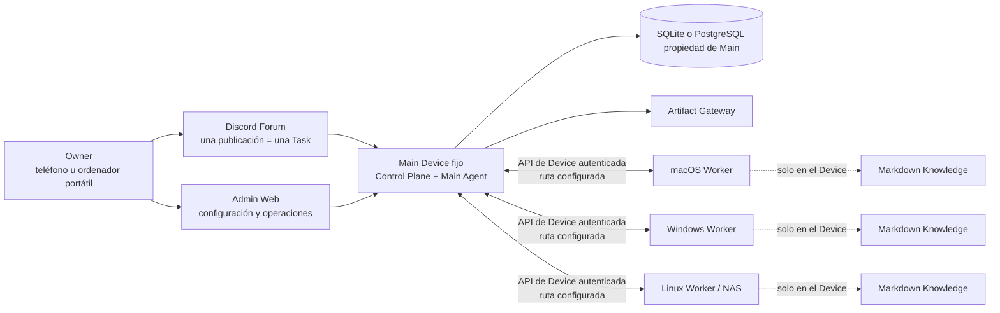

# OpenDelegate

Idiomas: [English](README.md) · [한국어](README.ko.md) · [日本語](README.ja.md) ·
[Français](README.fr.md) · **[Español](README.es.md)** · [简体中文](README.zh-CN.md)

OpenDelegate es un plano de control personal y autoalojado para coordinar agentes de IA entre un
Main Device fijo y varios Devices con macOS, Windows y Linux.

Crea una Task desde un teléfono o un ordenador, deja que el Main Agent la divida en Work Orders,
dirija esos Work Orders a los Devices aptos y recibe un único resultado duradero e inspeccionable
sin tener que reabrir manualmente cada sesión de agente.

> [!WARNING] Este repositorio genera actualmente una **vista previa interna sin soporte**, no una
> release de OpenDelegate con soporte. El código fuente ya incluye rutas con forma de producción
> para la orquestación Main–Worker, los Agent Adapters programáticos, las aprobaciones de acciones
> exactas, el Knowledge local al Device, la supervisión nativa de servicios y Computer Use. Una
> implementación en el código fuente no constituye evidencia de release: aún faltan pruebas reales
> de macOS, Windows, Linux, Discord, proveedores, redes privadas, reinicios, permisos y empaquetado.
> No presentes OpenDelegate como publicado ni lo utilices todavía como plano de control de
> producción sin supervisión.

## Por qué OpenDelegate

- Una publicación de Discord Forum se corresponde con una Task duradera y un límite de contexto.
- El software determinista se ocupa de la identidad, las Policies, el estado de salud, el
  enrutamiento, los leases, los reintentos, la persistencia y las transiciones de estado. Los
  agentes se ocupan del criterio semántico y del trabajo asignado.
- Los Workers se conectan únicamente al Main. No necesitan una malla SSH NxN ni acceso directo a la
  base de datos.
- Codex, Claude y los runners personalizados se sitúan detrás de contratos Agent Adapter, mientras
  que las sesiones nativas útiles de cada proveedor se pueden reanudar.
- Cada Device conserva su propio Knowledge Markdown selectivo y enlazado. El Main nunca recibe sus
  nombres de archivo, títulos, enlaces, grafo, índice, fragmentos ni contenido.
- Los resultados enriquecidos pueden convertirse en Artifacts servidos por el Main conforme a una
  Exposure Policy explícita.

## Arquitectura



Los Workers no se conectan a la base de datos ni entre sí como una malla de control de OpenDelegate.
LAN, Omada, Tailscale, los túneles y las redes personalizadas son opciones deterministas de
Transport Profile entre el Main y cada Device.

## Estado actual del código fuente

La tabla siguiente distingue las rutas con forma de producción implementadas en el código fuente de
la evidencia externa que aún se necesita antes de afirmar que existe soporte.

| Área                    | Implementado y comprobable en el código fuente                                                                                                                                                                                                                                                                                                                                                       | Aún necesario para el primer milestone                                                                                                                                                                                               |
| ----------------------- | ---------------------------------------------------------------------------------------------------------------------------------------------------------------------------------------------------------------------------------------------------------------------------------------------------------------------------------------------------------------------------------------------------- | ------------------------------------------------------------------------------------------------------------------------------------------------------------------------------------------------------------------------------------ |
| Main y persistencia     | CLI `opendelegate` incluida; Control Plane compuesto; contratos de almacenamiento SQLite y PostgreSQL (la prueba alojada de PostgreSQL está fijada actualmente en la versión 17); servicios duraderos de Task, aprobación, auditoría, Artifact, inscripción, Discord y canal de Device; reconciliación de arranque que falla de forma segura si se desconoce el resultado de una acción interrumpida | Evidencia de instalación en host limpio, migración/restauración de base de datos, reinicio de servicio y reconciliación completa en cada plataforma Main declarada; otras versiones principales de PostgreSQL siguen sin verificarse |
| Acceso del Owner        | Reclamación inicial limitada a loopback, inicio de sesión con frase de contraseña, códigos de recuperación, revocación de sesiones, protección CSRF y persistencia SQL                                                                                                                                                                                                                               | Evidencia válida para la release sobre rutas remotas, reinicios, revocación de navegador robado y recuperación independiente de Discord                                                                                              |
| Admin Web               | Superficies autenticadas de Devices, Tasks, aprobaciones, inscripción, Artifacts, auditoría, controles de emergencia y Configuration Chat; controles según las capacidades; interfaz adaptable con selección persistente en inglés, coreano, japonés, francés, español y chino simplificado                                                                                                          | Recorridos de inscripción de Devices reales y de interrupciones, evidencia de accesibilidad y ausencia de desbordamiento en bundles de release y aceptación real por un operador                                                     |
| Runtime de Devices      | Inscripción de un solo uso, identidad propia del Device, canal saliente Main–Worker autenticado, dispatch con lease, inbox/outbox duraderos, supervisión de Runs, Workspaces, ejecución local de Agents, MCP de Knowledge local, MCP de Computer Use y carga de Artifacts                                                                                                                            | Devices físicos inscritos, recuperación tras pérdida de ruta y reinicio, prueba de rutas mixtas de tipo Omada/Tailscale y de servicios persistentes en las tres familias de SO                                                       |
| Agentes y Discord       | Codex App Server y Claude Agent SDK como adapters principales, fallbacks CLI de capacidad reducida, comandos genéricos, continuidad de sesiones nativas, un solo writer y autorización exacta de acciones; HTTP/Gateway de Discord, reconciliación del Forum, controles y composición del Main                                                                                                       | Ejecuciones reales y autenticadas de Codex y Claude con versiones fijadas; pruebas de Community Server, Forum, bot, token, intents, permisos, reconexión, móvil e interrupciones                                                     |
| Knowledge               | Descubrimiento de Markdown enlazado y local al Device, recuperación acotada, indexación determinista, controles de admisión y herramientas MCP para Agents cuyo contenido queda fuera de los contratos del Main                                                                                                                                                                                      | Evidencia de ausencia de exfiltración a nivel de red y recorridos de creación/actualización/reconstrucción en cada familia de Devices reales                                                                                         |
| Artifacts               | Almacén local propiedad del Main, carga de Worker autenticada y reanudable, rutas Gateway estáticas e interactivas aisladas, acceso firmado, contratos de Exposure Policy e inspección en Admin                                                                                                                                                                                                      | Presentación real en Discord, recorridos de retención/exposición, validación de contenido hostil en builds empaquetados y apertura entre redes desde un Device del Owner                                                             |
| Servicios de plataforma | Implementaciones de Windows SCM, macOS launchd y Linux systemd/primer plano; hosts separados para el núcleo y el helper de sesión del Owner; IPC local autenticado; comandos de instalación, inicio, parada, reinicio, actualización, rollback, diagnóstico y desinstalación                                                                                                                         | Ejecución privilegiada en hosts limpios, persistencia tras reinicio/inicio/cierre de sesión, rollback ante fallos, configuración de permisos, firma/notarización según la plataforma y pruebas de laboratorio                        |
| Computer Use            | Lock de escritorio por Device, autorización exacta de acciones, broker local de un solo uso, IPC del helper de sesión, código fuente de backends nativos Windows/macOS/Linux, sondas de disponibilidad/permisos y contratos/pruebas de captura, entrada, cancelación y parada de emergencia                                                                                                          | Interacción de referencia en macOS y Windows físicos y el entorno Linux gráfico declarado, con pruebas de captura, exclusividad, cancelación, fallo de permisos, sesión bloqueada y Linux sin interfaz                               |

La ejecución del Claude SDK en Windows nativo no se anuncia deliberadamente hasta que se pueda
aplicar el sandbox requerido; en Windows, utiliza Codex, WSL2 o un contenedor configurado. Un Worker
en WSL2 o en un contenedor no sustituye los criterios de release del servicio Windows nativo,
reinicio, permisos o Computer Use.

La instalación automática de dependencias de proyecto admite actualmente solo npm, mediante un
staging sin credenciales limitado al registro oficial y con los scripts desactivados. Los gestores
de paquetes del sistema configurados explícitamente también pueden recibir solicitudes exclusivas de
instalación: OpenDelegate fija y vuelve a validar el ejecutable del gestor, mientras que añadir
repositorios o usar instaladores remotos sigue requiriendo aprobación. Esto solo constituye
evidencia de implementación; ningún gestor del sistema cuenta con soporte de release hasta que su
comportamiento con las fuentes existentes y los privilegios supere el laboratorio de host limpio de
la plataforma de destino.

El registro de release legible por máquinas está en
[`docs/release/acceptance-evidence.json`](docs/release/acceptance-evidence.json).
`pnpm release:status` muestra su estado actual. Los 36 criterios de aceptación requieren evidencia;
no se puede omitir ninguna gate de plataforma ni de Computer Use.

Los términos de release tienen significados deliberadamente precisos:

| Etiqueta                    | Significado                                                                                                                                                                                              |
| --------------------------- | -------------------------------------------------------------------------------------------------------------------------------------------------------------------------------------------------------- |
| Public source pre-alpha     | Código fuente revisable; sin soporte y no constituye una instalación completa                                                                                                                            |
| Bundle `internal-preview-*` | Carga de validación local; siempre sin soporte, aunque supere el smoke test local                                                                                                                        |
| Bundle `release-candidate`  | Se han superado las 36 gates, pero el Artifact aún no se ha promocionado ni tiene soporte                                                                                                                |
| `released`                  | Estado efectivo calculado a partir de un Candidate inmutable válido y de la cadena completa y confiable de publicador, autenticidad de plataforma, promoción, canal con soporte y política de revocación |

Actualmente no existe ningún Artifact `released`.

## Admin Web implementada

Las capturas de pantalla siguientes muestran la implementación actual de Admin Web. Se obtuvieron
con la suite de navegador mediante fixtures de API deterministas. La interfaz utiliza el contrato de
la API Admin autenticada, pero estas imágenes no demuestran una vinculación real con Discord, la
inscripción de Workers reales ni la aceptación en tres sistemas operativos. El inglés es el idioma
predeterminado. El selector de idioma también cambia toda la interfaz dirigida al Owner a coreano,
japonés, francés, español o chino simplificado, sin traducir el contenido de las Tasks escrito por
el Owner ni el historial de conversaciones de los Agents.


_Fixture de diseño de operaciones de Task: datos autenticados de lista/detalle y controles. Cada
control respeta el estado de capacidad comunicado por el Main; esta fixture no demuestra que un
runtime externo real esté listo._


_Superficie implementada de inicio de sesión y recuperación del Owner. La reclamación inicial del
Owner sigue siendo un flujo de bootstrap independiente limitado a loopback._

## Compilar una vista previa interna

Los bundles de release requieren exactamente **Node.js 24.18.0**. El repositorio fija pnpm 11.15.1.
Node.js 22.14 o una versión posterior de la línea Node 22 sigue siendo un objetivo de compatibilidad
para colaboradores, pero no puede generar un bundle de release.

Desde un checkout limpio, confirmado mediante un commit y con las dependencias instaladas:

```sh
node --version
git status --short
pnpm install --frozen-lockfile
pnpm check
pnpm build
pnpm test:browser
pnpm release:build --destination ABSOLUTE_PATH --internal-preview
```

`node --version` debe mostrar `v24.18.0` y `git status --short` no debe mostrar nada.
`ABSOLUTE_PATH` debe ser una ruta inexistente fuera del checkout del código fuente. El builder se
niega a sobrescribir un destino existente. Un launcher mínimo exporta el commit limpio y vuelve a
ejecutar la lógica de release desde ese snapshot desechable antes del ensamblado. El builder crea un
bundle específico para la plataforma descargando el archivo oficial de Node fijado y verificando su
SHA-256 auditado. Incluye los launchers de Main y Worker, los assets de Admin, los skills de
inicialización e inscripción, los metadatos de release, un inventario legal de instancias de
dependencias, checksums y evidencia acotada de smoke test para los comandos CLI/servicio/Worker, la
inicialización con un directorio personal limpio, el estado de salud del Main, el servicio de Admin,
la reclamación/inicio de sesión del Owner, el ciclo completo de la cookie de sesión y el cierre
limpio.

El nombre del destino debe contener `internal-preview`. Los archivos generados `INTERNAL_PREVIEW.md`
y `release-metadata.json` indican que el bundle no tiene soporte y conservan el estado exacto de la
evidencia de release. Para inspeccionar el runtime en primer plano:

```powershell
.\opendelegate.cmd init --open
```

```sh
./opendelegate init --open
```

Utiliza el launcher correspondiente a la plataforma en la que se compiló el bundle. La vista previa
interna no instala un servicio persistente del SO y no debe publicarse bajo un tag de release.

Una compilación de producción falla intencionadamente mientras algún criterio de aceptación esté
incompleto:

```sh
pnpm release:gate
pnpm release:build \
  --destination ABSOLUTE_PATH \
  --git-executable ABSOLUTE_UNLINKED_GIT \
  --git-executable-sha256 APPROVED_GIT_EXECUTABLE_SHA256 \
  --runner-executable-sha256 APPROVED_NODE_EXECUTABLE_SHA256
```

La invocación `release:build` anterior solo está completa tal como aparece para el Candidate Linux
x64. En macOS y Windows, añade la Policy de credenciales obligatoria para la plataforma de destino:

```sh
  --platform-signing-policy ABSOLUTE_PLATFORM_SIGNING_POLICY \
  --platform-signing-policy-sha256 APPROVED_PLATFORM_SIGNING_POLICY_SHA256
```

`pnpm release:sign` está limitado deliberadamente a previews sin soporte aceptadas de forma
explícita y rechaza los Release Candidates. Una vez completada la gate de 36 criterios, un runner
nativo del destino, limpio y fijado por hash, usa `pnpm release:finalize` para congelar cada
Production Candidate y crear su attestation de publicador Candidate-v2. Solo la verificación
configurada de la cadena externa de promoción y del recibo del canal con soporte puede dar a ese
Candidate inmutable el estado efectivo `released`; consulta el
[procedimiento de confianza de releases](docs/release/README.md#supported-promotion-trust-path).

Genera esqueletos de entrada para el operador sin credenciales con:

```sh
pnpm release:examples -- --destination ABSOLUTE_NEW_DIRECTORY
```

Cada conjunto generado está marcado como `PLACEHOLDER` y `NOT-A-RELEASE`; no contiene credenciales,
firmas, Artifacts ni evidencia de release. Consulta la
[guía de ejemplos de entradas de release](docs/release/EXAMPLES.md).

Los comandos de producción `release:gate` y `release:build` en modo Candidate solo pueden
completarse después de superar las 36 gates de implementación y de evidencia real. La firma de una
preview sin soporte no satisface ni elude esa gate de producción. Consulta
[la matriz exacta de soporte del primer hito](docs/release/SUPPORT_MATRIX.md),
[la guía de evidencia de release](docs/release/README.md) y
[la lista de comprobación del laboratorio de plataformas](docs/release/PLATFORM_LAB.md).

## Desarrollo

```sh
pnpm install --frozen-lockfile
pnpm setup:browser
pnpm check
pnpm build
pnpm test:browser
```

`pnpm setup:browser` instala Chromium para la suite de navegador de Admin Web. En Linux, Playwright
también puede solicitar dependencias del sistema operativo.

Inicia el servidor de desarrollo de Admin con:

```sh
pnpm dev:admin
```

Este servidor de desarrollo no es una ruta de instalación para el Owner. Utiliza el launcher
`internal-preview` generado para validar el Main empaquetado.

La autenticación de Codex y Claude se aísla por cada Device de OpenDelegate, de forma predeterminada
en `state/providers/codex` y `state/providers/claude`. Después de la configuración, autentícate de
forma interactiva en esos controlled homes exactos. OpenDelegate no copia ni hereda un inicio de
sesión del provider home global del usuario, y los Runs first-class rechazan las variables de
entorno con credenciales.

## Mapa del repositorio

- `apps/main` — composición del Main, CLI determinista, autorización de acciones, canal de Device,
  Discord, Artifacts e integración del runtime de Agent.
- `apps/worker` y `apps/service-host` — runtime del Worker inscrito y hosts persistentes de procesos
  de núcleo/sesión usados por las definiciones de servicios de plataforma.
- `apps/control-plane` — límites HTTP autenticados y de reclamación local.
- `apps/admin-web` — inicio de sesión del Owner, Devices, Tasks, aprobaciones, inscripción,
  Artifacts, auditoría, operaciones de emergencia y Configuration Chat.
- `apps/artifact-gateway` — límite aislado de entrega de Artifacts.
- `packages/domain`, `packages/policy` y `packages/scheduler` — mecánica determinista del dominio y
  Policy ejecutable.
- `packages/storage-sql`, `packages/owner-auth`, `packages/task-service` y `packages/configuration`
  — persistencia y servicios de aplicación del Main.
- `packages/device-identity`, `packages/device-channel`, `packages/worker-runtime`,
  `packages/transport` y `packages/device-discovery` — inscripción de Devices, comunicación
  Main–Worker autenticada y ejecución del Worker.
- `packages/agent-adapters` y `packages/discord-adapter` — integraciones programáticas de
  proveedores y Discord Forum que todavía necesitan pruebas reales con credenciales.
- `packages/artifact-store` — límite de bytes y metadatos de Artifacts propiedad del Main.
- `packages/platform-services` y `packages/computer-use-os` — implementaciones de servicios del SO y
  runtime gráfico; el código fuente y las fixtures no demuestran servicios instalados con soporte ni
  control del escritorio en tres SO.
- `packages/session-helper-ipc`, `packages/session-helper-runtime`, `packages/computer-use-mcp` y
  `packages/run-capability-broker` — capacidades de sesión del Owner autenticadas y acotadas por
  Run.
- `packages/knowledge` y `packages/knowledge-mcp` — descubrimiento Markdown local al Device,
  recuperación enlazada, indexación y herramientas para Agents.
- `packages/acceptance` y `packages/simulator` — recorridos deterministas de Tasks, casos de
  reinicio y fixtures de replay.
- `skills/opendelegate-init` — workflow de inicialización para agentes con gate explícita de
  `internal-preview`.
- `skills/opendelegate-join` — workflow de inscripción y recuperación de un Worker solo saliente sin
  exponer credenciales.
- `docs` — producto, arquitectura, seguridad, diseño, investigación y evidencia de release.

## Documentos canónicos del producto

Léelos en este orden antes de planificar o modificar el comportamiento del producto:

1. [`CONTEXT.md`](CONTEXT.md) — modelo de dominio compacto, vocabulario e invariantes no
   negociables.
2. [`docs/PRODUCT_SPEC.md`](docs/PRODUCT_SPEC.md) — especificación completa del producto y la
   arquitectura.
3. [`docs/IMPLEMENTATION_PLAN.md`](docs/IMPLEMENTATION_PLAN.md) — fases de entrega, límites de
   prueba públicos y gates de release.
4. [`docs/DECISIONS.md`](docs/DECISIONS.md) — decisiones de producto aceptadas y su justificación.
5. [`docs/research/platform-capabilities.md`](docs/research/platform-capabilities.md) —
   restricciones de plataforma obtenidas de fuentes primarias.

El workflow para colaboradores se documenta en [CONTRIBUTING.md](CONTRIBUTING.md). Los límites de
seguridad y la vía privada verificada para notificar vulnerabilidades se encuentran en
[SECURITY.md](SECURITY.md). Las snapshots seguras de metadatos Main y la restauración en un destino
nuevo se documentan en la [guía de copia de seguridad y restauración](docs/BACKUP_AND_RESTORE.md).

OpenDelegate se distribuye bajo la [Apache License 2.0](LICENSE). El contenido del repositorio, los
términos del dominio, las API, los logs y los valores predeterminados de la interfaz utilizan el
inglés. Este README y la interfaz Admin dirigida al Owner también están disponibles en las cinco
traducciones enlazadas al principio.
