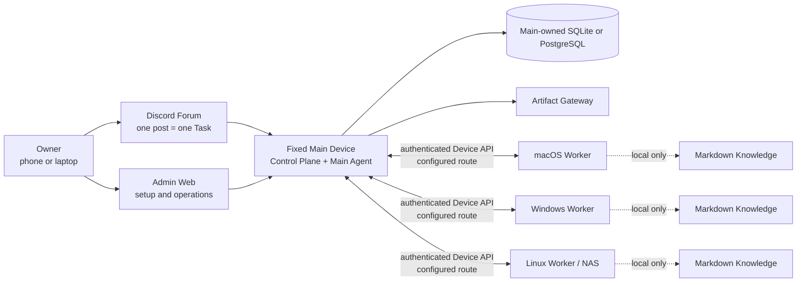
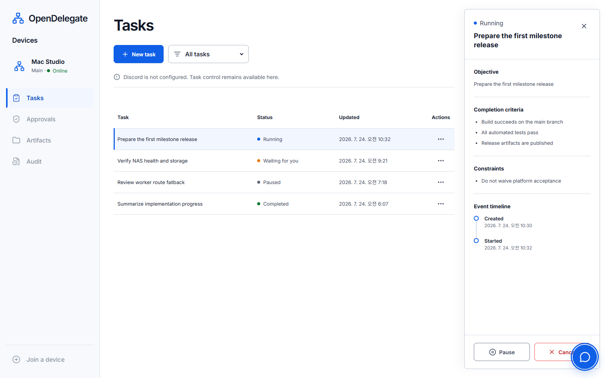
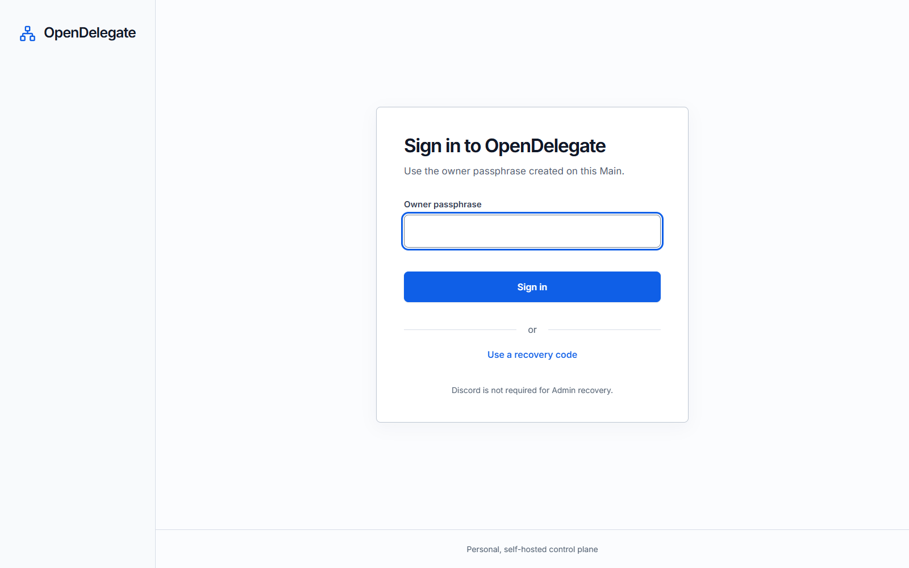

# OpenDelegate

Idiomas: [English](README.md) · [한국어](README.ko.md) · [日本語](README.ja.md) ·
[Français](README.fr.md) · **[Español](README.es.md)** · [简体中文](README.zh-CN.md)

OpenDelegate es un plano de control personal y autoalojado para coordinar agentes de IA entre un
Main Device fijo y varios Devices con macOS, Windows y Linux.

Crea una Task desde un teléfono o un ordenador, deja que el Main Agent la divida en Work Orders,
dirija esos Work Orders a los Devices aptos y recibe un único resultado duradero e inspeccionable
sin tener que reabrir manualmente cada sesión de agente.

> [!WARNING] Este repositorio genera actualmente una **vista previa interna sin soporte**, no una
> versión de OpenDelegate con soporte. El runtime Main, la superficie Admin autenticada para Tasks y
> muchos contratos con forma de producción ya existen, pero la integración de producción para la
> ejecución de Worker/Discord/servicio/Agent/Computer Use y la matriz de aceptación real en tres
> sistemas operativos están incompletas. OpenDelegate todavía no debe presentarse como completo ni
> utilizarse como un plano de control de producción sin supervisión.

## Por qué OpenDelegate

- Una publicación de Discord Forum se corresponde con una Task duradera y un límite de contexto.
- El software determinista se ocupa de la identidad, las Policies, el estado de salud, el
  enrutamiento, los leases, los reintentos, la persistencia y las transiciones de estado. Los
  agentes se ocupan del criterio semántico y del trabajo asignado.
- Los Workers se conectan únicamente al Main. No necesitan una malla SSH NxN ni acceso directo a la
  base de datos.
- Codex, Claude y los runners personalizados se sitúan detrás de contratos Agent Adapter, mientras
  que las sesiones nativas útiles de cada proveedor se pueden reanudar.
- Cada Device conserva su propio Knowledge Markdown selectivo y enlazado. El Main nunca recibe sus
  nombres de archivo, títulos, enlaces, grafo, índice, fragmentos ni contenido.
- Los resultados enriquecidos pueden convertirse en Artifacts servidos por el Main conforme a una
  Exposure Policy explícita.

## Arquitectura



Los Workers no se conectan a la base de datos ni entre sí como una malla de control de OpenDelegate.
LAN, Omada, Tailscale, los túneles y las redes personalizadas son opciones deterministas de
Transport Profile entre el Main y cada Device.

## Estado actual del código fuente

La tabla siguiente distingue el código ejecutable de los límites que todavía no están conectados a
sistemas externos válidos para una release.

| Área                    | Implementado y comprobable ahora                                                                                                                                                                                                                                                                                                                                                                                           | Aún necesario para el primer milestone                                                                                                                                        |
| ----------------------- | -------------------------------------------------------------------------------------------------------------------------------------------------------------------------------------------------------------------------------------------------------------------------------------------------------------------------------------------------------------------------------------------------------------------------- | ----------------------------------------------------------------------------------------------------------------------------------------------------------------------------- |
| Main y persistencia     | CLI `opendelegate` incluida con `init`, `serve` y `status`; composición del Main; estado de salud del Control Plane; API autenticada de inspección y control de emergencia de Tasks; SQLite integrado; configuración PostgreSQL y contratos de almacenamiento equivalentes                                                                                                                                                 | Orquestación/ejecución conectadas, pruebas en hosts limpios y tras reinicios para cada SO compatible, prueba de copia/restauración y reconciliación completa del runtime      |
| Acceso del Owner        | Reclamación inicial limitada a loopback, inicio de sesión con frase de contraseña, códigos de recuperación, revocación de sesiones, protección CSRF y persistencia SQL                                                                                                                                                                                                                                                     | Evidencia válida para la release sobre rutas remotas, reinicios, revocación por robo y recuperación                                                                           |
| Admin Web               | Inicio de sesión/recuperación autenticados; inspección duradera de Tasks; controles de emergencia para pausar/cancelar; superficies adaptables de Devices y Configuration Chat de solo lectura; interfaz persistente en inglés, coreano, japonés, francés, español y chino simplificado. Existen fixtures de creación/reanudación/reintento, pero el Main empaquetado las bloquea mientras la ejecución no esté disponible | Ejecución de Tasks y mensajería del Configuration Agent conectadas, proyecciones de Devices reales, inspectores de aprobaciones/auditoría y aceptación real de interrupciones |
| Runtime de Devices      | Contratos de identidad de Device y de inscripción de un solo uso, inbox/outbox duraderos del Worker y contratos de supervisión de Runs, descubrimiento, transporte, locks y Knowledge local                                                                                                                                                                                                                                | Canal Main–Worker autenticado de extremo a extremo, Devices reales inscritos, instalación del servicio y pruebas de desconexión/reinicio                                      |
| Agentes y Discord       | Paquetes de ciclo de vida para adapters de Codex CLI, Claude CLI y comandos genéricos; contratos duraderos de correspondencia de Discord Forum, autorización, reconciliación, controles y proyección                                                                                                                                                                                                                       | Sesiones reales y autenticadas de proveedores; driver HTTP/Gateway de Discord para producción; Community Server, Forum, bot, token, intents y permisos dedicados              |
| Artifacts               | Artifact Store local y contratos aislados de Artifact Gateway con pruebas de contenido hostil                                                                                                                                                                                                                                                                                                                              | Carga reanudable desde Workers, presentación real en Discord, exposición por las rutas del Owner y aceptación entre redes                                                     |
| Servicios de plataforma | Planes de servicio para Windows SCM, macOS launchd y Linux systemd, renderers, modelos de disponibilidad y límites de validación de solo lectura                                                                                                                                                                                                                                                                           | Instalación nativa con privilegios, ejecutores de servicio empaquetados, pruebas de reinicio/inicio/cierre de sesión, rollback de actualizaciones y firma/notarización        |
| Computer Use            | Núcleo de Resource Lock, paquete de contratos de drivers del SO, sondas de permisos/disponibilidad y fixtures de conformidad deterministas                                                                                                                                                                                                                                                                                 | Backend real de entrada y workflow de referencia en macOS, Windows y Linux gráfico compatible, incluidas pruebas de cancelación y fallos de permisos                          |

El registro de release legible por máquinas está en
[`docs/release/acceptance-evidence.json`](docs/release/acceptance-evidence.json).
`pnpm release:status` muestra su estado actual. Los 36 criterios de aceptación requieren evidencia;
no se puede omitir ninguna gate de plataforma ni de Computer Use.

Los términos de release tienen significados deliberadamente precisos:

| Etiqueta                    | Significado                                                                               |
| --------------------------- | ----------------------------------------------------------------------------------------- |
| Public source pre-alpha     | Código fuente revisable; sin soporte y no constituye una instalación completa             |
| Bundle `internal-preview-*` | Carga de validación local; siempre sin soporte, aunque supere el smoke test local         |
| Bundle `release-candidate`  | Se han superado las 36 gates, pero el Artifact aún no se ha promocionado ni tiene soporte |
| `released`                  | Artifact certificado por separado y publicado mediante un canal con soporte               |

Actualmente no existe ningún Artifact `released`.

## Admin Web implementada

Las capturas de pantalla siguientes muestran la implementación actual de Admin Web. Se obtuvieron
con la suite de navegador mediante fixtures de API deterministas. La interfaz utiliza el contrato de
la API Admin autenticada, pero estas imágenes no demuestran una vinculación real con Discord, la
inscripción de Workers reales ni la aceptación en tres sistemas operativos. El inglés es el idioma
predeterminado. El selector de idioma también cambia toda la interfaz dirigida al Owner a coreano,
japonés, francés, español o chino simplificado, sin traducir el contenido de las Tasks escrito por
el Owner ni el historial de conversaciones de los Agents.



_Fixture de diseño de operaciones de Task: datos autenticados de lista/detalle y controles. El Main
empaquetado desactiva las acciones que inician la ejecución hasta que su runtime de orquestación
esté conectado._



_Superficie implementada de inicio de sesión y recuperación del Owner. La reclamación inicial del
Owner sigue siendo un flujo de bootstrap independiente limitado a loopback._

## Compilar una vista previa interna

Los bundles de release requieren exactamente **Node.js 24.18.0**. El repositorio fija pnpm 11.15.1.
Node.js 22.14 o una versión posterior de la línea Node 22 sigue siendo un objetivo de compatibilidad
para colaboradores, pero no puede generar un bundle de release.

Desde un checkout limpio, confirmado mediante un commit y con las dependencias instaladas:

```sh
node --version
git status --short
pnpm install --frozen-lockfile
pnpm check
pnpm build
pnpm test:browser
pnpm release:build --destination ABSOLUTE_PATH --internal-preview
```

`node --version` debe mostrar `v24.18.0` y `git status --short` no debe mostrar nada.
`ABSOLUTE_PATH` debe ser una ruta inexistente fuera del checkout del código fuente. El builder se
niega a sobrescribir un destino existente. Un launcher mínimo exporta el commit limpio y vuelve a
ejecutar la lógica de release desde ese snapshot desechable antes del ensamblado. El builder crea un
bundle específico para la plataforma descargando el archivo oficial de Node fijado y verificando su
SHA-256 auditado. Incluye los assets de Admin, el skill de inicialización, los metadatos de release,
un inventario legal de instancias de dependencias, checksums y evidencia de smoke test para la ayuda
de la CLI, la inicialización con un directorio personal limpio, el estado de salud del Main, el
servicio de Admin, la reclamación/inicio de sesión del Owner, el ciclo completo de la cookie de
sesión y el cierre limpio.

El nombre del destino debe contener `internal-preview`. Los archivos generados `INTERNAL_PREVIEW.md`
y `release-metadata.json` indican que el bundle no tiene soporte y conservan el estado exacto de la
evidencia de release. Para inspeccionar el runtime en primer plano:

```powershell
.\opendelegate.cmd init --open
```

```sh
./opendelegate init --open
```

Utiliza el launcher correspondiente a la plataforma en la que se compiló el bundle. La vista previa
interna no instala un servicio persistente del SO y no debe publicarse bajo un tag de release.

Una compilación de producción falla intencionadamente mientras algún criterio de aceptación esté
incompleto:

```sh
pnpm release:gate
pnpm release:build --destination ABSOLUTE_PATH
```

Ambos comandos solo pueden completarse después de superar las 36 gates de implementación y de
evidencia real. Consulta [la guía de evidencia de release](docs/release/README.md) y
[la lista de comprobación del laboratorio de plataformas](docs/release/PLATFORM_LAB.md).

## Desarrollo

```sh
pnpm install --frozen-lockfile
pnpm setup:browser
pnpm check
pnpm build
pnpm test:browser
```

`pnpm setup:browser` instala Chromium para la suite de navegador de Admin Web. En Linux, Playwright
también puede solicitar dependencias del sistema operativo.

Inicia el servidor de desarrollo de Admin con:

```sh
pnpm dev:admin
```

Este servidor de desarrollo no es una ruta de instalación para el Owner. Utiliza el launcher
`internal-preview` generado para validar el Main empaquetado.

## Mapa del repositorio

- `apps/main` — composición del Main y CLI determinista.
- `apps/control-plane` — límites HTTP autenticados y de reclamación local.
- `apps/admin-web` — inicio de sesión del Owner, operaciones de Tasks, superficie de Devices y
  Configuration Chat.
- `apps/artifact-gateway` — límite aislado de entrega de Artifacts.
- `packages/domain`, `packages/policy` y `packages/scheduler` — mecánica determinista del dominio y
  Policy ejecutable.
- `packages/storage-sql`, `packages/owner-auth`, `packages/task-service` y `packages/configuration`
  — persistencia y servicios de aplicación del Main.
- `packages/device-identity`, `packages/worker-runtime`, `packages/transport` y
  `packages/device-discovery` — inscripción de Devices y contratos del lado del Worker.
- `packages/agent-adapters` y `packages/discord-adapter` — implementaciones de adapters de
  proveedores y Forum que todavía necesitan pruebas de integración real.
- `packages/artifact-store` — límite de bytes y metadatos de Artifacts propiedad del Main.
- `packages/platform-services` y `packages/computer-use-os` — contratos de servicios del SO y de
  runtime gráfico; no demuestran servicios instalados ni un control real del escritorio.
- `packages/knowledge` — descubrimiento Markdown local al Device, recuperación enlazada e
  indexación.
- `packages/acceptance` y `packages/simulator` — recorridos deterministas de Tasks, casos de
  reinicio y fixtures de replay.
- `skills/opendelegate-init` — workflow de inicialización para agentes con gate explícita de
  `internal-preview`.
- `docs` — producto, arquitectura, seguridad, diseño, investigación y evidencia de release.

## Documentos canónicos del producto

Léelos en este orden antes de planificar o modificar el comportamiento del producto:

1. [`CONTEXT.md`](CONTEXT.md) — modelo de dominio compacto, vocabulario e invariantes no
   negociables.
2. [`docs/PRODUCT_SPEC.md`](docs/PRODUCT_SPEC.md) — especificación completa del producto y la
   arquitectura.
3. [`docs/IMPLEMENTATION_PLAN.md`](docs/IMPLEMENTATION_PLAN.md) — fases de entrega, límites de
   prueba públicos y gates de release.
4. [`docs/DECISIONS.md`](docs/DECISIONS.md) — decisiones de producto aceptadas y su justificación.
5. [`docs/research/platform-capabilities.md`](docs/research/platform-capabilities.md) —
   restricciones de plataforma obtenidas de fuentes primarias.

El workflow para colaboradores se documenta en [CONTRIBUTING.md](CONTRIBUTING.md). Los límites de
seguridad y la vía privada verificada para notificar vulnerabilidades se encuentran en
[SECURITY.md](SECURITY.md).

OpenDelegate se distribuye bajo la [Apache License 2.0](LICENSE). El contenido del repositorio, los
términos del dominio, las API, los logs y los valores predeterminados de la interfaz utilizan el
inglés. Este README y la interfaz Admin dirigida al Owner también están disponibles en las cinco
traducciones enlazadas al principio.
