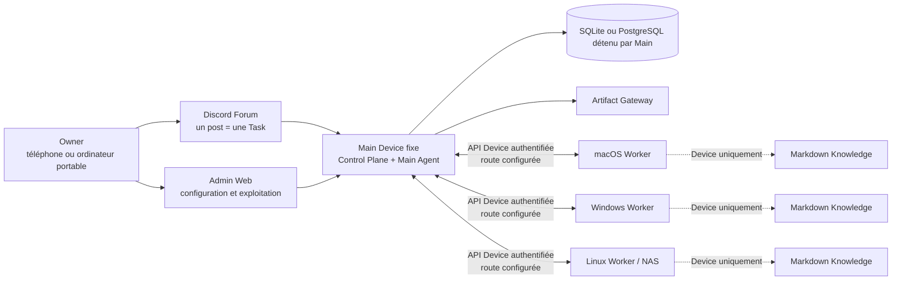

# OpenDelegate

Langues : [English](README.md) · [한국어](README.ko.md) · [日本語](README.ja.md) ·
**[Français](README.fr.md)** · [Español](README.es.md) · [简体中文](README.zh-CN.md)

OpenDelegate est un plan de contrôle personnel et auto-hébergé qui coordonne des agents d’IA entre
un Main Device fixe et plusieurs Devices sous macOS, Windows et Linux.

Créez une Task depuis un téléphone ou un ordinateur, laissez le Main Agent la diviser en Work
Orders, acheminer ces Work Orders vers les Devices éligibles, puis recevez un résultat unique,
durable et inspectable sans avoir à rouvrir manuellement chaque session d’agent.

> [!WARNING] Ce dépôt produit actuellement une **préversion interne non prise en charge**, et non
> une release OpenDelegate prise en charge. Le code source comporte désormais des parcours proches
> de la production pour l’orchestration Main–Worker, les Agent Adapters programmatiques, les
> approbations d’actions exactes, le Knowledge local au Device, la supervision native des services
> et Computer Use. Une implémentation dans le code source ne vaut pas preuve de release : les
> preuves réelles requises pour macOS, Windows, Linux, Discord, les fournisseurs, les réseaux
> privés, les redémarrages, les permissions et le packaging restent incomplètes. Ne présentez pas
> OpenDelegate comme publié et ne l’utilisez pas encore comme plan de contrôle de production sans
> surveillance.

## Pourquoi OpenDelegate

- Une publication Discord Forum correspond à une Task durable et à une frontière de contexte.
- Un logiciel déterministe gère l’identité, les Policies, l’état de santé, le routage, les leases,
  les nouvelles tentatives, la persistance et les transitions d’état. Les agents prennent en charge
  le jugement sémantique et le travail qui leur est attribué.
- Les Workers se connectent uniquement au Main. Ils n’ont besoin ni d’un maillage SSH NxN ni d’un
  accès direct à la base de données.
- Codex, Claude et les runners personnalisés se trouvent derrière les contrats Agent Adapter, tout
  en conservant la possibilité de reprendre les sessions natives utiles des fournisseurs.
- Chaque Device conserve son propre Knowledge Markdown sélectif et relié. Le Main ne reçoit jamais
  ses noms de fichiers, titres, liens, graphe, index, extraits ou contenu.
- Les résultats riches peuvent devenir des Artifacts servis par le Main selon une Exposure Policy
  explicite.

## Architecture



Les Workers ne se connectent ni à la base de données ni entre eux pour former un maillage de
contrôle OpenDelegate. LAN, Omada, Tailscale, les tunnels et les réseaux personnalisés sont des
options déterministes de Transport Profile entre le Main et chaque Device.

## État actuel du code source

Le tableau suivant distingue les parcours proches de la production implémentés dans le code source
des preuves externes encore requises avant de pouvoir annoncer un support.

| Domaine                | Implémenté et testable dans le code source                                                                                                                                                                                                                                                                          | Encore requis pour le premier milestone                                                                                                                                                                                       |
| ---------------------- | ------------------------------------------------------------------------------------------------------------------------------------------------------------------------------------------------------------------------------------------------------------------------------------------------------------------- | ----------------------------------------------------------------------------------------------------------------------------------------------------------------------------------------------------------------------------- |
| Main et persistance    | CLI `opendelegate` fournie ; Control Plane composé ; contrats de stockage SQLite et PostgreSQL ; services durables de Task, approbation, audit, Artifact, enrôlement, Discord et canal Device ; réconciliation au démarrage qui échoue de façon sûre si le résultat d’une action interrompue est inconnu            | Preuves d’installation sur hôte propre, de migration/restauration de la base, de redémarrage du service et de réconciliation complète sur chaque plateforme Main déclarée                                                     |
| Accès de l’Owner       | Revendication initiale limitée au loopback, connexion par phrase secrète, codes de récupération, révocation de session, protection CSRF et persistance SQL                                                                                                                                                          | Preuves valides pour la release concernant les routes distantes, le redémarrage, la révocation d’un navigateur volé et la récupération indépendante de Discord                                                                |
| Admin Web              | Surfaces authentifiées pour Devices, Tasks, approbations, enrôlement, Artifacts, audit, contrôles d’urgence et Configuration Chat ; contrôles adaptés aux capacités ; interface responsive avec choix persistant en anglais, coréen, japonais, français, espagnol et chinois simplifié                              | Parcours d’enrôlement de vrais Devices et de panne, preuves d’accessibilité et d’absence de débordement sur les bundles de release, et validation réelle par un opérateur                                                     |
| Runtime des Devices    | Enrôlement à usage unique, identité propre au Device, canal sortant Main–Worker authentifié, dispatch sous lease, inbox/outbox durables, supervision des Runs, Workspaces, exécution locale d’Agents, MCP Knowledge local, MCP Computer Use et téléversement d’Artifacts                                            | Devices physiques enrôlés, récupération après perte de route et redémarrage, preuve de routes mixtes de type Omada/Tailscale et de services persistants sur les trois familles d’OS                                           |
| Agents et Discord      | Codex App Server et Claude Agent SDK comme adapters de premier choix, fallbacks CLI aux capacités réduites, commandes génériques, continuité des sessions natives, contrainte d’un seul writer et autorisation exacte des actions ; HTTP/Gateway Discord, réconciliation du Forum, contrôles et composition du Main | Exécutions Codex et Claude réelles et authentifiées avec versions épinglées ; preuves sur Community Server, Forum, bot, token, intents, permissions, reconnexion, mobile et panne                                             |
| Knowledge              | Découverte de Markdown lié et local au Device, récupération bornée, indexation déterministe, contrôles d’admission et outils MCP pour Agents dont le contenu reste hors des contrats du Main                                                                                                                        | Preuve de non-exfiltration au niveau réseau et parcours de création/mise à jour/reconstruction sur chaque famille de Devices réels                                                                                            |
| Artifacts              | Store local détenu par le Main, téléversement Worker authentifié et reprenable, parcours Gateway statiques et interactifs isolés, accès signé, contrats d’Exposure Policy et inspection dans Admin                                                                                                                  | Présentation Discord réelle, parcours de rétention/exposition, validation de contenus hostiles sur les builds empaquetés et ouverture inter-réseaux depuis un Device de l’Owner                                               |
| Services de plateforme | Implémentations Windows SCM, macOS launchd et Linux systemd/premier plan ; hosts distincts pour le cœur et le helper de session Owner ; IPC locale authentifiée ; commandes d’installation, démarrage, arrêt, redémarrage, mise à niveau, retour arrière, diagnostic et désinstallation                             | Exécution privilégiée sur hôtes propres, persistance après redémarrage/connexion/déconnexion, retour arrière après échec, configuration des permissions, signature/notarisation selon la plateforme et preuves de laboratoire |
| Computer Use           | Verrou de bureau par Device, autorisation exacte des actions, broker local à usage unique, IPC du helper de session, code source des backends natifs Windows/macOS/Linux, sondes de disponibilité/permissions et contrats/tests de capture, entrée, annulation et arrêt d’urgence                                   | Interaction de référence sur macOS et Windows physiques ainsi que l’environnement Linux graphique déclaré, avec preuves de capture, exclusivité, annulation, échec de permission, session verrouillée et Linux sans interface |

L’exécution du Claude SDK sous Windows natif n’est volontairement pas annoncée tant que son sandbox
requis ne peut pas être imposé ; utilisez Codex, WSL2 ou un conteneur configuré sous Windows. Un
Worker WSL2 ou conteneurisé ne remplace pas les critères de release du service Windows natif, du
redémarrage, des permissions ou de Computer Use.

L’installation automatique des dépendances de projet prend actuellement en charge npm uniquement,
dans une zone de staging sans identifiants, limitée au registre officiel et avec les scripts
désactivés. OpenDelegate accepte aussi les requêtes limitées à l’installation via un gestionnaire de
paquets système explicitement configuré, épingle et revérifie l’exécutable de ce gestionnaire, et
soumet toujours à approbation l’ajout de dépôts et les installateurs distants. Il s’agit uniquement
d’une preuve d’implémentation : aucun gestionnaire système n’est pris en charge pour la release
avant que son comportement avec les sources existantes et les privilèges ait réussi le laboratoire
sur hôte propre de la plateforme cible.

Le registre de release lisible par machine se trouve dans
[`docs/release/acceptance-evidence.json`](docs/release/acceptance-evidence.json).
`pnpm release:status` affiche son état actuel. Les 36 critères d’acceptation exigent tous des
preuves ; aucune gate de plateforme ou de Computer Use ne peut être contournée.

Les termes de release ont volontairement des significations précises :

| Libellé                     | Signification                                                                                                                                                                                                   |
| --------------------------- | --------------------------------------------------------------------------------------------------------------------------------------------------------------------------------------------------------------- |
| Public source pre-alpha     | Code source examinable ; non pris en charge et non installé complètement                                                                                                                                        |
| Bundle `internal-preview-*` | Charge utile de validation locale ; toujours non prise en charge, même si le smoke test local réussit                                                                                                           |
| Bundle `release-candidate`  | Les 36 gates ont réussi, mais l’Artifact n’est pas encore promu ni pris en charge                                                                                                                               |
| `released`                  | Statut effectif calculé à partir d’un Candidate immuable valide et de la chaîne complète et fiable d’éditeur, d’authenticité de plateforme, de promotion, de canal pris en charge et de politique de révocation |

Aucun Artifact `released` n’existe actuellement.

## Admin Web implémentée

Les captures d’écran ci-dessous montrent l’implémentation actuelle d’Admin Web. Elles ont été
capturées par la suite de tests navigateur à l’aide de fixtures d’API déterministes. L’interface
appelle le contrat de l’API Admin authentifiée, mais ces images ne constituent pas une preuve d’une
liaison Discord réelle, de l’enrôlement de vrais Workers ni d’une acceptation sur trois OS.
L’anglais est la langue par défaut. Le sélecteur de langue fait également basculer l’ensemble de
l’interface destinée à l’Owner vers le coréen, le japonais, le français, l’espagnol ou le chinois
simplifié, sans traduire le contenu des Tasks rédigé par l’Owner ni l’historique des conversations
avec les Agents.


_Fixture de conception des opérations de Task : données authentifiées de liste/détail et contrôles.
Chaque contrôle suit l’état de capacité signalé par le Main ; cette fixture ne prouve pas qu’un
runtime externe réel est prêt._


_Surface implémentée de connexion et de récupération de l’Owner. La revendication initiale de
l’Owner reste un flux de bootstrap distinct, limité au loopback._

## Construire une préversion interne

Les bundles de release exigent exactement **Node.js 24.18.0**. Le dépôt épingle pnpm 11.15.1.
Node.js 22.14 ou une version ultérieure de la branche Node 22 reste une cible de compatibilité pour
les contributeurs, mais ne peut pas produire de bundle de release.

Depuis un checkout propre et validé par un commit, avec les dépendances installées :

```sh
node --version
git status --short
pnpm install --frozen-lockfile
pnpm check
pnpm build
pnpm test:browser
pnpm release:build --destination ABSOLUTE_PATH --internal-preview
```

`node --version` doit afficher `v24.18.0`, et `git status --short` ne doit rien afficher.
`ABSOLUTE_PATH` doit désigner un chemin inexistant situé hors du checkout source. Le builder refuse
d’écraser une destination existante. Un launcher minimal exporte le commit propre et réexécute la
logique de release depuis ce snapshot jetable avant l’assemblage. Le builder crée un bundle propre à
la plateforme en téléchargeant l’archive Node officielle épinglée et en vérifiant son SHA-256
audité. Il inclut les launchers Main et Worker, les assets Admin, les skills d’initialisation et
d’enrôlement, les métadonnées de release, un inventaire légal des instances de dépendances, les
checksums et des preuves de smoke test bornées pour les commandes CLI/service/Worker,
l’initialisation avec un répertoire personnel propre, l’état de santé du Main, le service Admin, la
revendication/connexion de l’Owner, l’aller-retour du cookie de session et l’arrêt propre.

Le nom de la destination doit contenir `internal-preview`. Les fichiers générés
`INTERNAL_PREVIEW.md` et `release-metadata.json` indiquent que le bundle n’est pas pris en charge et
conservent l’état exact des preuves de release. Pour inspecter le runtime au premier plan :

```powershell
.\opendelegate.cmd init --open
```

```sh
./opendelegate init --open
```

Utilisez le launcher correspondant à la plateforme sur laquelle le bundle a été construit. La
préversion interne n’installe aucun service OS persistant et ne doit pas être publiée sous un tag de
release.

Un build de production échoue intentionnellement tant qu’un critère d’acceptation reste incomplet :

```sh
pnpm release:gate
pnpm release:build --destination ABSOLUTE_PATH
```

`pnpm release:sign` est délibérément limité aux previews non prises en charge explicitement
acceptées et rejette les Release Candidates. Une fois le gate des 36 critères complet, un runner
natif à la cible, propre et épinglé par hachage, utilise `pnpm release:finalize` pour figer chaque
Production Candidate et créer son attestation d’éditeur Candidate-v2. Seule la vérification
configurée de la chaîne externe de promotion et de reçu du canal pris en charge peut donner à ce
Candidate immuable le statut effectif `released` ; consultez la
[procédure de confiance des releases](docs/release/README.md#supported-promotion-trust-path).

Ces deux commandes ne peuvent réussir qu’après le passage des 36 gates d’implémentation et de
preuves réelles. Consultez
[la matrice exacte de support du premier jalon](docs/release/SUPPORT_MATRIX.md),
[le guide des preuves de release](docs/release/README.md) et
[la checklist du laboratoire de plateformes](docs/release/PLATFORM_LAB.md).

## Développement

```sh
pnpm install --frozen-lockfile
pnpm setup:browser
pnpm check
pnpm build
pnpm test:browser
```

`pnpm setup:browser` installe Chromium pour la suite de tests navigateur d’Admin Web. Sous Linux,
Playwright peut également demander des dépendances du système d’exploitation.

Lancez le serveur de développement Admin avec :

```sh
pnpm dev:admin
```

Ce serveur de développement n’est pas un parcours d’installation pour l’Owner. Utilisez le launcher
`internal-preview` généré pour valider le Main empaqueté.

L’authentification Codex et Claude est isolée par Device OpenDelegate, par défaut dans
`state/providers/codex` et `state/providers/claude`. Après la configuration, authentifiez-vous
interactivement dans ces controlled homes précis. OpenDelegate ne copie ni n’hérite d’une connexion
provenant du provider home global de l’utilisateur, et les Runs first-class refusent les variables
d’environnement contenant des identifiants.

## Organisation du dépôt

- `apps/main` — composition du Main, CLI déterministe, autorisation des actions, canal Device,
  Discord, Artifacts et câblage du runtime Agent.
- `apps/worker` et `apps/service-host` — runtime Worker enrôlé et hosts persistants des processus
  cœur/session utilisés par les définitions des services de plateforme.
- `apps/control-plane` — frontières HTTP authentifiées et de revendication locale.
- `apps/admin-web` — connexion de l’Owner, Devices, Tasks, approbations, enrôlement, Artifacts,
  audit, opérations d’urgence et Configuration Chat.
- `apps/artifact-gateway` — frontière isolée de livraison des Artifacts.
- `packages/domain`, `packages/policy` et `packages/scheduler` — mécanique de domaine déterministe
  et Policy exécutable.
- `packages/storage-sql`, `packages/owner-auth`, `packages/task-service` et `packages/configuration`
  — persistance et services applicatifs du Main.
- `packages/device-identity`, `packages/device-channel`, `packages/worker-runtime`,
  `packages/transport` et `packages/device-discovery` — enrôlement des Devices, communication
  Main–Worker authentifiée et exécution Worker.
- `packages/agent-adapters` et `packages/discord-adapter` — intégrations programmatiques des
  fournisseurs et de Discord Forum qui nécessitent encore une preuve réelle avec identifiants.
- `packages/artifact-store` — frontière des octets et métadonnées des Artifacts détenue par le Main.
- `packages/platform-services` et `packages/computer-use-os` — implémentations des services OS et du
  runtime graphique ; le code source et les fixtures ne prouvent ni des services installés pris en
  charge ni le contrôle du bureau sur trois OS.
- `packages/session-helper-ipc`, `packages/session-helper-runtime`, `packages/computer-use-mcp` et
  `packages/run-capability-broker` — capacités de session Owner authentifiées et bornées par Run.
- `packages/knowledge` et `packages/knowledge-mcp` — découverte Markdown locale au Device,
  récupération liée, indexation et outils pour Agents.
- `packages/acceptance` et `packages/simulator` — parcours déterministes de Tasks, cas de
  redémarrage et fixtures de replay.
- `skills/opendelegate-init` — workflow d’initialisation destiné aux agents avec gate
  `internal-preview` explicite.
- `skills/opendelegate-join` — workflow d’enrôlement et de récupération d’un Worker sortant
  uniquement, sans exposer les identifiants.
- `docs` — produit, architecture, sécurité, conception, recherche et preuves de release.

## Documents produit canoniques

Lisez-les dans cet ordre avant de planifier ou de modifier le comportement du produit :

1. [`CONTEXT.md`](CONTEXT.md) — modèle de domaine compact, vocabulaire et invariants non
   négociables.
2. [`docs/PRODUCT_SPEC.md`](docs/PRODUCT_SPEC.md) — spécification complète du produit et de
   l’architecture.
3. [`docs/IMPLEMENTATION_PLAN.md`](docs/IMPLEMENTATION_PLAN.md) — phases de livraison, frontières de
   test publiques et gates de release.
4. [`docs/DECISIONS.md`](docs/DECISIONS.md) — décisions produit acceptées et leur justification.
5. [`docs/research/platform-capabilities.md`](docs/research/platform-capabilities.md) — contraintes
   de plateforme issues de sources primaires.

Le workflow des contributeurs est documenté dans [CONTRIBUTING.md](CONTRIBUTING.md). Les frontières
de sécurité et la voie privée vérifiée pour signaler les vulnérabilités se trouvent dans
[SECURITY.md](SECURITY.md). Les snapshots sûrs des métadonnées Main et la restauration vers une
nouvelle cible sont décrits dans le
[guide de sauvegarde et restauration](docs/BACKUP_AND_RESTORE.md).

OpenDelegate est distribué sous [Apache License 2.0](LICENSE). Le contenu du dépôt, les termes de
domaine, les API, les logs et les valeurs par défaut de l’interface utilisent l’anglais. Ce README
et l’interface Admin destinée à l’Owner sont également disponibles dans les cinq traductions liées
en haut de cette page.
