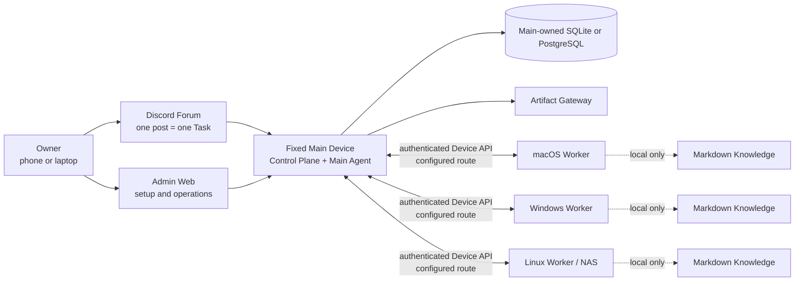

# OpenDelegate

Langues : [English](README.md) · [한국어](README.ko.md) · [日本語](README.ja.md) ·
**[Français](README.fr.md)** · [Español](README.es.md) · [简体中文](README.zh-CN.md)

OpenDelegate est un plan de contrôle personnel et auto-hébergé qui coordonne des agents d’IA entre
un Main Device fixe et plusieurs Devices sous macOS, Windows et Linux.

Créez une Task depuis un téléphone ou un ordinateur, laissez le Main Agent la diviser en Work
Orders, acheminer ces Work Orders vers les Devices éligibles, puis recevez un résultat unique,
durable et inspectable sans avoir à rouvrir manuellement chaque session d’agent.

> [!WARNING] Ce dépôt produit actuellement une **préversion interne non prise en charge**, et non
> une version OpenDelegate prise en charge. Le runtime Main, la surface Admin authentifiée pour les
> Tasks et de nombreux contrats proches de la production existent, mais le câblage de production
> pour l’exécution Worker/Discord/service/Agent/Computer Use ainsi que la matrice d’acceptation en
> conditions réelles sur trois OS sont incomplets. OpenDelegate ne doit pas encore être présenté
> comme terminé ni utilisé comme plan de contrôle de production sans surveillance.

## Pourquoi OpenDelegate

- Une publication Discord Forum correspond à une Task durable et à une frontière de contexte.
- Un logiciel déterministe gère l’identité, les Policies, l’état de santé, le routage, les leases,
  les nouvelles tentatives, la persistance et les transitions d’état. Les agents prennent en charge
  le jugement sémantique et le travail qui leur est attribué.
- Les Workers se connectent uniquement au Main. Ils n’ont besoin ni d’un maillage SSH NxN ni d’un
  accès direct à la base de données.
- Codex, Claude et les runners personnalisés se trouvent derrière les contrats Agent Adapter, tout
  en conservant la possibilité de reprendre les sessions natives utiles des fournisseurs.
- Chaque Device conserve son propre Knowledge Markdown sélectif et relié. Le Main ne reçoit jamais
  ses noms de fichiers, titres, liens, graphe, index, extraits ou contenu.
- Les résultats riches peuvent devenir des Artifacts servis par le Main selon une Exposure Policy
  explicite.

## Architecture



Les Workers ne se connectent ni à la base de données ni entre eux pour former un maillage de
contrôle OpenDelegate. LAN, Omada, Tailscale, les tunnels et les réseaux personnalisés sont des
options déterministes de Transport Profile entre le Main et chaque Device.

## État actuel du code source

Le tableau suivant distingue le code exécutable des frontières qui ne sont pas encore connectées à
des systèmes externes valides pour une release.

| Domaine                | Implémenté et testable actuellement                                                                                                                                                                                                                                                                                                                                                                                               | Encore requis pour le premier milestone                                                                                                                                                   |
| ---------------------- | --------------------------------------------------------------------------------------------------------------------------------------------------------------------------------------------------------------------------------------------------------------------------------------------------------------------------------------------------------------------------------------------------------------------------------- | ----------------------------------------------------------------------------------------------------------------------------------------------------------------------------------------- |
| Main et persistance    | CLI `opendelegate` fournie avec `init`, `serve` et `status` ; composition du Main ; état de santé du Control Plane ; API authentifiée d’inspection et de contrôle d’urgence des Tasks ; SQLite embarqué ; configuration PostgreSQL et contrats de stockage équivalents                                                                                                                                                            | Orchestration/exécution connectées, preuves sur hôtes propres et après redémarrage pour chaque OS pris en charge, preuve de sauvegarde/restauration et réconciliation complète du runtime |
| Accès de l’Owner       | Revendication initiale limitée au loopback, connexion par phrase secrète, codes de récupération, révocation de session, protection CSRF et persistance SQL                                                                                                                                                                                                                                                                        | Preuves valides pour la release concernant les routes distantes, le redémarrage, la révocation après vol et la récupération                                                               |
| Admin Web              | Connexion/récupération authentifiées ; inspection durable des Tasks ; contrôles d’urgence de pause/annulation ; surfaces responsive pour les Devices et le Configuration Chat en lecture seule ; interface persistée en anglais, coréen, japonais, français, espagnol et chinois simplifié. Des fixtures de création/reprise/nouvelle tentative existent, mais le Main empaqueté les bloque tant que l’exécution est indisponible | Exécution des Tasks et messagerie du Configuration Agent connectées, projections de Devices réels, inspecteurs d’approbations/audit et acceptation réelle des pannes                      |
| Runtime des Devices    | Contrats d’identité de Device et d’enrôlement à usage unique, inbox/outbox durables du Worker et contrats de supervision des Runs, découverte, transport, locks et Knowledge local                                                                                                                                                                                                                                                | Canal Main–Worker authentifié de bout en bout, vrais Devices enrôlés, installation du service et preuves de déconnexion/redémarrage                                                       |
| Agents et Discord      | Packages de cycle de vie pour les adapters Codex CLI, Claude CLI et commandes génériques ; contrats durables de correspondance Discord Forum, d’autorisation, de réconciliation, de contrôles et de projection                                                                                                                                                                                                                    | Sessions de fournisseurs réelles et authentifiées ; driver HTTP/Gateway Discord de production ; Community Server, Forum, bot, token, intents et permissions dédiés                        |
| Artifacts              | Artifact Store local et contrats Artifact Gateway isolés avec tests de contenu hostile                                                                                                                                                                                                                                                                                                                                            | Téléversement Worker reprenable, présentation Discord réelle, exposition sur les routes de l’Owner et acceptation inter-réseaux                                                           |
| Services de plateforme | Plans de service Windows SCM, macOS launchd et Linux systemd, renderers, modèles de disponibilité et frontières de validation en lecture seule                                                                                                                                                                                                                                                                                    | Installation native privilégiée, exécuteurs de service empaquetés, tests de redémarrage/connexion/déconnexion, retour arrière de mise à niveau et signature/notarisation                  |
| Computer Use           | Noyau de Resource Lock, package de contrats des drivers OS, sondes de permissions/disponibilité et fixtures de conformité déterministes                                                                                                                                                                                                                                                                                           | Backend d’entrée réel et workflow de référence sous macOS, Windows et Linux graphique pris en charge, y compris preuves d’annulation et d’échec de permission                             |

Le registre de release lisible par machine se trouve dans
[`docs/release/acceptance-evidence.json`](docs/release/acceptance-evidence.json).
`pnpm release:status` affiche son état actuel. Les 36 critères d’acceptation exigent tous des
preuves ; aucune gate de plateforme ou de Computer Use ne peut être contournée.

Les termes de release ont volontairement des significations précises :

| Libellé                     | Signification                                                                                         |
| --------------------------- | ----------------------------------------------------------------------------------------------------- |
| Public source pre-alpha     | Code source examinable ; non pris en charge et non installé complètement                              |
| Bundle `internal-preview-*` | Charge utile de validation locale ; toujours non prise en charge, même si le smoke test local réussit |
| Bundle `release-candidate`  | Les 36 gates ont réussi, mais l’Artifact n’est pas encore promu ni pris en charge                     |
| `released`                  | Artifact attesté séparément et publié par un canal pris en charge                                     |

Aucun Artifact `released` n’existe actuellement.

## Admin Web implémentée

Les captures d’écran ci-dessous montrent l’implémentation actuelle d’Admin Web. Elles ont été
capturées par la suite de tests navigateur à l’aide de fixtures d’API déterministes. L’interface
appelle le contrat de l’API Admin authentifiée, mais ces images ne constituent pas une preuve d’une
liaison Discord réelle, de l’enrôlement de vrais Workers ni d’une acceptation sur trois OS.
L’anglais est la langue par défaut. Le sélecteur de langue fait également basculer l’ensemble de
l’interface destinée à l’Owner vers le coréen, le japonais, le français, l’espagnol ou le chinois
simplifié, sans traduire le contenu des Tasks rédigé par l’Owner ni l’historique des conversations
avec les Agents.


_Fixture de conception des opérations de Task : données authentifiées de liste/détail et contrôles.
Le Main empaqueté désactive les actions qui démarrent une exécution jusqu’à ce que son runtime
d’orchestration soit connecté._


_Surface implémentée de connexion et de récupération de l’Owner. La revendication initiale de
l’Owner reste un flux de bootstrap distinct, limité au loopback._

## Construire une préversion interne

Les bundles de release exigent exactement **Node.js 24.18.0**. Le dépôt épingle pnpm 11.15.1.
Node.js 22.14 ou une version ultérieure de la branche Node 22 reste une cible de compatibilité pour
les contributeurs, mais ne peut pas produire de bundle de release.

Depuis un checkout propre et validé par un commit, avec les dépendances installées :

```sh
node --version
git status --short
pnpm install --frozen-lockfile
pnpm check
pnpm build
pnpm test:browser
pnpm release:build --destination ABSOLUTE_PATH --internal-preview
```

`node --version` doit afficher `v24.18.0`, et `git status --short` ne doit rien afficher.
`ABSOLUTE_PATH` doit désigner un chemin inexistant situé hors du checkout source. Le builder refuse
d’écraser une destination existante. Un launcher minimal exporte le commit propre et réexécute la
logique de release depuis ce snapshot jetable avant l’assemblage. Le builder crée un bundle propre à
la plateforme en téléchargeant l’archive Node officielle épinglée et en vérifiant son SHA-256
audité. Il inclut les assets Admin, le skill d’initialisation, les métadonnées de release, un
inventaire légal des instances de dépendances, les checksums et les preuves de smoke test pour
l’aide de la CLI, l’initialisation avec un répertoire personnel propre, l’état de santé du Main, le
service Admin, la revendication/connexion de l’Owner, l’aller-retour du cookie de session et l’arrêt
propre.

Le nom de la destination doit contenir `internal-preview`. Les fichiers générés
`INTERNAL_PREVIEW.md` et `release-metadata.json` indiquent que le bundle n’est pas pris en charge et
conservent l’état exact des preuves de release. Pour inspecter le runtime au premier plan :

```powershell
.\opendelegate.cmd init --open
```

```sh
./opendelegate init --open
```

Utilisez le launcher correspondant à la plateforme sur laquelle le bundle a été construit. La
préversion interne n’installe aucun service OS persistant et ne doit pas être publiée sous un tag de
release.

Un build de production échoue intentionnellement tant qu’un critère d’acceptation reste incomplet :

```sh
pnpm release:gate
pnpm release:build --destination ABSOLUTE_PATH
```

Ces deux commandes ne peuvent réussir qu’après le passage des 36 gates d’implémentation et de
preuves réelles. Consultez [le guide des preuves de release](docs/release/README.md) et
[la checklist du laboratoire de plateformes](docs/release/PLATFORM_LAB.md).

## Développement

```sh
pnpm install --frozen-lockfile
pnpm setup:browser
pnpm check
pnpm build
pnpm test:browser
```

`pnpm setup:browser` installe Chromium pour la suite de tests navigateur d’Admin Web. Sous Linux,
Playwright peut également demander des dépendances du système d’exploitation.

Lancez le serveur de développement Admin avec :

```sh
pnpm dev:admin
```

Ce serveur de développement n’est pas un parcours d’installation pour l’Owner. Utilisez le launcher
`internal-preview` généré pour valider le Main empaqueté.

## Organisation du dépôt

- `apps/main` — composition du Main et CLI déterministe.
- `apps/control-plane` — frontières HTTP authentifiées et de revendication locale.
- `apps/admin-web` — connexion de l’Owner, opérations sur les Tasks, surface des Devices et
  Configuration Chat.
- `apps/artifact-gateway` — frontière isolée de livraison des Artifacts.
- `packages/domain`, `packages/policy` et `packages/scheduler` — mécanique de domaine déterministe
  et Policy exécutable.
- `packages/storage-sql`, `packages/owner-auth`, `packages/task-service` et `packages/configuration`
  — persistance et services applicatifs du Main.
- `packages/device-identity`, `packages/worker-runtime`, `packages/transport` et
  `packages/device-discovery` — enrôlement des Devices et contrats côté Worker.
- `packages/agent-adapters` et `packages/discord-adapter` — implémentations des adapters de
  fournisseurs et de Forum qui nécessitent encore une preuve d’intégration réelle.
- `packages/artifact-store` — frontière des octets et métadonnées des Artifacts détenue par le Main.
- `packages/platform-services` et `packages/computer-use-os` — contrats de services OS et de runtime
  graphique ; ils ne constituent pas une preuve de services installés ni d’un contrôle réel du
  bureau.
- `packages/knowledge` — découverte Markdown locale au Device, récupération liée et indexation.
- `packages/acceptance` et `packages/simulator` — parcours déterministes de Tasks, cas de
  redémarrage et fixtures de replay.
- `skills/opendelegate-init` — workflow d’initialisation destiné aux agents avec gate
  `internal-preview` explicite.
- `docs` — produit, architecture, sécurité, conception, recherche et preuves de release.

## Documents produit canoniques

Lisez-les dans cet ordre avant de planifier ou de modifier le comportement du produit :

1. [`CONTEXT.md`](CONTEXT.md) — modèle de domaine compact, vocabulaire et invariants non
   négociables.
2. [`docs/PRODUCT_SPEC.md`](docs/PRODUCT_SPEC.md) — spécification complète du produit et de
   l’architecture.
3. [`docs/IMPLEMENTATION_PLAN.md`](docs/IMPLEMENTATION_PLAN.md) — phases de livraison, frontières de
   test publiques et gates de release.
4. [`docs/DECISIONS.md`](docs/DECISIONS.md) — décisions produit acceptées et leur justification.
5. [`docs/research/platform-capabilities.md`](docs/research/platform-capabilities.md) — contraintes
   de plateforme issues de sources primaires.

Le workflow des contributeurs est documenté dans [CONTRIBUTING.md](CONTRIBUTING.md). Les frontières
de sécurité et la voie privée vérifiée pour signaler les vulnérabilités se trouvent dans
[SECURITY.md](SECURITY.md).

OpenDelegate est distribué sous [Apache License 2.0](LICENSE). Le contenu du dépôt, les termes de
domaine, les API, les logs et les valeurs par défaut de l’interface utilisent l’anglais. Ce README
et l’interface Admin destinée à l’Owner sont également disponibles dans les cinq traductions liées
en haut de cette page.
