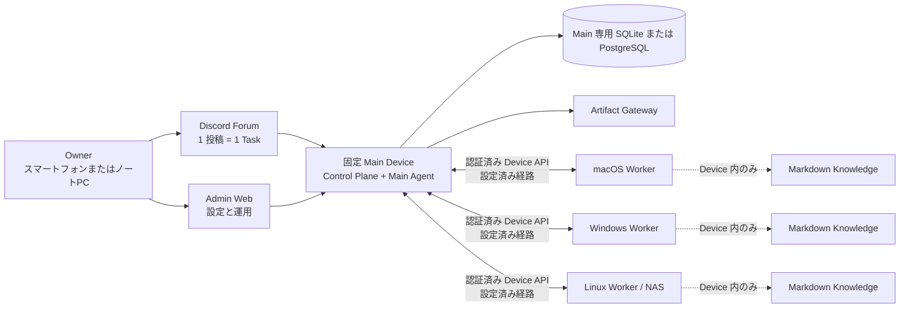

# OpenDelegate

言語：[English](README.md) · [한국어](README.ko.md) · **[日本語](README.ja.md)** ·
[Français](README.fr.md) · [Español](README.es.md) · [简体中文](README.zh-CN.md)

OpenDelegate は、1 台の固定 Main Device と複数の macOS、Windows、Linux Device にまたがる AI
Agent を連携させる、個人向けのセルフホスト型 Control Plane です。

> [!TIP]
> **ここから始めてください:** [クイックスタート](#クイックスタート) ·
> [完全セットアップガイド（英語）](docs/GETTING_STARTED.md) ·
> [Discord Forum セットアップ](docs/DISCORD_SETUP.md)

## クイックスタート

> [!WARNING]
> このリポジトリがビルドするのは、**サポート対象外の内部プレビュー**です。実環境の Platform、Provider、Discord、Network、Permission、Packaging の証拠は未完成です。リリース済みと表示したり、無人の本番 Control
> Plane として使用したりしないでください。詳細は[現在のソースの状態](#現在のソースの状態)を確認してください。

OpenDelegate は Agent とともにインストールします。Owner 向けの導入手順に `npm run start`
はありません。

1. OS とアーキテクチャに合う bundle を用意し、信頼できる公開チャネルから bundle とは別に取得した digest と
   `SHA256SUMS`
   を照合します。現在作成できるのは明示的に表示された内部プレビューの bundle だけです。[内部プレビューのビルド](#内部プレビューのビルド)を参照してください。
2. Discord を使用する場合は、[Discord Forum セットアップガイド](docs/DISCORD_SETUP.md)に従い、最初の Main 初期化前に完全な Binding を用意します。現在のプレビューでは初期化後に Binding を追加または置換できません。
3. 展開した bundle ディレクトリを Codex または Claude で開き、次の文をそのまま送信します: _“Read
   `skills/opendelegate-init/SKILL.md` and initialize this computer as my fixed OpenDelegate Main
   Device. Guide me through every owner decision, keep runtime state outside this bundle, and stop
   if a required safety check fails.”_
4. Agent の案内に従って Owner Claim を完了し、10 個の one-time Recovery
   Code をすべて安全に保存します。
5. Admin Web 右下の Configuration
   Chat で Device、Agent、Route、Artifact の設定と、事前に準備した Discord の状態を確認します。
6. Device を追加する際は、Configuration Chat で有効期間の短い Single-use Device
   Grant を発行します。ファイルを開かずに Owner が管理する安全な方法で転送し、対象 Device の Agent に
   `skills/opendelegate-join/SKILL.md` の手順を実行するよう依頼してください。
7. Discord を設定した場合は、独立した Task ごとに Forum へ新しい投稿を作成します。同じ投稿への返信は同じ Task と native
   Agent
   Session を継続し、新しい投稿はクリーンな Context から始まります。Discord を使用しない場合や利用できない場合は、**Admin
   Web → Tasks →新しいタスク**から作成します。

Owner Recovery、追加 Device、最初の Task、トラブルシューティングを含む
[完全なセットアップガイド（英語）](docs/GETTING_STARTED.md)を参照してください。

## OpenDelegate が必要な理由

スマートフォンやコンピューターから Task を作成すると、Main Agent が Task を Work
Order に分割し、実行可能な Device へ振り分けます。すべての Agent セッションを手作業で開き直すことなく、永続的で検証可能な 1 つの結果を受け取れます。

- Discord Forum の 1 つの投稿が、1 つの永続的な Task と Context Boundary に対応します。
- 決定論的なソフトウェアが ID、Policy、Health、Routing、Lease、Retry、Persistence、State
  Transition を管理します。Agent は意味的な判断と割り当てられた作業を担当します。
- Worker は Main にのみ接続します。NxN SSH Mesh も、データベースへの直接アクセスも必要ありません。
- Codex、Claude、およびカスタム Runner は Agent Adapter
  Contract の背後に配置され、有用な Provider-native Session は再開できます。
- 各 Device は、選択的に使用するリンク済み Markdown
  Knowledge をローカルに保持します。Main がそのファイル名、タイトル、リンク、グラフ、インデックス、スニペット、内容を受け取ることはありません。
- リッチな結果は、明示的な Exposure Policy の下で Main が配信する Artifact にできます。

## アーキテクチャ



Worker は OpenDelegate の Control
Mesh としてデータベースや相互の Worker に接続しません。LAN、Omada、Tailscale、Tunnel、カスタムネットワークは、Main と各 Device の間で使用する決定論的な Transport
Profile の選択肢です。

## 現在のソースの状態

次の表は、本番環境を想定して実装されたソース経路と、サポートを表明する前に必要な外部証拠を区別したものです。

| 領域                | ソースに実装済みでテスト可能な範囲                                                                                                                                                                                                                                                                                  | 最初の Milestone に引き続き必要な範囲                                                                                                                                                            |
| ------------------- | ------------------------------------------------------------------------------------------------------------------------------------------------------------------------------------------------------------------------------------------------------------------------------------------------------------------- | ------------------------------------------------------------------------------------------------------------------------------------------------------------------------------------------------ |
| Main と Persistence | バンドル版 `opendelegate` CLI、構成済み Control Plane、SQLite/PostgreSQL Storage Contract（Hosted PostgreSQL の検証は現在 17 に固定）、永続的な Task Execution・Approval・Audit・Artifact・Enrollment・Discord・Device-channel Service、中断された Action の結果が不明な場合に安全側へ失敗する起動時 Reconciliation | サポートを宣言する各 Main Platform での Clean-host Installation、Database Migration/Restore、Service Restart、および完全な Reconciliation の証拠。その他の PostgreSQL メジャーバージョンは未検証 |
| Owner Access        | Loopback 限定の Initial Claim、Passphrase Login、Recovery Code、Session Revoke、CSRF Protection、および SQL Persistence                                                                                                                                                                                             | リリースに有効な Remote Route、Restart、盗難 Browser Session の Revoke、および Discord に依存しない Recovery の証拠                                                                              |
| Admin Web           | 認証済み Device・Task・Approval・Enrollment・Artifact・Audit・Emergency Control・Configuration Chat 画面、Capability-aware Control、選択状態を保持するレスポンシブな英語・韓国語・日本語・フランス語・スペイン語・簡体字中国語 UI                                                                                   | 実 Device Onboarding と Outage Journey、Release Bundle 上の Accessibility/Overflow の証拠、および実際の Operator Acceptance                                                                      |
| Device Runtime      | Single-use Enrollment、Device-scoped Identity、認証済み Outbound Main–Worker Channel、Lease に基づく Dispatch、Durable Inbox/Outbox、Run Supervision、Workspace、Local Agent Execution、Local Knowledge MCP、Computer Use MCP、および Artifact Upload                                                               | Enrollment 済みの実 Device、Route-loss/Restart Recovery、Omada/Tailscale 型 Mixed Route の証拠、および 3 OS Family すべての Persistent Service の証拠                                            |
| Agent と Discord    | Codex App Server と Claude Agent SDK を第一選択とする Adapter、機能を限定した CLI Fallback、Generic Command、Native-session Continuity、Single-writer Enforcement、厳密な Action Authorization、Discord HTTP/Gateway・Forum Reconciliation・Control・Main Composition                                               | 固定バージョンで認証した Codex/Claude の Live Run、専用 Community Server・Forum・Bot・Token・Intent・Permission・Reconnect・Mobile・Outage の証拠                                                |
| Knowledge           | Device-local Linked Markdown Discovery、Bounded Retrieval、決定論的 Indexing、Admission Check、および内容を Main Contract の外に保つ Agent 向け MCP Tool                                                                                                                                                            | 各実 Device Family での Packet-level No-egress 証拠と Create/Update/Rebuild Journey                                                                                                              |
| Artifact            | Main 所有の Local Store、認証済みで再開可能な Worker Upload、分離された Static/Interactive Gateway Path、Signed Access、Exposure-policy Contract、および Admin Inspection                                                                                                                                           | Live Discord Presentation、Retention/Exposure Journey、Packaged Build 上の Hostile-content Validation、および Owner Device からの Cross-network Open                                             |
| Platform Service    | Windows SCM、macOS launchd、Linux systemd/Foreground のソース実装、分離された Core/Owner-session Helper Host、認証済み Local IPC、Install/Start/Stop/Restart/Upgrade/Rollback/Diagnose/Uninstall Command Path                                                                                                       | 特権付き Clean-host Execution、Reboot/Login/Logout Persistence、Failure Rollback、Permission Onboarding、該当 Platform の Signing/Notarization、および Lab Evidence                              |
| Computer Use        | Device-wide Desktop Lock、厳密な Action Authorization、One-time Local Capability Broker、Session-helper IPC、Native Windows/macOS/Linux Backend のソース、Readiness/Permission Probe、Capture/Input/Cancel/Emergency-stop Contract、および決定論的・Native Fixture Test                                             | 実 macOS・Windows・宣言済み Graphical Linux 環境での Reference Interaction と Screenshot・Exclusivity・Cancellation・Permission Failure・Locked-session・Headless Linux の証拠                   |

必要な Sandbox を強制できるようになるまで、Native Windows での Claude
SDK 実行は意図的にサポート対象として表示しません。Windows では Codex、WSL2、または設定済みの Container を使用してください。WSL2 や Container の Worker は、Native
Windows Service、Restart、Permission、Computer Use の Release Gate を代替しません。

Project Dependency の自動 Install は現在、Credential を持たない Official Registry の Staging
Boundary で Script を無効化した npm のみをサポートします。OpenDelegate は、明示的に設定された System
Package
Manager のインストール専用リクエストも受け付け、その Manager の実行ファイルを固定して実行直前に再検証します。リポジトリの追加とリモートインストーラーは引き続き承認対象です。これは実装上の証拠にすぎず、既存 Source と権限の挙動が対象 Clean-host
Lab に合格するまで、System Package Manager を Release のサポート対象とは表明しません。

機械可読な Release Ledger は
[`docs/release/acceptance-evidence.json`](docs/release/acceptance-evidence.json)
にあります。現在の状態は `pnpm release:status` で確認できます。36 個の Acceptance
Criteria はすべて証拠を必要とし、Platform または Computer Use の Gate を免除することはできません。

リリースに関する用語は、意図的に狭い意味で使用しています。

| Label                       | 意味                                                                                                                                                           |
| --------------------------- | -------------------------------------------------------------------------------------------------------------------------------------------------------------- |
| Public source pre-alpha     | レビュー可能なソース。サポート対象外で、完成したインストールではない                                                                                           |
| `internal-preview-*` bundle | ローカル検証用 Payload。ローカル Smoke に合格しても常にサポート対象外                                                                                          |
| `release-candidate` bundle  | 36 個の Gate をすべて通過しているが、まだ昇格もサポートもされていない Artifact                                                                                 |
| `released`                  | 有効な不変 Candidate と、信頼された Publisher、Platform Authenticity、Promotion、Supported Channel、Revocation Policy の完全な Chain から算出される実効 Status |

現在、`released` Artifact は存在しません。

## 実装済みの Admin Web

以下のスクリーンショットは、現在実装されている Admin Web を示しています。決定論的な API
Fixture を使用する Browser Suite から取得したものです。UI は認証済み Admin API
Contract を呼び出しますが、これらの画像は Live Discord Binding、実 Worker Enrollment、または 3 OS
Acceptance の証拠ではありません。デフォルトは英語です。言語セレクターを使用すると、Owner 向け UI 全体を韓国語、日本語、フランス語、スペイン語、または簡体字中国語に切り替えられます。Owner が記述した Task の内容や Agent の会話履歴は翻訳されません。


_Task 操作 Design
Fixture：認証済みの一覧/詳細データと Control。各 Control は Main が報告する Capability
State に従います。この Fixture は、実際の外部 Runtime が準備済みであることの証拠ではありません。_


_実装済みの Owner Login および Recovery Entry 画面。Initial Owner
Claim は、独立した Loopback 限定 Bootstrap Flow のままです。_

## 内部プレビューのビルド

Release Bundle には正確に **Node.js 24.18.0** が必要です。このリポジトリでは pnpm
11.15.1 を固定しています。Node.js 22.14 以降の Node 22 系列は Contributor Compatibility
Target ですが、Release Bundle の作成には使用できません。

依存関係をインストール済みの、Clean かつ Commit 済みの Checkout から実行します。

```sh
node --version
git status --short
pnpm install --frozen-lockfile
pnpm check
pnpm build
pnpm test:browser
pnpm release:build --destination ABSOLUTE_PATH --internal-preview
```

`node --version` は `v24.18.0` を出力し、`git status --short` は何も出力してはいけません。
`ABSOLUTE_PATH`
はソース Checkout の外部にある、まだ存在しないパスでなければなりません。Builder は既存の Destination を上書きしません。最小限の Launcher が Clean
Commit を Export し、Assembly の前に使い捨て Snapshot から Release
Logic を再実行します。Builder は固定された公式 Node
Archive をダウンロードし、監査済み SHA-256 を検証して Platform-specific
Bundle を作成します。これには Main/Worker Launcher、Admin Asset、Init/Join Skill、Release
Metadata、Dependency-instance Legal Inventory、Checksum のほか、CLI/Service/Worker
Command、Clean-home Initialization、Main Health、Admin Serving、Owner Claim/Login、Session-cookie
Round-trip、Clean Shutdown の限定的な Smoke Evidence が含まれます。

Destination 名には `internal-preview` を含める必要があります。生成される `INTERNAL_PREVIEW.md` と
`release-metadata.json` は、Bundle がサポート対象外であることと、正確な Release Evidence
State を記録します。Discord とその他の Owner の選択を永続的な Main 設定の作成前に確定できるよう、組み立て済み Bundle は上記の Agent-first
[クイックスタート](#クイックスタート)からのみ初期化してください。内部プレビューは Foreground で動作し、永続的な OS
Service をインストールせず、Release Tag として公開してはいけません。

Acceptance Criterion が 1 つでも未完了の場合、Production Build は意図的に失敗します。

```sh
pnpm release:gate
pnpm release:build \
  --destination ABSOLUTE_PATH \
  --git-executable ABSOLUTE_UNLINKED_GIT \
  --git-executable-sha256 APPROVED_GIT_EXECUTABLE_SHA256 \
  --runner-executable-sha256 APPROVED_NODE_EXECUTABLE_SHA256
```

上記の `release:build` 呼び出しが記載どおりで完全なのは、Linux x64
Candidate の場合だけです。macOS と Windows では、対象プラットフォーム固有の必須 Credential
Policy を次のように追加してください。

```sh
  --platform-signing-policy ABSOLUTE_PLATFORM_SIGNING_POLICY \
  --platform-signing-policy-sha256 APPROVED_PLATFORM_SIGNING_POLICY_SHA256
```

`pnpm release:sign` は、明示的に確認されたサポート対象外の Preview 専用に意図的に制限され、Release
Candidate を拒否します。36 個の Criterion
Gate が完了すると、Clean かつ Hash-pinned な対象ネイティブ Runner が `pnpm release:finalize`
を使用して各 Production Candidate を Freeze し、Candidate-v2 Publisher
Attestation を作成します。構成済みの外部 Promotion と Supported Channel
Receipt の Chain を検証した場合にのみ、その不変 Candidate の実効 Status が `released`
になります。詳細は
[Release Trust の手順](docs/release/README.md#supported-promotion-trust-path)を参照してください。

Credential を含まない Operator 入力 Skeleton は、次のコマンドで生成できます。

```sh
pnpm release:examples -- --destination ABSOLUTE_NEW_DIRECTORY
```

生成物にはすべて `PLACEHOLDER` と `NOT-A-RELEASE`
が明記され、Credential、署名、Artifact、Release 証拠は含まれません。詳しくは
[Release 入力例ガイド](docs/release/EXAMPLES.md)を参照してください。

Production 用の `release:gate` と Candidate Mode の `release:build` は、36 個すべての Implementation
Gate と Live-evidence
Gate が通過した場合にのみ成功します。サポート対象外 Preview の署名は、この Production
Gate を満たすものでも、回避するものでもありません。
[正確な First Milestone Support Matrix](docs/release/SUPPORT_MATRIX.md)、
[Release Evidence Guide](docs/release/README.md) および
[Platform Lab Checklist](docs/release/PLATFORM_LAB.md) を参照してください。

## 開発

```sh
pnpm install --frozen-lockfile
pnpm setup:browser
pnpm check
pnpm build
pnpm test:browser
```

`pnpm setup:browser` は Admin Web Browser
Suite 用の Chromium をインストールします。Linux では、Playwright が OS
Dependency のインストールも要求する場合があります。

Admin 開発サーバーは次のコマンドで起動します。

```sh
pnpm dev:admin
```

この開発サーバーは Owner 向けのインストール手順ではありません。バンドル済み Main を検証するときは、生成された Internal-preview
Launcher を使用してください。

Codex と Claude の認証は、既定で OpenDelegate Device ごとの `state/providers/codex` と
`state/providers/claude` に分離されます。セットアップ後、その controlled
home 自体で対話的に認証してください。OpenDelegate はユーザーのグローバルな provider
home からログインをコピーも継承もせず、first-class provider Run は認証情報の環境変数を拒否します。

## リポジトリ構成

- `apps/main` — Main Composition、決定論的 CLI、Action Authorization、Device
  Channel、Discord、Artifact、および Agent Runtime Wiring。
- `apps/worker`、`apps/service-host` — Enrollment 済み Worker Runtime と、Platform Service
  Definition が使用する永続的な Core/Session Process Host。
- `apps/control-plane` — 認証済み HTTP と Local-claim Boundary。
- `apps/admin-web` — Owner Login、Device、Task、Approval、Enrollment、Artifact、Audit、Emergency
  Operation、および Configuration Chat。
- `apps/artifact-gateway` — 隔離された Artifact Delivery Boundary。
- `packages/domain`、`packages/policy`、`packages/scheduler` — 決定論的 Domain
  Mechanic と実行可能な Policy。
- `packages/storage-sql`、`packages/owner-auth`、`packages/task-service`、 `packages/configuration`
  — Main Persistence と Application Service。
- `packages/device-identity`、`packages/device-channel`、`packages/worker-runtime`、
  `packages/transport`、`packages/device-discovery` — Device Enrollment、認証済み Main–Worker
  Communication、および Worker Execution。
- `packages/agent-adapters`、`packages/discord-adapter` — まだ Credential を使用した Live
  Proof が必要な Programmatic Provider および Discord Forum Integration。
- `packages/artifact-store` — Main が所有する Artifact Byte と Metadata Boundary。
- `packages/platform-services`、`packages/computer-use-os` — OS Service と Graphical-runtime
  Implementation。ソースおよび Fixture の結果は、サポート対象の Installed Service や 3 OS Desktop
  Control の証拠ではありません。
- `packages/session-helper-ipc`、`packages/session-helper-runtime`、
  `packages/computer-use-mcp`、`packages/run-capability-broker` —
  Run ごとに制限された認証済み Owner-session Capability。
- `packages/knowledge`、`packages/knowledge-mcp` — Device-local Markdown Discovery、Linked
  Retrieval、Indexing、および Agent Tool。
- `packages/acceptance`、`packages/simulator` — 決定論的 Task Journey、Restart Case、Replay
  Fixture。
- `skills/opendelegate-init` — 明示的な Internal-preview Gate を持つ Agent 向け Initialization
  Workflow。
- `skills/opendelegate-join` — Credential を公開しない Outbound-only Worker
  Enrollment と Recovery の Workflow。
- `docs` — Product、Architecture、Security、Design、Research、Release Evidence。

## 正式な製品ドキュメント

製品の挙動を計画または変更する前に、次の順序で読んでください。

1. [`CONTEXT.md`](CONTEXT.md) — 簡潔な Domain Model、Vocabulary、および変更不可の Invariant。
2. [`docs/PRODUCT_SPEC.md`](docs/PRODUCT_SPEC.md) — 完全な Product/Architecture 仕様。
3. [`docs/IMPLEMENTATION_PLAN.md`](docs/IMPLEMENTATION_PLAN.md) — Delivery Phase、公開Test
   Seam、Release Gate。
4. [`docs/DECISIONS.md`](docs/DECISIONS.md) — 承認済み Product Decision とその根拠。
5. [`docs/research/platform-capabilities.md`](docs/research/platform-capabilities.md)
   —一次資料に基づく Platform Constraint。

Contributor Workflow は [CONTRIBUTING.md](CONTRIBUTING.md) に記載されています。Security
Boundary と検証済みの非公開 Vulnerability-reporting Route については、 [SECURITY.md](SECURITY.md)
を参照してください。安全な Main Metadata Snapshot と新規 Target への復元手順は
[Backup and Restore Guide](docs/BACKUP_AND_RESTORE.md) に記載されています。

OpenDelegate は [Apache License 2.0](LICENSE) の下で提供されます。リポジトリの内容、Domain
Term、API、Log、UI の Default には英語を使用します。この README と Owner 向け Admin
UI は、上部でリンクしている 5 つの翻訳でも利用できます。
