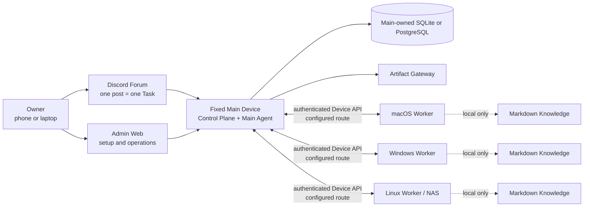

# OpenDelegate

言語：[English](README.md) · [한국어](README.ko.md) · **[日本語](README.ja.md)** ·
[Français](README.fr.md) · [Español](README.es.md) · [简体中文](README.zh-CN.md)

OpenDelegate は、1 台の固定 Main Device と複数の macOS、Windows、Linux Device にまたがる AI
Agent を連携させる、個人向けのセルフホスト型 Control Plane です。

スマートフォンやコンピューターから Task を作成すると、Main Agent が Task を Work
Order に分割し、実行可能な Device へ振り分けます。すべての Agent セッションを手作業で開き直すことなく、永続的で検証可能な 1 つの結果を受け取れます。

> [!WARNING] このリポジトリが現在ビルドするのは、サポート対象の OpenDelegate リリースではなく、**サポート対象外の内部プレビュー**です。Main
> Runtime、認証済み Admin
> Task 画面、および多くの本番環境を想定した Contract は存在しますが、本番用の Worker/Discord/Service/Agent/Computer
> Use 実行配線と、実機での 3 OS Acceptance
> Matrix は未完成です。現時点の OpenDelegate を完成品と表示したり、無人の本番 Control
> Plane として使用したりしないでください。

## OpenDelegate が必要な理由

- Discord Forum の 1 つの投稿が、1 つの永続的な Task と Context Boundary に対応します。
- 決定論的なソフトウェアが ID、Policy、Health、Routing、Lease、Retry、Persistence、State
  Transition を管理します。Agent は意味的な判断と割り当てられた作業を担当します。
- Worker は Main にのみ接続します。NxN SSH Mesh も、データベースへの直接アクセスも必要ありません。
- Codex、Claude、およびカスタム Runner は Agent Adapter
  Contract の背後に配置され、有用な Provider-native Session は再開できます。
- 各 Device は、選択的に使用するリンク済み Markdown
  Knowledge をローカルに保持します。Main がそのファイル名、タイトル、リンク、グラフ、インデックス、スニペット、内容を受け取ることはありません。
- リッチな結果は、明示的な Exposure Policy の下で Main が配信する Artifact にできます。

## アーキテクチャ



Worker は OpenDelegate の Control
Mesh としてデータベースや相互の Worker に接続しません。LAN、Omada、Tailscale、Tunnel、カスタムネットワークは、Main と各 Device の間で使用する決定論的な Transport
Profile の選択肢です。

## 現在のソースの状態

次の表は、現在実行可能なコードと、リリースに有効な外部システムへまだ接続されていない境界を区別したものです。

| 領域                | 現在実装済みでテスト可能な範囲                                                                                                                                                                                                                                                                                                          | 最初の Milestone に引き続き必要な範囲                                                                                                                    |
| ------------------- | --------------------------------------------------------------------------------------------------------------------------------------------------------------------------------------------------------------------------------------------------------------------------------------------------------------------------------------- | -------------------------------------------------------------------------------------------------------------------------------------------------------- |
| Main と Persistence | `init`、`serve`、`status` を備えたバンドル版 `opendelegate` CLI、Main Composition、Control Plane Health、認証済み Task Inspection/Emergency-control API、組み込み SQLite、PostgreSQL の設定と同等の Storage Contract                                                                                                                    | 接続済みの Orchestration/Execution、サポート対象の各 OS における Clean-host と Restart の証明、Backup/Restore の証明、完全な Runtime Reconciliation      |
| Owner Access        | Loopback 限定の Initial Claim、Passphrase Login、Recovery Code、Session Revoke、CSRF Protection、および SQL Persistence                                                                                                                                                                                                                 | リリースに有効な Remote Route、Restart、盗難 Session の Revoke、および Recovery の証拠                                                                   |
| Admin Web           | 認証済み Login/Recovery、永続的な Task Inspection、Pause/Cancel Emergency Control、レスポンシブな Device 画面と読み取り専用 Configuration Chat 画面、選択状態が保持される英語、韓国語、日本語、フランス語、スペイン語、簡体字中国語 UI。Creation/Resume/Retry Fixture は存在するが、実行が利用できない間は Packaged Main がこれらを制限 | 接続済み Task Execution と Configuration Agent Messaging、実 Device Projection、Approval/Audit Inspector、および実際の Outage Acceptance                 |
| Device Runtime      | Device Identity と Single-use Enrollment Contract、Worker の Durable Inbox/Outbox と Run Supervision Contract、Discovery、Transport、Lock、Local Knowledge                                                                                                                                                                              | 認証済み End-to-End Main–Worker Channel、Enrollment 済みの実 Device、Service Installation、および Disconnect/Restart の証明                              |
| Agent と Discord    | Codex CLI、Claude CLI、Generic Command Adapter Lifecycle Package、永続的な Discord Forum Mapping、Authorization、Reconciliation、Control、Projection の Contract                                                                                                                                                                        | 認証済み Live Provider Session、本番用 Discord HTTP/Gateway Driver、専用 Community Server、Forum、Bot、Token、Intent、Permission                         |
| Artifact            | Hostile-content Test を備えた Local Artifact Store と隔離された Artifact Gateway Contract                                                                                                                                                                                                                                               | 再開可能な Worker Upload、Live Discord Presentation、Owner-route Exposure、および Cross-network Acceptance                                               |
| Platform Service    | Windows SCM、macOS launchd、Linux systemd の Service Plan、Renderer、Readiness Model、Read-only Validation Seam                                                                                                                                                                                                                         | 特権を要する Native Installation、Packaged Service Executor、Reboot/Login/Logout Test、Upgrade Rollback、および Signing/Notarization                     |
| Computer Use        | Resource-lock Kernel、OS-driver Contract Package、Permission/Readiness Probe、決定論的 Conformance Fixture                                                                                                                                                                                                                              | macOS、Windows、サポート対象のグラフィカル Linux で動作する実際の Input Backend と Reference Workflow（Cancellation と Permission-failure の証明を含む） |

機械可読な Release Ledger は
[`docs/release/acceptance-evidence.json`](docs/release/acceptance-evidence.json)
にあります。現在の状態は `pnpm release:status` で確認できます。36 個の Acceptance
Criteria はすべて証拠を必要とし、Platform または Computer Use の Gate を免除することはできません。

リリースに関する用語は、意図的に狭い意味で使用しています。

| Label                       | 意味                                                                           |
| --------------------------- | ------------------------------------------------------------------------------ |
| Public source pre-alpha     | レビュー可能なソース。サポート対象外で、完成したインストールではない           |
| `internal-preview-*` bundle | ローカル検証用 Payload。ローカル Smoke に合格しても常にサポート対象外          |
| `release-candidate` bundle  | 36 個の Gate をすべて通過しているが、まだ昇格もサポートもされていない Artifact |
| `released`                  | 個別に Attestation され、サポート対象 Channel を通じて公開された Artifact      |

現在、`released` Artifact は存在しません。

## 実装済みの Admin Web

以下のスクリーンショットは、現在実装されている Admin Web を示しています。決定論的な API
Fixture を使用する Browser Suite から取得したものです。UI は認証済み Admin API
Contract を呼び出しますが、これらの画像は Live Discord Binding、実 Worker Enrollment、または 3 OS
Acceptance の証拠ではありません。デフォルトは英語です。言語セレクターを使用すると、Owner 向け UI 全体を韓国語、日本語、フランス語、スペイン語、または簡体字中国語に切り替えられます。Owner が記述した Task の内容や Agent の会話履歴は翻訳されません。


_Task 操作 Design Fixture：認証済みの一覧/詳細データと Control。Packaged Main は、Orchestration
Runtime が接続されるまで実行開始アクションを無効にします。_


_実装済みの Owner Login および Recovery Entry 画面。Initial Owner
Claim は、独立した Loopback 限定 Bootstrap Flow のままです。_

## 内部プレビューのビルド

Release Bundle には正確に **Node.js 24.18.0** が必要です。このリポジトリでは pnpm
11.15.1 を固定しています。Node.js 22.14 以降の Node 22 系列は Contributor Compatibility
Target ですが、Release Bundle の作成には使用できません。

依存関係をインストール済みの、Clean かつ Commit 済みの Checkout から実行します。

```sh
node --version
git status --short
pnpm install --frozen-lockfile
pnpm check
pnpm build
pnpm test:browser
pnpm release:build --destination ABSOLUTE_PATH --internal-preview
```

`node --version` は `v24.18.0` を出力し、`git status --short` は何も出力してはいけません。
`ABSOLUTE_PATH`
はソース Checkout の外部にある、まだ存在しないパスでなければなりません。Builder は既存の Destination を上書きしません。最小限の Launcher が Clean
Commit を Export し、Assembly の前に使い捨て Snapshot から Release
Logic を再実行します。Builder は固定された公式 Node
Archive をダウンロードし、監査済み SHA-256 を検証して Platform-specific
Bundle を作成します。これには Admin Asset、Init Skill、Release Metadata、Dependency-instance Legal
Inventory、Checksum のほか、CLI Help、Clean-home Initialization、Main Health、Admin Serving、Owner
Claim/Login、Session-cookie Round-trip、Clean Shutdown の Smoke Evidence が含まれます。

Destination 名には `internal-preview` を含める必要があります。生成される `INTERNAL_PREVIEW.md` と
`release-metadata.json` は、Bundle がサポート対象外であることと、正確な Release Evidence
State を記録します。Foreground Runtime を確認するには、次を実行します。

```powershell
.\opendelegate.cmd init --open
```

```sh
./opendelegate init --open
```

Bundle をビルドした Platform に対応する Launcher を使用してください。内部プレビューは永続的な OS
Service をインストールせず、Release Tag として公開してはいけません。

Acceptance Criterion が 1 つでも未完了の場合、Production Build は意図的に失敗します。

```sh
pnpm release:gate
pnpm release:build --destination ABSOLUTE_PATH
```

どちらのコマンドも、36 個すべての Implementation Gate と Live-evidence
Gate が通過した後にのみ成功します。[Release Evidence Guide](docs/release/README.md) および
[Platform Lab Checklist](docs/release/PLATFORM_LAB.md) を参照してください。

## 開発

```sh
pnpm install --frozen-lockfile
pnpm setup:browser
pnpm check
pnpm build
pnpm test:browser
```

`pnpm setup:browser` は Admin Web Browser
Suite 用の Chromium をインストールします。Linux では、Playwright が OS
Dependency のインストールも要求する場合があります。

Admin 開発サーバーは次のコマンドで起動します。

```sh
pnpm dev:admin
```

この開発サーバーは Owner 向けのインストール手順ではありません。バンドル済み Main を検証するときは、生成された Internal-preview
Launcher を使用してください。

## リポジトリ構成

- `apps/main` — Main Composition と決定論的 CLI。
- `apps/control-plane` — 認証済み HTTP と Local-claim Boundary。
- `apps/admin-web` — Owner Login、Task 操作、Device 画面、Configuration Chat。
- `apps/artifact-gateway` — 隔離された Artifact Delivery Boundary。
- `packages/domain`、`packages/policy`、`packages/scheduler` — 決定論的 Domain
  Mechanic と実行可能な Policy。
- `packages/storage-sql`、`packages/owner-auth`、`packages/task-service`、 `packages/configuration`
  — Main Persistence と Application Service。
- `packages/device-identity`、`packages/worker-runtime`、`packages/transport`、
  `packages/device-discovery` — Device Enrollment と Worker-side Contract。
- `packages/agent-adapters`、`packages/discord-adapter` — まだ Live Integration
  Proof が必要な Provider および Forum Adapter Implementation。
- `packages/artifact-store` — Main が所有する Artifact Byte と Metadata Boundary。
- `packages/platform-services`、`packages/computer-use-os` — OS Service と Graphical-runtime
  Contract。Installed Service や実際の Desktop Control の証拠ではありません。
- `packages/knowledge` — Device-local Markdown Discovery、Linked Retrieval、Indexing。
- `packages/acceptance`、`packages/simulator` — 決定論的 Task Journey、Restart Case、Replay
  Fixture。
- `skills/opendelegate-init` — 明示的な Internal-preview Gate を持つ Agent 向け Initialization
  Workflow。
- `docs` — Product、Architecture、Security、Design、Research、Release Evidence。

## 正式な製品ドキュメント

製品の挙動を計画または変更する前に、次の順序で読んでください。

1. [`CONTEXT.md`](CONTEXT.md) — 簡潔な Domain Model、Vocabulary、および変更不可の Invariant。
2. [`docs/PRODUCT_SPEC.md`](docs/PRODUCT_SPEC.md) — 完全な Product/Architecture 仕様。
3. [`docs/IMPLEMENTATION_PLAN.md`](docs/IMPLEMENTATION_PLAN.md) — Delivery Phase、公開Test
   Seam、Release Gate。
4. [`docs/DECISIONS.md`](docs/DECISIONS.md) — 承認済み Product Decision とその根拠。
5. [`docs/research/platform-capabilities.md`](docs/research/platform-capabilities.md)
   —一次資料に基づく Platform Constraint。

Contributor Workflow は [CONTRIBUTING.md](CONTRIBUTING.md) に記載されています。Security
Boundary と検証済みの非公開 Vulnerability-reporting Route については、 [SECURITY.md](SECURITY.md)
を参照してください。

OpenDelegate は [Apache License 2.0](LICENSE) の下で提供されます。リポジトリの内容、Domain
Term、API、Log、UI の Default には英語を使用します。この README と Owner 向け Admin
UI は、上部でリンクしている 5 つの翻訳でも利用できます。
