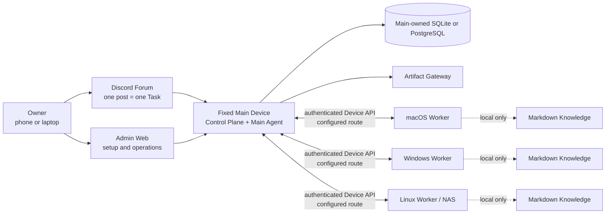

# OpenDelegate

언어: [English](README.md) · **[한국어](README.ko.md)** · [日本語](README.ja.md) ·
[Français](README.fr.md) · [Español](README.es.md) · [简体中文](README.zh-CN.md)

OpenDelegate는 하나의 고정 Main Device와 여러 macOS, Windows, Linux Device에서 AI Agent를 조율하기
위한 개인용 셀프 호스팅 Control Plane입니다.

휴대폰이나 컴퓨터에서 Task를 만들면 Main Agent가 이를 Work Order로 나누고, 해당 Work Order를 수행할
수 있는 Device로 전달합니다. 사용자는 Agent 세션을 하나씩 다시 열지 않아도 지속성 있고 점검 가능한
하나의 결과를 받을 수 있습니다.

> [!WARNING] 이 저장소는 현재 지원되는 OpenDelegate 릴리스가 아니라 **지원되지 않는 내부 프리뷰**를
> 빌드합니다. Main 런타임, 인증된 Admin Task 화면, 그리고 프로덕션 형태를 갖춘 여러 계약은 구현되어
> 있지만, 프로덕션 Worker/Discord/서비스/Agent/Computer Use 실행 연결과 실제 3개 OS 인수 매트릭스는
> 완성되지 않았습니다. 아직 OpenDelegate를 완성된 제품으로 표방하거나 무인 프로덕션 Control
> Plane으로 사용해서는 안 됩니다.

## OpenDelegate를 만드는 이유

- Discord Forum 게시글 하나는 지속성 있는 Task 하나와 하나의 컨텍스트 경계에 대응합니다.
- 결정론적 소프트웨어가 ID, Policy, 상태, 라우팅, Lease, 재시도, 영속성, 상태 전이를 담당합니다.
  Agent는 의미론적 판단과 할당된 작업을 담당합니다.
- Worker는 Main에만 연결됩니다. NxN SSH 메시나 데이터베이스 직접 접근은 필요하지 않습니다.
- Codex, Claude 및 사용자 정의 Runner는 Agent Adapter 계약 뒤에 배치되며, 유용한 Provider-native
  세션은 재개할 수 있습니다.
- 각 Device는 선택적으로 사용하는 연결된 Markdown Knowledge를 로컬에 보관합니다. Main은 파일명,
  제목, 링크, 그래프, 인덱스, 스니펫 또는 내용을 절대 전달받지 않습니다.
- 풍부한 결과물은 명시적인 노출 Policy에 따라 Main이 제공하는 Artifact가 될 수 있습니다.

## 아키텍처



Worker는 OpenDelegate Control Mesh의 일부로 데이터베이스나 서로에게 연결되지 않습니다. LAN, Omada,
Tailscale, 터널, 사용자 정의 네트워크는 Main과 각 Device 사이에서 사용하는 결정론적 Transport
Profile 옵션입니다.

## 현재 소스 상태

다음 표는 지금 실행 가능한 코드와 릴리스에 유효한 외부 시스템에 아직 연결되지 않은 경계를
구분합니다.

| 영역             | 현재 구현되어 테스트할 수 있는 범위                                                                                                                                                                                                                                                     | 첫 Milestone에 여전히 필요한 범위                                                                                                  |
| ---------------- | --------------------------------------------------------------------------------------------------------------------------------------------------------------------------------------------------------------------------------------------------------------------------------------- | ---------------------------------------------------------------------------------------------------------------------------------- |
| Main 및 영속성   | `init`, `serve`, `status`를 제공하는 번들 `opendelegate` CLI, Main 구성, Control Plane 상태, 인증된 Task 점검/긴급 제어 API, 내장 SQLite, PostgreSQL 구성 및 동등한 Storage 계약                                                                                                        | 연결된 오케스트레이션/실행, 지원하는 모든 OS의 깨끗한 Host 및 재시작 증명, 백업/복원 증명, 완전한 Runtime Reconciliation           |
| Owner 접근       | Loopback 전용 최초 Claim, Passphrase 로그인, 복구 코드, 세션 폐기, CSRF 방어 및 SQL 영속성                                                                                                                                                                                              | 릴리스에 유효한 Remote Route, 재시작, 도난 세션 폐기 및 복구 증거                                                                  |
| Admin Web        | 인증된 로그인/복구, 지속성 있는 Task 점검, Pause/Cancel 긴급 제어, 반응형 Device 및 읽기 전용 Configuration Chat 화면, 선택 상태가 유지되는 영어·한국어·일본어·프랑스어·스페인어·중국어(간체) UI. Create/Resume/Retry Fixture는 있지만 실행이 불가능한 동안 패키징된 Main이 이를 차단함 | 연결된 Task 실행 및 Configuration Agent 메시징, 실제 Device Projection, Approval/Audit Inspector 및 실제 장애 인수 테스트          |
| Device Runtime   | Device ID 및 일회용 Enrollment 계약, Worker의 지속성 있는 Inbox/Outbox와 Run Supervision 계약, Discovery, Transport, Lock 및 로컬 Knowledge                                                                                                                                             | 인증된 End-to-End Main–Worker 채널, Enrollment가 완료된 실제 Device, 서비스 설치 및 연결 끊김/재시작 증명                          |
| Agent 및 Discord | Codex CLI, Claude CLI 및 Generic Command Adapter Lifecycle 패키지, 지속성 있는 Discord Forum Mapping, Authorization, Reconciliation, Control 및 Projection 계약                                                                                                                         | 인증된 실제 Provider Session, 프로덕션 Discord HTTP/Gateway Driver, 전용 Community Server, Forum, Bot, Token, Intent 및 Permission |
| Artifact         | Hostile Content 테스트가 포함된 로컬 Artifact Store 및 격리된 Artifact Gateway 계약                                                                                                                                                                                                     | 재개 가능한 Worker Upload, 실제 Discord 표시, Owner Route 노출 및 Cross-network 인수 테스트                                        |
| 플랫폼 서비스    | Windows SCM, macOS launchd 및 Linux systemd Service Plan, Renderer, Readiness Model 및 읽기 전용 Validation Seam                                                                                                                                                                        | 권한이 필요한 Native 설치, 패키징된 Service Executor, 재부팅/Login/Logout 테스트, Upgrade Rollback 및 Signing/Notarization         |
| Computer Use     | Resource-lock Kernel, OS-driver 계약 패키지, Permission/Readiness Probe 및 결정론적 Conformance Fixture                                                                                                                                                                                 | macOS, Windows 및 지원되는 그래픽 Linux에서 동작하는 실제 Input Backend와 Reference Workflow(취소 및 Permission Failure 증명 포함) |

기계가 읽을 수 있는 Release Ledger는
[`docs/release/acceptance-evidence.json`](docs/release/acceptance-evidence.json)에 있습니다.
`pnpm release:status`로 현재 상태를 확인할 수 있습니다. 36개 인수 기준 모두 증거가 필요하며 플랫폼
또는 Computer Use Gate는 하나도 면제할 수 없습니다.

릴리스 관련 용어는 의도적으로 좁은 의미를 가집니다.

| Label                       | 의미                                                               |
| --------------------------- | ------------------------------------------------------------------ |
| Public source pre-alpha     | 검토 가능한 소스. 지원되지 않으며 완성된 설치본이 아님             |
| `internal-preview-*` bundle | 로컬 검증 Payload. 로컬 Smoke Test를 통과해도 항상 지원되지 않음   |
| `release-candidate` bundle  | 36개 Gate를 모두 통과했지만 아직 승격되거나 지원되지 않은 Artifact |
| `released`                  | 별도로 Attestation을 거쳐 지원되는 Channel에 게시된 Artifact       |

현재 `released` Artifact는 없습니다.

## 구현된 Admin Web

아래 스크린샷은 현재 구현된 Admin Web을 보여줍니다. 결정론적 API Fixture를 사용하는 Browser
Suite에서 캡처했습니다. UI는 인증된 Admin API 계약을 호출하지만, 이 이미지는 실제 Discord Binding,
실제 Worker Enrollment 또는 3개 OS 인수 테스트의 증거가 아닙니다. 기본값은 영어입니다. 언어 선택기를
사용하면 Owner 대상 UI 전체를 한국어, 일본어, 프랑스어, 스페인어 또는 중국어(간체)로 전환할 수
있습니다. Owner가 작성한 Task 내용이나 Agent 대화 기록은 번역하지 않습니다.


_Task 작업 Design Fixture: 인증된 목록/상세 데이터 및 제어 기능. 패키징된 Main은 Orchestration
Runtime이 연결될 때까지 실행을 시작하는 동작을 비활성화합니다._


_구현된 Owner 로그인 및 복구 진입 화면. 최초 Owner Claim은 별도의 Loopback 전용 Bootstrap Flow로
유지됩니다._

## 내부 프리뷰 빌드

Release Bundle에는 정확히 **Node.js 24.18.0**이 필요합니다. 저장소에는 pnpm 11.15.1이 고정되어
있습니다. Node.js 22.14 이상인 Node 22 계열은 Contributor 호환성 대상으로 유지되지만 Release
Bundle을 만들 수는 없습니다.

의존성을 설치한 깨끗하고 Commit된 Checkout에서 실행합니다.

```sh
node --version
git status --short
pnpm install --frozen-lockfile
pnpm check
pnpm build
pnpm test:browser
pnpm release:build --destination ABSOLUTE_PATH --internal-preview
```

`node --version`은 `v24.18.0`을 출력해야 하며 `git status --short`는 아무것도 출력하지 않아야
합니다. `ABSOLUTE_PATH`는 소스 Checkout 외부에 있는, 아직 존재하지 않는 경로여야 합니다. Builder는
기존 Destination을 덮어쓰지 않습니다. 최소 Launcher는 깨끗한 Commit을 내보낸 뒤 Assembly 전에 일회용
Snapshot에서 Release Logic을 다시 실행합니다. Builder는 고정된 공식 Node Archive를 내려받고 감사된
SHA-256을 검증하여 플랫폼별 Bundle을 생성합니다. 여기에는 Admin Asset, Init Skill, Release Metadata,
Dependency-instance Legal Inventory, Checksum과 더불어 CLI Help, 깨끗한 Home Initialization, Main
Health, Admin Serving, Owner Claim/Login, Session-cookie Round-trip 및 정상 종료에 대한 Smoke
Evidence가 포함됩니다.

Destination 이름에는 `internal-preview`가 포함되어야 합니다. 생성된 `INTERNAL_PREVIEW.md`와
`release-metadata.json`에는 Bundle이 지원되지 않는다는 사실과 정확한 Release Evidence 상태가
기록됩니다. Foreground Runtime을 점검하려면 다음을 실행합니다.

```powershell
.\opendelegate.cmd init --open
```

```sh
./opendelegate init --open
```

Bundle이 빌드된 플랫폼에 맞는 Launcher를 사용하십시오. 내부 프리뷰는 지속성 있는 OS 서비스를
설치하지 않으며 Release Tag로 게시해서는 안 됩니다.

인수 기준이 하나라도 미완료이면 프로덕션 빌드는 의도적으로 실패합니다.

```sh
pnpm release:gate
pnpm release:build --destination ABSOLUTE_PATH
```

두 명령은 36개 구현 Gate와 실제 증거 Gate를 모두 통과한 뒤에만 성공할 수 있습니다.
[릴리스 증거 가이드](docs/release/README.md)와
[플랫폼 Lab 체크리스트](docs/release/PLATFORM_LAB.md)를 참고하십시오.

## 개발

```sh
pnpm install --frozen-lockfile
pnpm setup:browser
pnpm check
pnpm build
pnpm test:browser
```

`pnpm setup:browser`는 Admin Web Browser Suite용 Chromium을 설치합니다. Linux에서는 Playwright가 OS
의존성 설치도 요청할 수 있습니다.

Admin 개발 서버는 다음 명령으로 실행합니다.

```sh
pnpm dev:admin
```

이 개발 서버는 Owner 설치 경로가 아닙니다. 번들 Main을 검증할 때는 생성된 Internal-preview
Launcher를 사용하십시오.

## 저장소 구성

- `apps/main` — Main 구성 및 결정론적 CLI.
- `apps/control-plane` — 인증된 HTTP 및 Local-claim 경계.
- `apps/admin-web` — Owner 로그인, Task 작업, Device 화면 및 Configuration Chat.
- `apps/artifact-gateway` — 격리된 Artifact 전달 경계.
- `packages/domain`, `packages/policy`, `packages/scheduler` — 결정론적 Domain Mechanic 및 실행
  가능한 Policy.
- `packages/storage-sql`, `packages/owner-auth`, `packages/task-service`, `packages/configuration` —
  Main 영속성 및 Application Service.
- `packages/device-identity`, `packages/worker-runtime`, `packages/transport`,
  `packages/device-discovery` — Device Enrollment 및 Worker-side 계약.
- `packages/agent-adapters`, `packages/discord-adapter` — 여전히 실제 Integration Proof가 필요한
  Provider 및 Forum Adapter 구현.
- `packages/artifact-store` — Main이 소유하는 Artifact Byte 및 Metadata 경계.
- `packages/platform-services`, `packages/computer-use-os` — OS Service 및 Graphical-runtime 계약.
  설치된 서비스나 실제 Desktop Control의 증거는 아닙니다.
- `packages/knowledge` — Device-local Markdown Discovery, 연결형 Retrieval 및 Indexing.
- `packages/acceptance`, `packages/simulator` — 결정론적 Task Journey, Restart Case 및 Replay
  Fixture.
- `skills/opendelegate-init` — 명시적인 Internal-preview Gate를 갖춘 Agent 대상 초기화 Workflow.
- `docs` — Product, Architecture, Security, Design, Research 및 Release Evidence.

## 정식 제품 문서

제품 동작을 계획하거나 변경하기 전에 다음 순서로 읽으십시오.

1. [`CONTEXT.md`](CONTEXT.md) — 간결한 Domain Model, Vocabulary 및 변경할 수 없는 Invariant.
2. [`docs/PRODUCT_SPEC.md`](docs/PRODUCT_SPEC.md) — 전체 Product 및 Architecture 명세.
3. [`docs/IMPLEMENTATION_PLAN.md`](docs/IMPLEMENTATION_PLAN.md) — Delivery Phase, 공개 Test Seam 및
   Release Gate.
4. [`docs/DECISIONS.md`](docs/DECISIONS.md) — 승인된 Product Decision 및 근거.
5. [`docs/research/platform-capabilities.md`](docs/research/platform-capabilities.md) — 1차 출처
   기반 Platform Constraint.

Contributor Workflow는 [CONTRIBUTING.md](CONTRIBUTING.md)에 문서화되어 있습니다. Security Boundary와
검증된 비공개 취약점 신고 경로는 [SECURITY.md](SECURITY.md)에 있습니다.

OpenDelegate는 [Apache License 2.0](LICENSE)으로 배포됩니다. 저장소 콘텐츠, Domain Term, API, Log 및
UI 기본값에는 영어를 사용합니다. 이 README와 Owner 대상 Admin UI는 위에 링크한 다섯 가지 번역으로도
제공됩니다.
