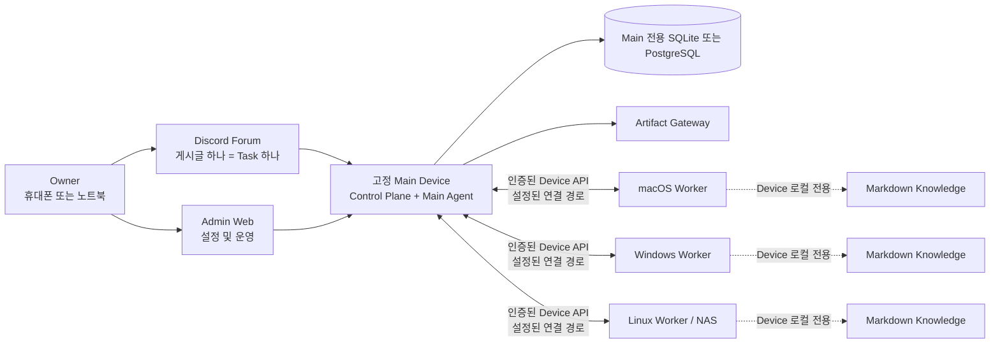

# OpenDelegate

언어: [English](README.md) · **[한국어](README.ko.md)** · [日本語](README.ja.md) ·
[Français](README.fr.md) · [Español](README.es.md) · [简体中文](README.zh-CN.md)

OpenDelegate는 하나의 고정 Main Device와 여러 macOS, Windows, Linux Device에서 AI Agent를 조율하기
위한 개인용 셀프 호스팅 Control Plane입니다.

휴대폰이나 컴퓨터에서 Task를 만들면 Main Agent가 이를 Work Order로 나누고, 해당 Work Order를 수행할
수 있는 Device로 전달합니다. 사용자는 Agent 세션을 하나씩 다시 열지 않아도 지속성 있고 점검 가능한
하나의 결과를 받을 수 있습니다.

> [!WARNING] 이 저장소는 현재 지원되는 OpenDelegate 릴리스가 아니라 **지원되지 않는 내부 프리뷰**를
> 빌드합니다. 이제 소스에는 Main–Worker 오케스트레이션, 프로그래밍 방식 Agent Adapter, 정확한 Action
> Approval, Device-local Knowledge, Native Service Supervision 및 Computer Use를 위한 프로덕션
> 형태의 실행 경로가 구현되어 있습니다. 그러나 소스 구현은 릴리스 증거가 아닙니다. macOS, Windows,
> Linux, Discord, Provider, Private Network, 재시작, 권한 및 패키징에 필요한 실제 증거는 아직
> 완성되지 않았습니다. OpenDelegate를 릴리스된 제품으로 표방하거나 무인 프로덕션 Control Plane으로
> 사용하지 마십시오.

## 빠른 시작

OpenDelegate는 Agent와 함께 설치합니다. Owner 설치 절차에 `npm run start`는 없습니다.

1. 운영체제와 아키텍처에 맞는 bundle을 준비하고, 신뢰할 수 있는 배포 채널에서 bundle과 별도로 받은
   digest로 `SHA256SUMS`를 검증합니다. 현재 저장소가 만드는 것은 명시적으로 표시된 내부 프리뷰
   bundle뿐입니다. [내부 프리뷰 빌드](#내부-프리뷰-빌드)를 참고하십시오.
2. Discord를 사용하려면 [Discord Forum 설정 가이드](docs/DISCORD_SETUP.md)를 따라 최초 Main 초기화
   전에 완전한 Binding을 준비합니다. 현재 프리뷰는 초기화 후 Binding을 추가하거나 교체할 수
   없습니다.
3. 압축을 푼 bundle 디렉터리를 Codex 또는 Claude에서 열고 다음 문장을 그대로 보냅니다: _“Read
   `skills/opendelegate-init/SKILL.md` and initialize this computer as my fixed OpenDelegate Main
   Device. Guide me through every owner decision, keep runtime state outside this bundle, and stop
   if a required safety check fails.”_
4. Agent의 안내에 따라 Owner Claim을 완료하고 일회용 복구 코드 10개를 모두 안전하게 보관합니다.
5. Admin Web 우측 하단의 Configuration Chat에서 Device, Agent, Route, Artifact 설정과 미리 준비한
   Discord 상태를 검토합니다.
6. Device를 추가할 때는 Configuration Chat에서 유효 시간이 짧은 일회용 Device Grant를 발급받습니다.
   파일을 열지 않은 채 Owner가 통제하는 안전한 방법으로 전달한 다음, 대상 Device의 Agent에게
   `skills/opendelegate-join/SKILL.md`를 따르도록 요청합니다.
7. Discord를 설정했다면 독립된 Task마다 Forum에 새 게시글을 하나 만듭니다. 같은 게시글의 답글은
   동일한 Task와 native Agent Session을 이어가며, 새 게시글은 깨끗한 Context에서 시작합니다.
   Discord를 사용하지 않거나 사용할 수 없으면 **Admin Web → Tasks → 새 작업**에서 만듭니다.

Owner 복구, 추가 Device, 첫 Task 및 문제 해결까지 포함한
[전체 설정 가이드(영문)](docs/GETTING_STARTED.md)를 참고하십시오.

## OpenDelegate를 만드는 이유

- Discord Forum 게시글 하나는 지속성 있는 Task 하나와 하나의 컨텍스트 경계에 대응합니다.
- 결정론적 소프트웨어가 ID, Policy, 상태, 라우팅, Lease, 재시도, 영속성, 상태 전이를 담당합니다.
  Agent는 의미론적 판단과 할당된 작업을 담당합니다.
- Worker는 Main에만 연결됩니다. NxN SSH 메시나 데이터베이스 직접 접근은 필요하지 않습니다.
- Codex, Claude 및 사용자 정의 Runner는 Agent Adapter 계약 뒤에 배치되며, 유용한 Provider-native
  세션은 재개할 수 있습니다.
- 각 Device는 선택적으로 사용하는 연결된 Markdown Knowledge를 로컬에 보관합니다. Main은 파일명,
  제목, 링크, 그래프, 인덱스, 스니펫 또는 내용을 절대 전달받지 않습니다.
- 풍부한 결과물은 명시적인 노출 Policy에 따라 Main이 제공하는 Artifact가 될 수 있습니다.

## 아키텍처



Worker는 OpenDelegate Control Mesh의 일부로 데이터베이스나 서로에게 연결되지 않습니다. LAN, Omada,
Tailscale, 터널, 사용자 정의 네트워크는 Main과 각 Device 사이에서 사용하는 결정론적 Transport
Profile 옵션입니다.

## 현재 소스 상태

다음 표는 프로덕션 형태로 구현된 소스 경로와 지원을 표방하기 전에 여전히 필요한 외부 증거를
구분합니다.

| 영역             | 소스에 구현되어 테스트할 수 있는 범위                                                                                                                                                                                                                                                      | 첫 Milestone에 여전히 필요한 범위                                                                                                                                                |
| ---------------- | ------------------------------------------------------------------------------------------------------------------------------------------------------------------------------------------------------------------------------------------------------------------------------------------ | -------------------------------------------------------------------------------------------------------------------------------------------------------------------------------- |
| Main 및 영속성   | 번들 `opendelegate` CLI, 구성된 Control Plane, SQLite/PostgreSQL Storage 계약(호스팅 PostgreSQL 증명은 현재 17로 고정), 지속성 있는 Task 실행·Approval·Audit·Artifact·Enrollment·Discord·Device Channel 서비스, 중단된 Action의 결과가 불명확하면 안전하게 실패하는 시작 시 Reconciliation | 지원을 선언할 각 Main 플랫폼에서의 깨끗한 Host 설치, Database Migration/Restore, Service Restart 및 완전한 Reconciliation 증거. 다른 PostgreSQL 메이저 버전은 아직 검증되지 않음 |
| Owner 접근       | Loopback 전용 최초 Claim, Passphrase 로그인, 복구 코드, 세션 폐기, CSRF 방어 및 SQL 영속성                                                                                                                                                                                                 | 릴리스에 유효한 Remote Route, 재시작, 탈취된 Browser Session 폐기 및 Discord와 독립적인 복구 증거                                                                                |
| Admin Web        | 인증된 Device·Task·Approval·Enrollment·Artifact·Audit·Emergency Control·Configuration Chat 화면, Capability-aware Control, 선택 상태가 유지되는 반응형 영어·한국어·일본어·프랑스어·스페인어·중국어(간체) UI                                                                                | 실제 Device Onboarding 및 장애 상황 Journey, Release Bundle의 Accessibility/Overflow 증거, 실제 운영자 인수 테스트                                                               |
| Device Runtime   | 일회용 Enrollment, Device-scoped Identity, 인증된 Outbound Main–Worker Channel, Lease 기반 Dispatch, 지속성 있는 Inbox/Outbox, Run Supervision, Workspace, 로컬 Agent 실행, 로컬 Knowledge MCP, Computer Use MCP 및 Artifact Upload                                                        | Enrollment가 완료된 실제 Device, Route Loss/Restart Recovery, Omada/Tailscale 형태의 혼합 Route 증거 및 세 OS 계열의 Persistent Service 증거                                     |
| Agent 및 Discord | Codex App Server와 Claude Agent SDK를 우선 사용하는 Adapter, 기능이 제한된 CLI Fallback, Generic Command, Native Session 연속성, Single-writer Enforcement 및 정확한 Action Authorization, Discord HTTP/Gateway·Forum Reconciliation·Control·Main 구성                                     | 고정된 버전의 인증된 실제 Codex/Claude 실행, 전용 Community Server·Forum·Bot·Token·Intent·Permission·Reconnect·Mobile·Outage 증거                                                |
| Knowledge        | Device-local Linked Markdown Discovery, 제한된 Retrieval, 결정론적 Indexing, Admission Check 및 내용을 Main 계약 밖에 유지하는 Agent용 MCP Tool                                                                                                                                            | 각 실제 Device 계열에서 Packet 수준 No-egress 증거와 Create/Update/Rebuild Journey                                                                                               |
| Artifact         | Main 소유 Local Store, 인증된 재개 가능 Worker Upload, 격리된 Static/Interactive Gateway 경로, Signed Access, Exposure Policy 계약 및 Admin 점검                                                                                                                                           | 실제 Discord 표시, Retention/Exposure Journey, 패키징된 Build의 Hostile-content 검증 및 Owner Device에서의 Cross-network 열기                                                    |
| 플랫폼 서비스    | Windows SCM, macOS launchd, Linux systemd/Foreground 소스 구현, 분리된 Core/Owner-session Helper Host, 인증된 Local IPC, Install/Start/Stop/Restart/Upgrade/Rollback/Diagnose/Uninstall 명령 경로                                                                                          | 권한이 필요한 깨끗한 Host 실행, Reboot/Login/Logout Persistence, 실패 Rollback, Permission Onboarding, 필요한 플랫폼의 Signing/Notarization 및 Lab 증거                          |
| Computer Use     | Device-wide Desktop Lock, 정확한 Action Authorization, 일회용 Local Capability Broker, Session-helper IPC, Native Windows/macOS/Linux Backend 소스, Readiness/Permission Probe, Capture/Input/Cancel/Emergency-stop 계약 및 결정론적·Native Fixture 테스트                                 | 실제 macOS·Windows·선언된 그래픽 Linux 환경의 Reference Interaction과 Screenshot·Exclusivity·Cancellation·Permission Failure·Locked-session·Headless Linux 증거                  |

필요한 Sandbox를 강제할 수 있을 때까지 Native Windows의 Claude SDK 실행은 의도적으로 지원 대상으로
표방하지 않습니다. Windows에서는 Codex, WSL2 또는 설정된 Container를 사용하십시오. WSL2나 Container
Worker는 Native Windows Service, Restart, Permission 또는 Computer Use 릴리스 기준을 대체하지
않습니다.

프로젝트 의존성 자동 설치는 현재 자격 증명이 없는 공식 Registry Staging 경계에서 Script를 끈 npm만
지원합니다. OpenDelegate는 명시적으로 설정된 System Package Manager의 설치 전용 요청도 수락하며,
해당 Manager 실행 파일을 고정한 뒤 실행 직전에 다시 검증합니다. 저장소 추가와 원격 설치 프로그램은
계속 승인 대상입니다. 이는 구현 증거일 뿐이며, 기존 Source와 권한 동작이 대상 Clean-host Lab을
통과하기 전에는 어떤 System Package Manager도 Release 지원 대상으로 표방하지 않습니다.

기계가 읽을 수 있는 Release Ledger는
[`docs/release/acceptance-evidence.json`](docs/release/acceptance-evidence.json)에 있습니다.
`pnpm release:status`로 현재 상태를 확인할 수 있습니다. 36개 인수 기준 모두 증거가 필요하며 플랫폼
또는 Computer Use Gate는 하나도 면제할 수 없습니다.

릴리스 관련 용어는 의도적으로 좁은 의미를 가집니다.

| Label                       | 의미                                                                                                                                          |
| --------------------------- | --------------------------------------------------------------------------------------------------------------------------------------------- |
| Public source pre-alpha     | 검토 가능한 소스. 지원되지 않으며 완성된 설치본이 아님                                                                                        |
| `internal-preview-*` bundle | 로컬 검증 Payload. 로컬 Smoke Test를 통과해도 항상 지원되지 않음                                                                              |
| `release-candidate` bundle  | 36개 Gate를 모두 통과했지만 아직 승격되거나 지원되지 않은 Artifact                                                                            |
| `released`                  | 유효한 불변 Candidate와 신뢰된 게시자, Platform Authenticity, Promotion, Supported Channel, Revocation Policy 전체 Chain으로 계산된 실효 상태 |

현재 `released` Artifact는 없습니다.

## 구현된 Admin Web

아래 스크린샷은 현재 구현된 Admin Web을 보여줍니다. 결정론적 API Fixture를 사용하는 Browser
Suite에서 캡처했습니다. UI는 인증된 Admin API 계약을 호출하지만, 이 이미지는 실제 Discord Binding,
실제 Worker Enrollment 또는 3개 OS 인수 테스트의 증거가 아닙니다. 기본값은 영어입니다. 언어 선택기를
사용하면 Owner 대상 UI 전체를 한국어, 일본어, 프랑스어, 스페인어 또는 중국어(간체)로 전환할 수
있습니다. Owner가 작성한 Task 내용이나 Agent 대화 기록은 번역하지 않습니다.


_Task 작업 Design Fixture: 인증된 목록/상세 데이터 및 제어 기능. 각 제어 기능은 Main이 보고한
Capability 상태를 따릅니다. 이 Fixture는 실제 외부 Runtime이 준비되었다는 증거가 아닙니다._


_구현된 Owner 로그인 및 복구 진입 화면. 최초 Owner Claim은 별도의 Loopback 전용 Bootstrap Flow로
유지됩니다._

## 내부 프리뷰 빌드

Release Bundle에는 정확히 **Node.js 24.18.0**이 필요합니다. 저장소에는 pnpm 11.15.1이 고정되어
있습니다. Node.js 22.14 이상인 Node 22 계열은 Contributor 호환성 대상으로 유지되지만 Release
Bundle을 만들 수는 없습니다.

의존성을 설치한 깨끗하고 Commit된 Checkout에서 실행합니다.

```sh
node --version
git status --short
pnpm install --frozen-lockfile
pnpm check
pnpm build
pnpm test:browser
pnpm release:build --destination ABSOLUTE_PATH --internal-preview
```

`node --version`은 `v24.18.0`을 출력해야 하며 `git status --short`는 아무것도 출력하지 않아야
합니다. `ABSOLUTE_PATH`는 소스 Checkout 외부에 있는, 아직 존재하지 않는 경로여야 합니다. Builder는
기존 Destination을 덮어쓰지 않습니다. 최소 Launcher는 깨끗한 Commit을 내보낸 뒤 Assembly 전에 일회용
Snapshot에서 Release Logic을 다시 실행합니다. Builder는 고정된 공식 Node Archive를 내려받고 감사된
SHA-256을 검증하여 플랫폼별 Bundle을 생성합니다. 여기에는 Main/Worker Launcher, Admin Asset,
Init/Join Skill, Release Metadata, Dependency-instance Legal Inventory, Checksum과 더불어
CLI/Service/Worker Command, 깨끗한 Home Initialization, Main Health, Admin Serving, Owner
Claim/Login, Session-cookie Round-trip 및 정상 종료에 대한 제한된 Smoke Evidence가 포함됩니다.

Destination 이름에는 `internal-preview`가 포함되어야 합니다. 생성된 `INTERNAL_PREVIEW.md`와
`release-metadata.json`에는 Bundle이 지원되지 않는다는 사실과 정확한 Release Evidence 상태가
기록됩니다. Discord와 기타 Owner 선택이 지속성 있는 Main 설정 생성 전에 모두 확정되도록, 조립된
Bundle은 위의 Agent-first [빠른 시작](#빠른-시작)을 통해서만 초기화하십시오. 내부 프리뷰는
Foreground에서 실행되고 지속성 있는 OS 서비스를 설치하지 않으며 Release Tag로 게시해서는 안 됩니다.

인수 기준이 하나라도 미완료이면 프로덕션 빌드는 의도적으로 실패합니다.

```sh
pnpm release:gate
pnpm release:build \
  --destination ABSOLUTE_PATH \
  --git-executable ABSOLUTE_UNLINKED_GIT \
  --git-executable-sha256 APPROVED_GIT_EXECUTABLE_SHA256 \
  --runner-executable-sha256 APPROVED_NODE_EXECUTABLE_SHA256
```

위 `release:build` 호출은 Linux x64 Candidate에서만 표시된 그대로 사용할 수 있습니다. macOS와
Windows에서는 대상 플랫폼별 필수 Credential Policy를 다음과 같이 추가해야 합니다.

```sh
  --platform-signing-policy ABSOLUTE_PLATFORM_SIGNING_POLICY \
  --platform-signing-policy-sha256 APPROVED_PLATFORM_SIGNING_POLICY_SHA256
```

`pnpm release:sign`은 명시적으로 확인된 지원되지 않는 Preview에만 의도적으로 제한되며 Release
Candidate를 거부합니다. 36개 Criterion Gate가 완료되면 깨끗하고 Hash가 고정된 대상 네이티브 Runner가
`pnpm release:finalize`를 사용해 각 Production Candidate를 Freeze하고 Candidate-v2 게시자
Attestation을 생성합니다. 구성된 외부 Promotion과 Supported Channel Receipt Chain을 검증해야만 이
불변 Candidate의 실효 상태가 `released`가 될 수 있습니다. 자세한 내용은
[Release Trust 절차](docs/release/README.md#supported-promotion-trust-path)를 참고하십시오.

Credential이 없는 운영자 입력 골격은 다음 명령으로 생성할 수 있습니다.

```sh
pnpm release:examples -- --destination ABSOLUTE_NEW_DIRECTORY
```

모든 생성물에는 `PLACEHOLDER`와 `NOT-A-RELEASE`가 표시되며 Credential, 서명, Artifact, Release
증거를 포함하지 않습니다. 자세한 내용은 [Release 입력 예시 가이드](docs/release/EXAMPLES.md)를
참고하십시오.

프로덕션 `release:gate`와 Candidate 모드 `release:build` 명령은 36개 구현 Gate와 실제 증거 Gate를
모두 통과한 뒤에만 성공할 수 있습니다. 지원되지 않는 Preview에 대한 서명은 이 프로덕션 Gate를
충족하지도 우회하지도 않습니다. [정확한 첫 Milestone 지원 Matrix](docs/release/SUPPORT_MATRIX.md),
[릴리스 증거 가이드](docs/release/README.md)와
[플랫폼 Lab 체크리스트](docs/release/PLATFORM_LAB.md)를 참고하십시오.

## 개발

```sh
pnpm install --frozen-lockfile
pnpm setup:browser
pnpm check
pnpm build
pnpm test:browser
```

`pnpm setup:browser`는 Admin Web Browser Suite용 Chromium을 설치합니다. Linux에서는 Playwright가 OS
의존성 설치도 요청할 수 있습니다.

Admin 개발 서버는 다음 명령으로 실행합니다.

```sh
pnpm dev:admin
```

이 개발 서버는 Owner 설치 경로가 아닙니다. 번들 Main을 검증할 때는 생성된 Internal-preview
Launcher를 사용하십시오.

Codex와 Claude 인증은 기본적으로 각 OpenDelegate Device의 `state/providers/codex` 및
`state/providers/claude`에 격리됩니다. 설정이 끝나면 바로 그 controlled home에서 대화형으로
인증하십시오. OpenDelegate는 사용자의 전역 provider home에서 로그인을 복사하거나 상속하지 않으며,
first-class provider Run은 자격 증명 환경 변수를 거부합니다.

## 저장소 구성

- `apps/main` — Main 구성, 결정론적 CLI, Action Authorization, Device Channel, Discord, Artifact 및
  Agent Runtime 연결.
- `apps/worker`, `apps/service-host` — Enrollment된 Worker Runtime과 Platform Service 정의가
  사용하는 지속성 있는 Core/Session Process Host.
- `apps/control-plane` — 인증된 HTTP 및 Local-claim 경계.
- `apps/admin-web` — Owner 로그인, Device, Task, Approval, Enrollment, Artifact, Audit, 긴급 작업 및
  Configuration Chat.
- `apps/artifact-gateway` — 격리된 Artifact 전달 경계.
- `packages/domain`, `packages/policy`, `packages/scheduler` — 결정론적 Domain Mechanic 및 실행
  가능한 Policy.
- `packages/storage-sql`, `packages/owner-auth`, `packages/task-service`, `packages/configuration` —
  Main 영속성 및 Application Service.
- `packages/device-identity`, `packages/device-channel`, `packages/worker-runtime`,
  `packages/transport`, `packages/device-discovery` — Device Enrollment, 인증된 Main–Worker 통신 및
  Worker 실행.
- `packages/agent-adapters`, `packages/discord-adapter` — 여전히 자격 증명을 사용하는 실제 증거가
  필요한 프로그래밍 방식 Provider 및 Discord Forum 통합.
- `packages/artifact-store` — Main이 소유하는 Artifact Byte 및 Metadata 경계.
- `packages/platform-services`, `packages/computer-use-os` — OS Service 및 Graphical Runtime 구현.
  소스와 Fixture 결과는 지원되는 설치 서비스나 3개 OS Desktop Control의 증거가 아닙니다.
- `packages/session-helper-ipc`, `packages/session-helper-runtime`, `packages/computer-use-mcp`,
  `packages/run-capability-broker` — Run별로 제한되고 인증된 Owner-session Capability.
- `packages/knowledge`, `packages/knowledge-mcp` — Device-local Markdown Discovery, 연결형
  Retrieval, Indexing 및 Agent Tool.
- `packages/acceptance`, `packages/simulator` — 결정론적 Task Journey, Restart Case 및 Replay
  Fixture.
- `skills/opendelegate-init` — 명시적인 Internal-preview Gate를 갖춘 Agent 대상 초기화 Workflow.
- `skills/opendelegate-join` — 자격 증명을 노출하지 않는 Outbound-only Worker Enrollment 및 복구
  Workflow.
- `docs` — Product, Architecture, Security, Design, Research 및 Release Evidence.

## 정식 제품 문서

제품 동작을 계획하거나 변경하기 전에 다음 순서로 읽으십시오.

1. [`CONTEXT.md`](CONTEXT.md) — 간결한 Domain Model, Vocabulary 및 변경할 수 없는 Invariant.
2. [`docs/PRODUCT_SPEC.md`](docs/PRODUCT_SPEC.md) — 전체 Product 및 Architecture 명세.
3. [`docs/IMPLEMENTATION_PLAN.md`](docs/IMPLEMENTATION_PLAN.md) — Delivery Phase, 공개 Test Seam 및
   Release Gate.
4. [`docs/DECISIONS.md`](docs/DECISIONS.md) — 승인된 Product Decision 및 근거.
5. [`docs/research/platform-capabilities.md`](docs/research/platform-capabilities.md) — 1차 출처
   기반 Platform Constraint.

Contributor Workflow는 [CONTRIBUTING.md](CONTRIBUTING.md)에 문서화되어 있습니다. Security Boundary와
검증된 비공개 취약점 신고 경로는 [SECURITY.md](SECURITY.md)에 있습니다. 안전한 Main Metadata
Snapshot과 새 Target 복원 절차는 [Backup 및 Restore 가이드](docs/BACKUP_AND_RESTORE.md)를
참고하십시오.

OpenDelegate는 [Apache License 2.0](LICENSE)으로 배포됩니다. 저장소 콘텐츠, Domain Term, API, Log 및
UI 기본값에는 영어를 사용합니다. 이 README와 Owner 대상 Admin UI는 위에 링크한 다섯 가지 번역으로도
제공됩니다.
