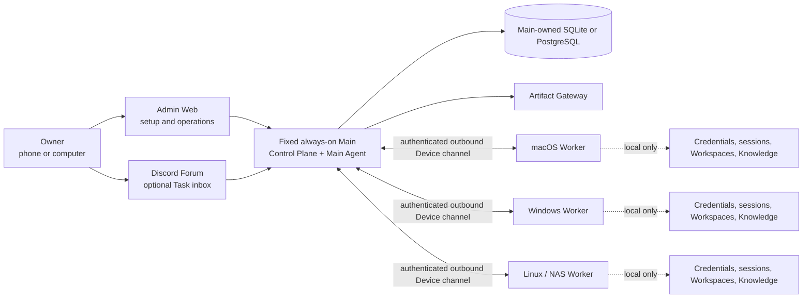

# OpenDelegate

Languages: **[English](README.md)** · [한국어](README.ko.md) · [日本語](README.ja.md) ·
[Français](README.fr.md) · [Español](README.es.md) · [简体中文](README.zh-CN.md)

**Set up one personal control plane for the AI Agents on all of your computers.** Clone or pull this
repository, give it to a capable setup Agent, and let that Agent configure one always-on Main plus
macOS, Windows, and Linux/NAS Worker Devices without making you design the topology yourself.


> [!TIP]
> **Start here:** [What it does](#what-opendelegate-does) ·
> [5-minute setup](#5-minute-setup-recommended) · [Add Devices](#add-every-device) ·
> [Use it](#use-opendelegate) · [Complete guide](docs/GETTING_STARTED.md) ·
> [Hermes guide](docs/HERMES_SETUP_AGENT.md)

> [!WARNING]
> This repository is currently a **public source pre-alpha** that can build an unsupported internal
> preview. No supported OpenDelegate release exists yet. Use it for review and controlled validation;
> do not present it as a production-ready unattended control plane.

## What OpenDelegate does

OpenDelegate is a personal, self-hosted coordinator for Agents running on several Devices:

- one fixed, always-on **Main** owns durable Tasks, scheduling, policy, approvals, audit, and Admin Web;
- every computer, including Main, joins as a **Worker Device** and reports its verified capabilities;
- Workers connect outbound to Main—there is no pairwise SSH mesh and no Worker database credential;
- deterministic code chooses healthy Devices and routes, while Agents handle semantic planning and work;
- each Device keeps credentials, provider sessions, Workspaces, and local Markdown Knowledge locally;
- Admin Web is the setup and operations surface; Discord Forum can be connected later as the primary
  conversational Task inbox, but it is not required for initial setup.

You tell OpenDelegate the outcome. Main may split it across Windows development, macOS build or
signing, and Linux/NAS work, then collect the result without asking you to coordinate each handoff.

## 5-minute setup (recommended)

You do not need to learn OpenDelegate commands first. Use a capable local setup Agent such as
**Hermes, Codex, or Claude**.

### 1. Choose Main

Pick one computer that can remain online and that you can reach for recovery. Main is fixed in the
first milestone. It may be a NAS, server, desktop, or another reliable Device.

### 2. Prepare the setup Agent on Main

Open Hermes, Codex, or Claude on the intended Main. For Hermes, use the
[official Hermes setup path](docs/HERMES_SETUP_AGENT.md) and verify it with `hermes doctor`.
Hermes is a setup Agent here; this does not make it an OpenDelegate runtime Agent Adapter.

### 3. Clone or update OpenDelegate

```sh
git clone https://github.com/jugol/OpenDelegate.git
cd OpenDelegate
```

If the checkout already exists:

```sh
git pull --ff-only
```

When Hermes is the setup Agent for source, trust the repository skills once and start a fresh session:

```sh
hermes skills trust
hermes
```

Source Main setup uses `.agents/skills/opendelegate-init/SKILL.md`; Worker join uses
`.agents/skills/opendelegate-join/SKILL.md`. A verified release bundle instead uses
`skills/opendelegate-init/SKILL.md` and `skills/opendelegate-join/SKILL.md` through its bundled
`AGENTS.md` and does not use project-skill trust. Keep `HERMES_HOME`, OpenDelegate runtime state,
credentials, provider homes, sessions, databases, logs, private keys, Knowledge, Artifacts, and
Device grants outside the checkout or bundle.

### 4. Ask the setup Agent to configure Main

Copy this prompt:

> Set up OpenDelegate on this computer as my fixed, always-on Main Device. Identify whether this is a
> source checkout or a verified release bundle, then follow its AGENTS.md, canonical product documents,
> and Main initialization skill. Keep all runtime state and credentials outside the project. Never ask
> me to paste tokens, credentials, private keys, provider homes, sessions, databases, or grant contents
> into chat. Do everything safe and reversible, ask only for consequential owner decisions or secure
> owner-only actions, report the exact support status, and continue until Admin Web is ready.

The Agent will inspect the host, distinguish source from bundle, check `supportStatus`, prepare an
integrity-checked preview or launcher when applicable, initialize Main, open the local owner-claim
flow, and leave exact recovery steps when an external prerequisite is missing.

### 5. Finish Main in Admin Web

1. Claim the owner account locally and store all ten one-time recovery codes.
2. Run **Assess device** so Main records bounded, non-secret capability evidence.
3. Review the Main and co-located Worker profiles, database, routes, Artifact policy, and startup plan.
4. Add Discord later if you want Forum posts to become durable conversational Tasks.

SQLite is the zero-configuration default. Provider credentials and Discord tokens never belong in
chat; use provider-native authentication or OpenDelegate's secure intake panel.

## Add every Device

Repeat this flow for each macOS, Windows, Linux, or NAS computer:

1. In Main Admin Web, choose **Add Device**, define its intended role, and create a short-lived,
   single-use enrollment grant.
2. Move the **unopened** grant file through an owner-controlled secure handoff. Never paste or attach
   its contents in chat.
3. On the new Device, clone/pull the same repository or open the matching verified bundle. If Hermes
   is used with source, run `hermes skills trust` and start a fresh session there.
4. Give the local Agent this prompt:

   > Join this computer to my fixed OpenDelegate Main as an outbound-only Worker using the unopened
   > single-use grant file at `<absolute-path-to-grant-file>`. Follow AGENTS.md and the matching Worker
   > join skill. Pass only the grant path to OpenDelegate tooling; never print, paste, log, summarize,
   > or copy its contents. Detect this Device's capabilities, keep credentials and Knowledge local,
   > ask before protected network or privileged changes, and verify that Main sees the joined Device.

5. Back in Admin Web, assess the Device, register Workspaces, and review its Roles, Instructions,
   routes, Agent profile, service state, and Computer Use readiness.

Workers connect only to Main. OpenDelegate—not the owner—chooses the eligible Device, route, and
Agent binding for ordinary Tasks.

## Use OpenDelegate

- **Admin Web:** configure the Instance, inspect Devices and Tasks, approve protected work, review
  audit and Artifacts, recover from outages, and create Tasks when Discord is disabled.
- **Discord Forum (optional during setup):** after binding a bot and Forum, one post becomes one
  durable Task; replies continue its native Agent session and a new post starts clean context.
- **Configuration Chat:** change OpenDelegate configuration and Device profiles; do not use it for
  project work.
- **Artifacts:** receive files, reports, images, patches, and isolated hosted results through Main.
- **Owner Handoff:** complete login, MFA, CAPTCHA, legal confirmation, or OS-permission steps without
  exposing credentials to the Agent or Discord.

## How responsibilities are split

- **Main deterministic services:** identity, durable state, eligibility, routes, leases, retries,
  budgets, Policy, approvals, audit, Discord projection, and Artifact delivery.
- **Main Agent:** understands intent, decomposes Tasks, and synthesizes Worker results.
- **Worker services:** Device identity, local capabilities, Workspaces, resource locks, provider
  sessions, local Knowledge, execution, and result upload.
- **Worker Agents:** perform only the assigned Work Order under the Device's exact Policy and binding.

Codex and Claude are the current first-class runtime Agent Adapters. Generic runners remain an
extension point. Hermes is currently documented as a setup Agent only, not as a first-class runtime
Adapter.

## Architecture



LAN, Omada, Tailscale, tunnels, and custom networking are Transport Profile options between each
Worker and Main. They provide reachability, not application identity or permission.

## Current source state

The following table distinguishes production-shaped source paths from the external evidence still
required before support can be claimed.

| Area                 | Implemented and testable in source                                                                                                                                                                                                                                                                           | Still required for the first milestone                                                                                                                                                                                       |
| -------------------- | ------------------------------------------------------------------------------------------------------------------------------------------------------------------------------------------------------------------------------------------------------------------------------------------------------------ | ---------------------------------------------------------------------------------------------------------------------------------------------------------------------------------------------------------------------------- |
| Main and persistence | Bundled `opendelegate` CLI; composed Control Plane; SQLite and PostgreSQL storage contracts (hosted PostgreSQL proof is currently pinned to 17); durable Task execution, approval, audit, Artifact, enrollment, Discord, and Device-channel services; startup reconciliation that fails closed when an interrupted action outcome is unknown | Clean-host installation, database migration and restore, service restart, and complete reconciliation evidence on every declared Main platform; other PostgreSQL major versions remain unproven                              |
| Owner access         | Loopback-only initial claim, passphrase login, recovery codes, session revocation, CSRF protection, and SQL persistence                                                                                                                                                                                      | Release-valid remote-route, restart, browser-theft revocation, and Discord-independent recovery evidence                                                                                                                     |
| Admin Web            | Authenticated Device, Task, Approval, enrollment, Artifact, audit, emergency-control, and Configuration Chat surfaces; capability-aware controls; responsive, persisted English, Korean, Japanese, French, Spanish, and Simplified Chinese presentation                                                        | Real-device onboarding and outage journeys, accessibility and overflow evidence on the release bundles, and live operator acceptance                                                                                         |
| Device runtime       | Single-use enrollment, Device-scoped identity, authenticated outbound Main–Worker channel, leased dispatch, durable inbox/outbox, Run supervision, Workspaces, local Agent execution, local Knowledge MCP, Computer Use MCP, and Artifact upload                                                              | Enrolled physical Devices, route-loss and restart recovery, mixed Omada/Tailscale-style route proof, and persistent service proof on all three OS families                                                                    |
| Agents and Discord   | Codex App Server and Claude Agent SDK as first-class adapters, reduced-capability CLI fallbacks, generic commands, native-session continuity, single-writer enforcement, and exact action authorization; Discord HTTP/Gateway, Forum reconciliation, controls, and Main composition                              | Authenticated live Codex and Claude runs with pinned versions; a dedicated Community Server, Forum, bot, token, intents, permissions, reconnect, mobile, and outage proof                                                      |
| Knowledge            | Device-local linked Markdown discovery, bounded retrieval, deterministic indexing, admission checks, and agent-facing MCP tools whose contents stay outside Main contracts                                                                                                                                   | Packet-level no-egress proof and create/update/rebuild journeys on each real Device family                                                                                                                                    |
| Artifacts            | Main-owned local store, authenticated resumable Worker upload, isolated static and interactive gateway paths, signed access, exposure-policy contracts, and Admin inspection                                                                                                                                  | Live Discord presentation, retention/exposure journeys, hostile-content validation on packaged builds, and cross-network opening from an owner Device                                                                        |
| Platform services    | Windows SCM, macOS launchd, and Linux systemd/foreground source implementations; separate core and owner-session helper hosts; authenticated local IPC; install, start, stop, restart, upgrade, rollback, diagnose, and uninstall command paths                                                                  | Privileged clean-host execution, reboot/login/logout persistence, failure rollback, permission onboarding, platform signing/notarization where applicable, and lab evidence                                                  |
| Computer Use         | Device-wide desktop lock, exact action authorization, one-time local capability broker, session-helper IPC, native Windows/macOS/Linux backend source, readiness and permission probes, capture/input/cancel/emergency-stop contracts, and deterministic/native fixture tests                                 | The reference interaction on physical macOS, Windows, and the declared graphical Linux environment, including screenshot, exclusivity, cancellation, permission failure, locked-session, and headless-Linux evidence         |

Native Windows Claude SDK execution is intentionally not advertised until its required sandbox can
be enforced; use Codex, WSL2, or a configured container there. A WSL2 or container Worker does not
substitute for the native Windows service, restart, permission, or Computer Use release gates.

Automatic project dependency installation currently supports npm only, through a credential-free
official-registry staging boundary with scripts disabled. OpenDelegate also accepts install-only
requests for an explicitly configured system package manager, pins and revalidates that manager
executable, and keeps repository additions and remote installers behind approval. This is
implementation evidence only: no system manager is release-supported until its existing-source and
privilege behavior passes the target clean-host lab.

The machine-readable release ledger is
[`docs/release/acceptance-evidence.json`](docs/release/acceptance-evidence.json).
`pnpm release:status` reports its current state. All 36 acceptance criteria require evidence; none
of the platform or Computer Use gates can be waived.

Release words have deliberately narrow meanings:

| Label                           | Meaning                                                                 |
| ------------------------------- | ----------------------------------------------------------------------- |
| Public source pre-alpha         | Reviewable source; unsupported and not a completed installation         |
| `internal-preview-*` bundle     | Local validation payload; always unsupported, even if local smoke passes |
| `release-candidate` bundle      | All 36 gates passed, but the artifact is not yet promoted or supported  |
| `released`                      | Effective status computed from a valid immutable candidate and the complete trusted publisher, platform-authenticity, promotion, observer read-back, supported-channel, and revocation-policy chain |

No `released` artifact currently exists.

## Implemented Admin Web

The screenshots below show the current Admin Web implementation. They were captured from the browser
suite using deterministic API fixtures. The UI calls the authenticated Admin API contract, but these
images are not evidence of a live Discord binding, real Worker enrollment, or three-OS acceptance.
English is the default. The language control also switches the complete owner-facing surface to
Korean, Japanese, French, Spanish, or Simplified Chinese without translating owner-authored Task
content or Agent conversation history.


_Task operations design fixture: authenticated list/detail data and controls. Each control follows
the capability state reported by Main; this fixture is not evidence that a live external runtime is
ready._


_Implemented owner login and recovery entry surface. Initial owner claim remains a separate
loopback-only bootstrap flow._

## Build an internal preview

Release bundles require exactly **Node.js 24.18.0**. The repository pins pnpm 11.15.1. Node.js 22.14
or later in the Node 22 line remains a contributor compatibility target, but it cannot produce a
release bundle.

From a clean committed checkout and dependency installation:

```sh
node --version
git status --short
pnpm install --frozen-lockfile
pnpm check
pnpm build
pnpm test:browser
pnpm release:build --destination ABSOLUTE_PATH --internal-preview
```

`node --version` must print `v24.18.0`, and `git status --short` must print nothing.
`ABSOLUTE_PATH` must be an absent path outside the source checkout. The builder refuses to overwrite
an existing destination. A minimal launcher exports the clean commit and re-executes the release
logic from that disposable snapshot before assembly. The builder creates a platform-specific bundle
by downloading the pinned official Node archive and verifying its audited SHA-256. It includes Main
and Worker launchers, Admin assets, the init and join skills, release metadata, a
dependency-instance legal inventory, checksums, and bounded smoke evidence for
CLI/service/Worker commands, clean-home initialization, Main health, Admin serving, owner
claim/login, session-cookie round-trip, and clean shutdown.

The destination name must contain `internal-preview`. Generated `INTERNAL_PREVIEW.md` and
`release-metadata.json` record that the bundle is unsupported and preserve the exact release
evidence state. Initialize the assembled bundle only through the Agent-first
[recommended installation](#recommended-installation-ask-your-agent)
above so Discord and every other owner choice are resolved before the durable Main configuration is
created. The internal preview runs in the foreground, does not install a persistent OS service, and
must not be published under a release tag.

The builder smokes the bundle with temporary state and an isolated dynamic loopback listener pair.
It can run while an existing Main owns its configured ports and never stops, reconfigures, or
upgrades that Main. Building creates inactive bytes; persistent activation belongs exclusively to
the packaged native service lifecycle.

A production build intentionally fails while any acceptance criterion is incomplete:

```sh
pnpm release:gate
pnpm release:build \
  --destination ABSOLUTE_PATH \
  --git-executable ABSOLUTE_UNLINKED_GIT \
  --git-executable-sha256 APPROVED_GIT_EXECUTABLE_SHA256 \
  --runner-executable-sha256 APPROVED_NODE_EXECUTABLE_SHA256
```

The `release:build` invocation above is complete as written only for the Linux x64 candidate. On
macOS and Windows, append the required target-native credential policy:

```sh
  --platform-signing-policy ABSOLUTE_PLATFORM_SIGNING_POLICY \
  --platform-signing-policy-sha256 APPROVED_PLATFORM_SIGNING_POLICY_SHA256
```

`pnpm release:sign` is deliberately restricted to explicitly acknowledged unsupported previews.
It rejects release candidates. After the 36-criterion gate is complete, a clean hash-pinned
target-native runner uses `pnpm release:finalize` to freeze each production candidate and create
its candidate-v2 publisher attestation. Only the configured external promotion and
supported-channel receipt chain can make that immutable candidate effectively `released`; see the
[release trust procedure](docs/release/README.md#supported-promotion-trust-path).

Generate credential-free operator input skeletons with:

```sh
pnpm release:examples -- --destination ABSOLUTE_NEW_DIRECTORY
```

Every generated set is marked `PLACEHOLDER` and `NOT-A-RELEASE`; it contains no credentials,
signatures, artifacts, or release evidence. See the
[release input examples guide](docs/release/EXAMPLES.md).

The production `release:gate` and candidate-mode `release:build` commands may succeed only after all
36 implementation and live-evidence gates pass. Unsupported preview signing does not satisfy or
bypass that production gate. See
[the exact first-milestone support matrix](docs/release/SUPPORT_MATRIX.md),
[the release evidence guide](docs/release/README.md), and
[platform lab checklist](docs/release/PLATFORM_LAB.md).

## Development

```sh
pnpm install --frozen-lockfile
pnpm setup:browser
pnpm check
pnpm build
pnpm test:browser
```

`pnpm setup:browser` installs Chromium for the Admin Web browser suite. On Linux, Playwright may
also request operating-system dependencies.

Run the Admin development server with:

```sh
pnpm dev:admin
```

This development server is not an owner installation path. Use the generated internal-preview
launcher when validating the bundled Main.

Codex and Claude authentication is isolated per OpenDelegate Device under
`state/providers/codex` and `state/providers/claude` by default. An owner may pass
`--codex-home ABSOLUTE_PATH` or `--claude-home ABSOLUTE_PATH` during Main init to use
an existing local provider directory as an explicit shared source of truth.
OpenDelegate persists the path without copying login material and uses that same
home for execution and Device assessment. Provider settings, plugins, caches, and
native-session storage are then shared, while each Task still keeps its own native
session. Ambient global homes are never inherited.

## Repository map

- `apps/main` — Main composition, deterministic CLI, action authorization, Device channel, Discord,
  Artifact, and Agent runtime wiring.
- `apps/worker` and `apps/service-host` — enrolled Worker runtime and the persistent core/session
  process hosts used by platform service definitions.
- `apps/control-plane` — authenticated HTTP and local-claim boundaries.
- `apps/admin-web` — owner login, Device, Task, Approval, enrollment, Artifact, audit, emergency
  operations, and Configuration Chat.
- `apps/artifact-gateway` — isolated Artifact delivery boundary.
- `packages/domain`, `packages/policy`, and `packages/scheduler` — deterministic domain mechanics
  and executable policy.
- `packages/storage-sql`, `packages/owner-auth`, `packages/task-service`, and
  `packages/configuration` — Main persistence and application services.
- `packages/device-identity`, `packages/device-channel`, `packages/worker-runtime`,
  `packages/transport`, and `packages/device-discovery` — Device enrollment, authenticated
  Main–Worker communication, and Worker execution.
- `packages/agent-adapters` and `packages/discord-adapter` — programmatic provider and Discord Forum
  integrations that still require credentialed live proof.
- `packages/artifact-store` — Main-owned Artifact bytes and metadata boundary.
- `packages/platform-services` and `packages/computer-use-os` — OS service and graphical-runtime
  implementations; source and fixture results are not evidence of supported installed services or
  three-OS desktop control.
- `packages/session-helper-ipc`, `packages/session-helper-runtime`,
  `packages/computer-use-mcp`, and `packages/run-capability-broker` — authenticated owner-session
  capabilities with bounded, per-Run access.
- `packages/knowledge` and `packages/knowledge-mcp` — Device-local Markdown discovery, linked
  retrieval, indexing, and agent tools.
- `packages/acceptance` and `packages/simulator` — deterministic Task journeys, restart cases, and
  replay fixtures.
- `.agents/skills/opendelegate-init` — agent-facing initialization workflow with explicit internal-preview
  gating.
- `.agents/skills/opendelegate-join` — credential-safe, outbound-only Worker enrollment and recovery
  workflow.
- `docs` — product, architecture, security, design, research, and release evidence.

## Canonical product documents

Read these in order before planning or changing product behavior:

1. [`CONTEXT.md`](CONTEXT.md) — compact domain model, vocabulary, and non-negotiable invariants.
2. [`docs/PRODUCT_SPEC.md`](docs/PRODUCT_SPEC.md) — complete product and architecture specification.
3. [`docs/IMPLEMENTATION_PLAN.md`](docs/IMPLEMENTATION_PLAN.md) — delivery phases, public test
   seams, and release gates.
4. [`docs/DECISIONS.md`](docs/DECISIONS.md) — accepted product decisions and rationale.
5. [`docs/research/platform-capabilities.md`](docs/research/platform-capabilities.md) —
   primary-source platform constraints.

Contributor workflow is documented in [CONTRIBUTING.md](CONTRIBUTING.md). Security boundaries and
the verified private vulnerability-reporting route are in [SECURITY.md](SECURITY.md). Safe Main
metadata snapshots and fresh-target recovery are documented in
[the backup and restore guide](docs/BACKUP_AND_RESTORE.md).

OpenDelegate is licensed under the [Apache License 2.0](LICENSE). Repository content, domain terms,
APIs, logs, and UI defaults use English. This README and owner-facing Admin UI are also available in
the five translations linked at the top.
