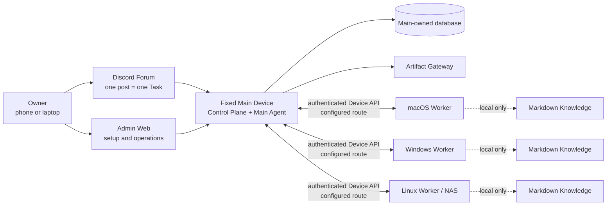
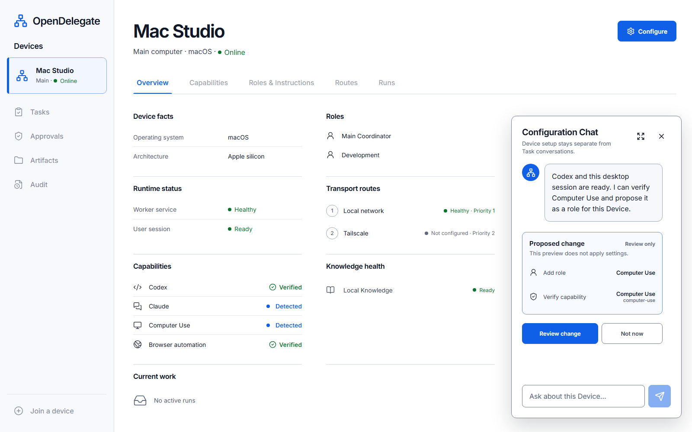

# OpenDelegate

OpenDelegate is a personal, self-hosted control plane for coordinating AI agents
across one fixed Main Device and multiple macOS, Windows, and Linux Devices.

The goal is simple: create a Task from any phone or computer, let the Main Agent
delegate its Work Orders to the right Devices, and receive one inspectable result
without manually reopening every agent session.

> **Pre-release foundation:** this repository does not yet run the first OpenDelegate
> milestone. It currently contains the approved specification, deterministic domain
> and orchestration contracts, a simulated end-to-end seam, and an Admin Web design
> fixture. Do not use it to control real Devices yet.

## Why OpenDelegate

- One Discord Forum post becomes one durable Task and context boundary.
- Deterministic software owns identity, policy, health, routing, leases, retries, and
  state transitions; agents handle semantic judgment and assigned work.
- Workers connect only to Main. They never need an NxN SSH mesh or direct database
  access.
- Codex, Claude, and future runners sit behind Agent Adapter contracts while their
  useful native sessions remain resumable.
- Each Device keeps its own selective, linked Markdown Knowledge. Main never receives
  its files, names, graph, index, or contents.
- Rich results can become Artifacts served by Main under an explicit exposure policy.

## Target architecture

This is the approved target, not a claim about the current runnable foundation.



Workers do not connect to the database or to one another as an OpenDelegate control
mesh. LAN, Omada, Tailscale, tunnels, and custom networking are deterministic
Transport Profile options between Main and each Device.

## What exists today

| Area | Available in this repository | Not available yet |
| --- | --- | --- |
| Product contract | Approved specification, decisions, threat model, and cross-platform acceptance gate | A supported public release |
| Orchestration | Deterministic Phase 1 Task journey, public contracts, replay and failure tests | A running Main service or remote Worker service |
| Admin Web | Responsive one-Device fixture, Configuration Chat interactions, browser tests | Authentication, Control Plane data, or applied configuration |
| Agents and channels | Fake Agent and Forum-like boundaries | Live Codex, Claude, or Discord adapters |
| State and networking | In-memory event, policy, transport, Secret, and lock seams | SQLite/PostgreSQL, enrollment, authenticated Device transport, or service installation |
| Computer Use | Backend-neutral contracts, exclusive lock behavior, and deterministic fake evidence | Real macOS, Windows, or Linux desktop control |

The in-memory seam rejects malformed and inconsistently paired lock state, but it
does not prove resistance to coherent rollback of all durable state. The first
milestone remains gated on the complete real workflow across macOS, Windows, Linux,
and supported graphical Computer Use environments.



_The screenshot is a design and browser-test fixture with sample Device data, not a
live Control Plane connection._

## Repository map

- `apps/admin-web` — the current Admin Web fixture and its component/browser tests.
- `packages/domain`, `packages/policy`, `packages/scheduler` — deterministic domain
  mechanics and executable policy seams.
- `packages/orchestrator`, `packages/event-store` — the simulated Control Plane
  application seam and in-memory journal.
- `packages/agent-adapter`, `packages/transport`, `packages/computer-use` — replaceable
  external-boundary contracts and deterministic fakes.
- `packages/knowledge`, `packages/secrets`, `packages/device-discovery` — Worker-local
  reference services and contracts.
- `packages/acceptance` — the canonical fake Task journey through public contracts.
- `packages/simulator` — a lower-level recorded-event replay and projection fixture,
  not a second product contract.
- `docs` — product, architecture, security, design, research, and delivery contracts.

## Development

The release and CI baseline is Node.js 24 LTS with pnpm 9. Node.js 22.14 remains a
temporary contributor compatibility floor.

```sh
pnpm install --frozen-lockfile
pnpm setup:browser
pnpm check
pnpm build
pnpm test:browser
```

`pnpm setup:browser` installs the Chromium binary used by Admin Web browser tests. On
Linux, Playwright may additionally request operating-system packages; install them
with its printed command or run the equivalent `playwright install --with-deps
chromium` command for your environment.

To inspect the current Admin Web fixture during development:

```sh
pnpm dev:admin
```

The development server prints its local URL. There is intentionally no production
`start` command: the agent-driven `init` experience is delivered only after its
runtime dependencies and recovery paths exist.

## Canonical product documents

Read these in order before planning or changing product behavior:

1. [`CONTEXT.md`](CONTEXT.md) — compact domain model, vocabulary, and non-negotiable
   invariants.
2. [`docs/PRODUCT_SPEC.md`](docs/PRODUCT_SPEC.md) — complete product and architecture
   specification.
3. [`docs/IMPLEMENTATION_PLAN.md`](docs/IMPLEMENTATION_PLAN.md) — delivery phases,
   public test seams, and release gates.
4. [`docs/DECISIONS.md`](docs/DECISIONS.md) — accepted product decisions and rationale.
5. [`docs/research/platform-capabilities.md`](docs/research/platform-capabilities.md)
   — primary-source platform constraints.

The first milestone acceptance list is
[here](docs/PRODUCT_SPEC.md#first-milestone-acceptance-criteria). Contributor
workflow is documented in [CONTRIBUTING.md](CONTRIBUTING.md), security boundaries and
reporting status in [SECURITY.md](SECURITY.md), and implementation decisions in
[docs/adr](docs/adr).

OpenDelegate is licensed under the [Apache License 2.0](LICENSE). Repository content,
domain terms, APIs, logs, and UI defaults use English.
