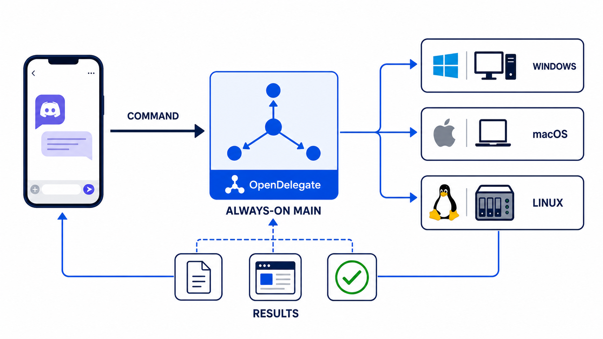
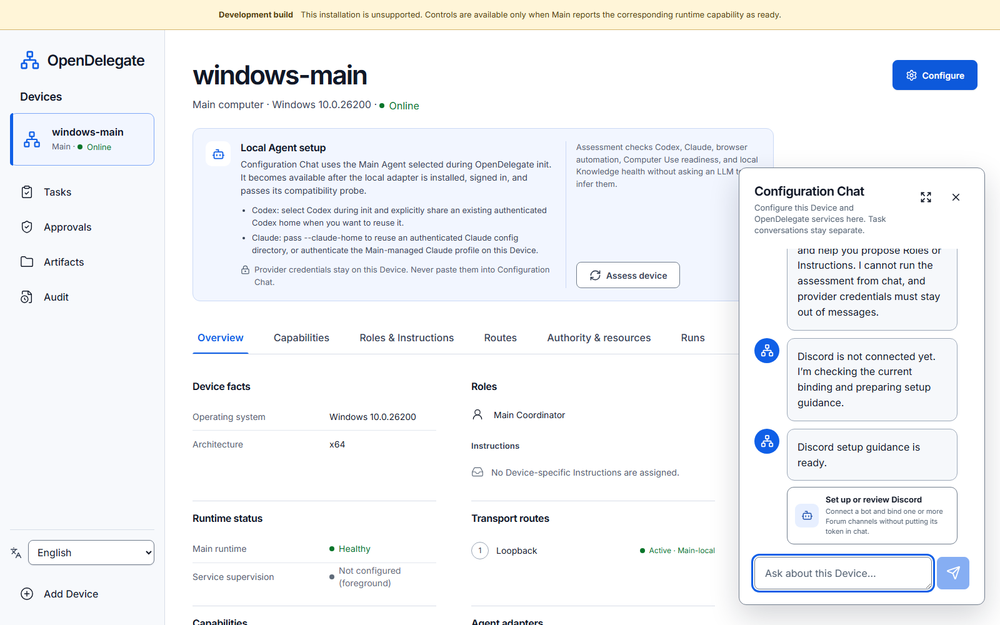
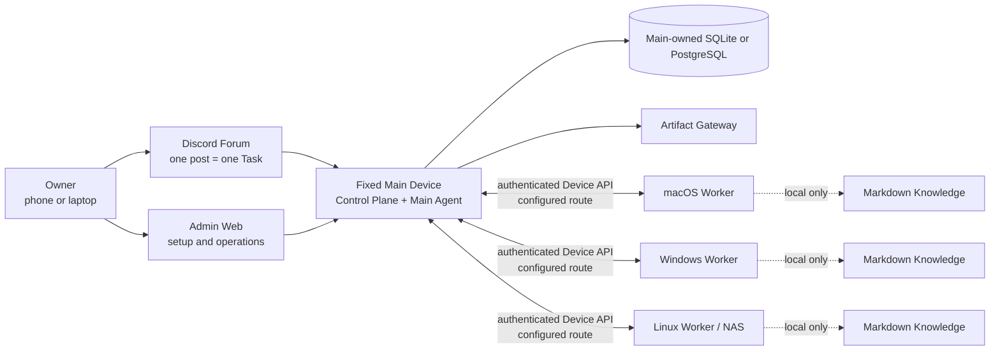

# OpenDelegate

Languages: **[English](README.md)** · [한국어](README.ko.md) · [日本語](README.ja.md) ·
[Français](README.fr.md) · [Español](README.es.md) · [简体中文](README.zh-CN.md)

**Tell OpenDelegate the outcome you want in Discord; it decides where and how to run it.** Your
phone or laptop may disconnect while a fixed always-on Main coordinates macOS, Windows, and Linux.



> [!TIP]
> **Start here:** [Recommended installation](#recommended-installation-ask-your-agent) ·
> [Detailed setup](#detailed-setup) ·
> [Complete setup guide](docs/GETTING_STARTED.md) ·
> [Discord Forum setup](docs/DISCORD_SETUP.md)

## Recommended installation: ask your Agent

**This is the shortest and recommended path. You do not need to learn OpenDelegate commands
first.**

1. Go to the computer you want to keep as your fixed, always-on **Main Device**.
2. Open a capable local Agent such as Codex or Claude and give it this repository URL.
3. Send this:

   > Set up OpenDelegate on this computer as my fixed, always-on Main Device. Follow the
   > repository's own Main installation instructions and do everything you safely can. Ask me only
   > when you need a decision or a secure owner-only action. Never ask me to paste credentials,
   > tokens, or other secrets into chat; guide me through provider-native authentication or
   > OpenDelegate's secure intake instead. Continue until Admin Web opens and setup is ready to
   > finish there.

4. Follow the Agent's questions. It will discover the repository's init skill, distinguish source
   from a release bundle, verify the support status, keep runtime data outside the checkout, and
   bring up Admin Web without making you translate this README into shell commands.

When Admin Web opens, continue in the **Configuration Chat** on the right. Ask the Agent to inspect
what is already configured and guide you through the rest in natural language: Device assessment,
embedded SQLite or external PostgreSQL, Codex and Claude, Discord Forum, connection routes, Agent
models, Artifact exposure, service startup, and additional Devices. OpenDelegate shows reviewable
structured changes in the conversation instead of expecting you to find every settings screen.



_Current Admin Web captured from deterministic browser fixtures. Start with **Assess device**, then
use Configuration Chat for the remaining setup. The banner accurately marks this source build as
unsupported; the image is not live-platform or release evidence._

SQLite is already the zero-configuration local default, so it does not need a database URI.
Provider credentials and Discord tokens never belong in chat: when one is genuinely needed,
Configuration Chat explains why and exposes the dedicated secure intake form. After Main is ready,
use **Add Device** and give each additional computer's Agent its single-use grant; that Agent will
discover the Worker join instructions.

## Detailed setup

> [!WARNING]
> This repository currently builds an **unsupported internal preview**, not a supported OpenDelegate
> release. Required live platform, provider, Discord, network, permission, and
> packaging evidence is incomplete. Do not represent it as released or run it as an unattended
> production control plane. See [Current source state](#current-source-state).

OpenDelegate is installed with an Agent; there is no `npm run start` owner workflow.

1. Give this repository URL to Codex or Claude on the intended Main computer. If you already have a
   supported platform bundle,
   open its extracted directory instead. The Agent will identify the source or bundle, inspect
   `supportStatus`, and verify `SHA256SUMS`; the current source can produce only the marked
   [internal preview described below](#build-an-internal-preview).
2. Send the prompt from [Recommended installation](#recommended-installation-ask-your-agent). The
   Agent discovers the repository contract and `skills/opendelegate-init/SKILL.md`; you do not need
   to know its internal file layout.
3. Discord is optional during first initialization. You can add, replace, extend, or disable its
   Forum binding later through the owner-authenticated Configuration Chat; use the
   [Discord Forum setup guide](docs/DISCORD_SETUP.md) for the required App, Forum, tags, and
   permissions.
4. Follow the Agent through owner claim, save the ten recovery codes, then select **Assess device**
   in Admin Web. Review the deterministic Codex, Claude, browser automation, Computer Use, and
   Knowledge result before finishing Device, Agent, route, Artifact, and optional Discord setup in
   Configuration Chat. Provider credentials never go into chat; Discord tokens use only the secure
   credential panel.
5. To add a computer, give its Agent this repository or the matching verified bundle plus the
   unopened short-lived Device grant, and ask it to join that computer as a Worker. The Agent
   discovers `skills/opendelegate-join/SKILL.md`. Workers connect only to Main; you do not choose
   future placement or build pairwise SSH trust.
6. If Discord is configured, create a Discord Forum post containing the outcome you want. One post
   is one durable Task; replies
   continue its native Agent session, while a new post starts a clean context. If Discord is
   unavailable or disabled, use **Admin Web → Tasks → New task** to create a minimal Task.

Each Device defaults to **Agent execution → Auto**. You can choose **Prefer** or **Pinned** from its
Device page, or tell that Device’s Configuration Chat, for example, _“Use Claude Opus on this
NAS.”_ Repeat on the Mac Studio with the GPT model you want. OpenDelegate resolves each request
against that target Device’s tested model catalog, shows the exact provider-native model ID for
review, and applies it only to new native sessions.

Read the [complete setup guide](docs/GETTING_STARTED.md), including owner recovery, additional
Devices, the first Task, and troubleshooting.

## Why OpenDelegate

Create a Task from a phone or computer and state the result, not the placement plan. The Main Agent
can divide it into Windows development, macOS build or signing, and Linux server Work Orders, while
deterministic scheduling chooses the eligible Devices and routes.

- One Discord Forum post maps to one durable Task and context boundary.
- Optional deterministic monitors can originate the same ordinary Forum-backed Tasks
  for incidents or improvements. Per-category authority can disable, propose for
  review, or execute them without bypassing Policy, approvals, budgets, or audit.
- Your command-sending phone or laptop can disconnect. Only the fixed Main and Devices needed for
  current work must be available.
- Placement is visible in Admin and audit, but routine Tasks do not require you to choose a Device,
  OS, route, or Agent provider.
- Deterministic software owns identity, policy, health, routing, leases, retries, persistence, and
  state transitions. Agents handle semantic judgment and assigned work.
- Workers connect only to Main. They do not need an NxN SSH mesh or direct database access.
- Codex, Claude, and custom runners sit behind Agent Adapter contracts while useful provider-native
  sessions remain resumable.
- A ready bridged Codex or Claude Worker may use up to four local child Agents for one Work Order;
  they stay inside that Run's Workspace and Policy, while only Main can delegate across Devices.
- Each Device keeps its own selective, linked Markdown Knowledge. Main never receives its filenames,
  titles, links, graph, index, snippets, or content.
- Results can arrive as a Discord response or attachment, file, Artifact, hosted view, or verified
  Git reference.
- If login, MFA, CAPTCHA, legal confirmation, or OS permission needs you, the same Task can pause
  with a time-bounded, revocable Owner Handoff through Main and continue after you reply. A raw
  Worker VNC endpoint or credential is never posted to Discord by default.

## Architecture



Workers do not connect to the database or to one another as an OpenDelegate control mesh. LAN,
Omada, Tailscale, tunnels, and custom networking are deterministic Transport Profile options between
Main and each Device.

## Current source state

The following table distinguishes production-shaped source paths from the external evidence still
required before support can be claimed.

| Area                 | Implemented and testable in source                                                                                                                                                                                                                                                                           | Still required for the first milestone                                                                                                                                                                                       |
| -------------------- | ------------------------------------------------------------------------------------------------------------------------------------------------------------------------------------------------------------------------------------------------------------------------------------------------------------ | ---------------------------------------------------------------------------------------------------------------------------------------------------------------------------------------------------------------------------- |
| Main and persistence | Bundled `opendelegate` CLI; composed Control Plane; SQLite and PostgreSQL storage contracts (hosted PostgreSQL proof is currently pinned to 17); durable Task execution, approval, audit, Artifact, enrollment, Discord, and Device-channel services; startup reconciliation that fails closed when an interrupted action outcome is unknown | Clean-host installation, database migration and restore, service restart, and complete reconciliation evidence on every declared Main platform; other PostgreSQL major versions remain unproven                              |
| Owner access         | Loopback-only initial claim, passphrase login, recovery codes, session revocation, CSRF protection, and SQL persistence                                                                                                                                                                                      | Release-valid remote-route, restart, browser-theft revocation, and Discord-independent recovery evidence                                                                                                                     |
| Admin Web            | Authenticated Device, Task, Approval, enrollment, Artifact, audit, emergency-control, and Configuration Chat surfaces; capability-aware controls; responsive, persisted English, Korean, Japanese, French, Spanish, and Simplified Chinese presentation                                                        | Real-device onboarding and outage journeys, accessibility and overflow evidence on the release bundles, and live operator acceptance                                                                                         |
| Device runtime       | Single-use enrollment, Device-scoped identity, authenticated outbound Main–Worker channel, leased dispatch, durable inbox/outbox, Run supervision, Workspaces, local Agent execution, local Knowledge MCP, Computer Use MCP, and Artifact upload                                                              | Enrolled physical Devices, route-loss and restart recovery, mixed Omada/Tailscale-style route proof, and persistent service proof on all three OS families                                                                    |
| Agents and Discord   | Codex App Server and Claude Agent SDK as first-class adapters, reduced-capability CLI fallbacks, generic commands, native-session continuity, single-writer enforcement, and exact action authorization; Discord HTTP/Gateway, Forum reconciliation, controls, and Main composition                              | Authenticated live Codex and Claude runs with pinned versions; a dedicated Community Server, Forum, bot, token, intents, permissions, reconnect, mobile, and outage proof                                                      |
| Knowledge            | Device-local linked Markdown discovery, bounded retrieval, deterministic indexing, admission checks, and agent-facing MCP tools whose contents stay outside Main contracts                                                                                                                                   | Packet-level no-egress proof and create/update/rebuild journeys on each real Device family                                                                                                                                    |
| Artifacts            | Main-owned local store, authenticated resumable Worker upload, isolated static and interactive gateway paths, signed access, exposure-policy contracts, and Admin inspection                                                                                                                                  | Live Discord presentation, retention/exposure journeys, hostile-content validation on packaged builds, and cross-network opening from an owner Device                                                                        |
| Platform services    | Windows SCM, macOS launchd, and Linux systemd/foreground source implementations; separate core and owner-session helper hosts; authenticated local IPC; install, start, stop, restart, upgrade, rollback, diagnose, and uninstall command paths                                                                  | Privileged clean-host execution, reboot/login/logout persistence, failure rollback, permission onboarding, platform signing/notarization where applicable, and lab evidence                                                  |
| Computer Use         | Device-wide desktop lock, exact action authorization, one-time local capability broker, session-helper IPC, native Windows/macOS/Linux backend source, readiness and permission probes, capture/input/cancel/emergency-stop contracts, and deterministic/native fixture tests                                 | The reference interaction on physical macOS, Windows, and the declared graphical Linux environment, including screenshot, exclusivity, cancellation, permission failure, locked-session, and headless-Linux evidence         |

Native Windows Claude SDK execution is intentionally not advertised until its required sandbox can
be enforced; use Codex, WSL2, or a configured container there. A WSL2 or container Worker does not
substitute for the native Windows service, restart, permission, or Computer Use release gates.

Automatic project dependency installation currently supports npm only, through a credential-free
official-registry staging boundary with scripts disabled. OpenDelegate also accepts install-only
requests for an explicitly configured system package manager, pins and revalidates that manager
executable, and keeps repository additions and remote installers behind approval. This is
implementation evidence only: no system manager is release-supported until its existing-source and
privilege behavior passes the target clean-host lab.

The machine-readable release ledger is
[`docs/release/acceptance-evidence.json`](docs/release/acceptance-evidence.json).
`pnpm release:status` reports its current state. All 36 acceptance criteria require evidence; none
of the platform or Computer Use gates can be waived.

Release words have deliberately narrow meanings:

| Label                           | Meaning                                                                 |
| ------------------------------- | ----------------------------------------------------------------------- |
| Public source pre-alpha         | Reviewable source; unsupported and not a completed installation         |
| `internal-preview-*` bundle     | Local validation payload; always unsupported, even if local smoke passes |
| `release-candidate` bundle      | All 36 gates passed, but the artifact is not yet promoted or supported  |
| `released`                      | Effective status computed from a valid immutable candidate and the complete trusted publisher, platform-authenticity, promotion, observer read-back, supported-channel, and revocation-policy chain |

No `released` artifact currently exists.

## Implemented Admin Web

The screenshots below show the current Admin Web implementation. They were captured from the browser
suite using deterministic API fixtures. The UI calls the authenticated Admin API contract, but these
images are not evidence of a live Discord binding, real Worker enrollment, or three-OS acceptance.
English is the default. The language control also switches the complete owner-facing surface to
Korean, Japanese, French, Spanish, or Simplified Chinese without translating owner-authored Task
content or Agent conversation history.


_Task operations design fixture: authenticated list/detail data and controls. Each control follows
the capability state reported by Main; this fixture is not evidence that a live external runtime is
ready._


_Implemented owner login and recovery entry surface. Initial owner claim remains a separate
loopback-only bootstrap flow._

## Build an internal preview

Release bundles require exactly **Node.js 24.18.0**. The repository pins pnpm 11.15.1. Node.js 22.14
or later in the Node 22 line remains a contributor compatibility target, but it cannot produce a
release bundle.

From a clean committed checkout and dependency installation:

```sh
node --version
git status --short
pnpm install --frozen-lockfile
pnpm check
pnpm build
pnpm test:browser
pnpm release:build --destination ABSOLUTE_PATH --internal-preview
```

`node --version` must print `v24.18.0`, and `git status --short` must print nothing.
`ABSOLUTE_PATH` must be an absent path outside the source checkout. The builder refuses to overwrite
an existing destination. A minimal launcher exports the clean commit and re-executes the release
logic from that disposable snapshot before assembly. The builder creates a platform-specific bundle
by downloading the pinned official Node archive and verifying its audited SHA-256. It includes Main
and Worker launchers, Admin assets, the init and join skills, release metadata, a
dependency-instance legal inventory, checksums, and bounded smoke evidence for
CLI/service/Worker commands, clean-home initialization, Main health, Admin serving, owner
claim/login, session-cookie round-trip, and clean shutdown.

The destination name must contain `internal-preview`. Generated `INTERNAL_PREVIEW.md` and
`release-metadata.json` record that the bundle is unsupported and preserve the exact release
evidence state. Initialize the assembled bundle only through the Agent-first
[recommended installation](#recommended-installation-ask-your-agent)
above so Discord and every other owner choice are resolved before the durable Main configuration is
created. The internal preview runs in the foreground, does not install a persistent OS service, and
must not be published under a release tag.

The builder smokes the bundle with temporary state and an isolated dynamic loopback listener pair.
It can run while an existing Main owns its configured ports and never stops, reconfigures, or
upgrades that Main. Building creates inactive bytes; persistent activation belongs exclusively to
the packaged native service lifecycle.

A production build intentionally fails while any acceptance criterion is incomplete:

```sh
pnpm release:gate
pnpm release:build \
  --destination ABSOLUTE_PATH \
  --git-executable ABSOLUTE_UNLINKED_GIT \
  --git-executable-sha256 APPROVED_GIT_EXECUTABLE_SHA256 \
  --runner-executable-sha256 APPROVED_NODE_EXECUTABLE_SHA256
```

The `release:build` invocation above is complete as written only for the Linux x64 candidate. On
macOS and Windows, append the required target-native credential policy:

```sh
  --platform-signing-policy ABSOLUTE_PLATFORM_SIGNING_POLICY \
  --platform-signing-policy-sha256 APPROVED_PLATFORM_SIGNING_POLICY_SHA256
```

`pnpm release:sign` is deliberately restricted to explicitly acknowledged unsupported previews.
It rejects release candidates. After the 36-criterion gate is complete, a clean hash-pinned
target-native runner uses `pnpm release:finalize` to freeze each production candidate and create
its candidate-v2 publisher attestation. Only the configured external promotion and
supported-channel receipt chain can make that immutable candidate effectively `released`; see the
[release trust procedure](docs/release/README.md#supported-promotion-trust-path).

Generate credential-free operator input skeletons with:

```sh
pnpm release:examples -- --destination ABSOLUTE_NEW_DIRECTORY
```

Every generated set is marked `PLACEHOLDER` and `NOT-A-RELEASE`; it contains no credentials,
signatures, artifacts, or release evidence. See the
[release input examples guide](docs/release/EXAMPLES.md).

The production `release:gate` and candidate-mode `release:build` commands may succeed only after all
36 implementation and live-evidence gates pass. Unsupported preview signing does not satisfy or
bypass that production gate. See
[the exact first-milestone support matrix](docs/release/SUPPORT_MATRIX.md),
[the release evidence guide](docs/release/README.md), and
[platform lab checklist](docs/release/PLATFORM_LAB.md).

## Development

```sh
pnpm install --frozen-lockfile
pnpm setup:browser
pnpm check
pnpm build
pnpm test:browser
```

`pnpm setup:browser` installs Chromium for the Admin Web browser suite. On Linux, Playwright may
also request operating-system dependencies.

Run the Admin development server with:

```sh
pnpm dev:admin
```

This development server is not an owner installation path. Use the generated internal-preview
launcher when validating the bundled Main.

Codex and Claude authentication is isolated per OpenDelegate Device under
`state/providers/codex` and `state/providers/claude` by default. An owner may pass
`--codex-home ABSOLUTE_PATH` or `--claude-home ABSOLUTE_PATH` during Main init to use
an existing local provider directory as an explicit shared source of truth.
OpenDelegate persists the path without copying login material and uses that same
home for execution and Device assessment. Provider settings, plugins, caches, and
native-session storage are then shared, while each Task still keeps its own native
session. Ambient global homes are never inherited.

## Repository map

- `apps/main` — Main composition, deterministic CLI, action authorization, Device channel, Discord,
  Artifact, and Agent runtime wiring.
- `apps/worker` and `apps/service-host` — enrolled Worker runtime and the persistent core/session
  process hosts used by platform service definitions.
- `apps/control-plane` — authenticated HTTP and local-claim boundaries.
- `apps/admin-web` — owner login, Device, Task, Approval, enrollment, Artifact, audit, emergency
  operations, and Configuration Chat.
- `apps/artifact-gateway` — isolated Artifact delivery boundary.
- `packages/domain`, `packages/policy`, and `packages/scheduler` — deterministic domain mechanics
  and executable policy.
- `packages/storage-sql`, `packages/owner-auth`, `packages/task-service`, and
  `packages/configuration` — Main persistence and application services.
- `packages/device-identity`, `packages/device-channel`, `packages/worker-runtime`,
  `packages/transport`, and `packages/device-discovery` — Device enrollment, authenticated
  Main–Worker communication, and Worker execution.
- `packages/agent-adapters` and `packages/discord-adapter` — programmatic provider and Discord Forum
  integrations that still require credentialed live proof.
- `packages/artifact-store` — Main-owned Artifact bytes and metadata boundary.
- `packages/platform-services` and `packages/computer-use-os` — OS service and graphical-runtime
  implementations; source and fixture results are not evidence of supported installed services or
  three-OS desktop control.
- `packages/session-helper-ipc`, `packages/session-helper-runtime`,
  `packages/computer-use-mcp`, and `packages/run-capability-broker` — authenticated owner-session
  capabilities with bounded, per-Run access.
- `packages/knowledge` and `packages/knowledge-mcp` — Device-local Markdown discovery, linked
  retrieval, indexing, and agent tools.
- `packages/acceptance` and `packages/simulator` — deterministic Task journeys, restart cases, and
  replay fixtures.
- `skills/opendelegate-init` — agent-facing initialization workflow with explicit internal-preview
  gating.
- `skills/opendelegate-join` — credential-safe, outbound-only Worker enrollment and recovery
  workflow.
- `docs` — product, architecture, security, design, research, and release evidence.

## Canonical product documents

Read these in order before planning or changing product behavior:

1. [`CONTEXT.md`](CONTEXT.md) — compact domain model, vocabulary, and non-negotiable invariants.
2. [`docs/PRODUCT_SPEC.md`](docs/PRODUCT_SPEC.md) — complete product and architecture specification.
3. [`docs/IMPLEMENTATION_PLAN.md`](docs/IMPLEMENTATION_PLAN.md) — delivery phases, public test
   seams, and release gates.
4. [`docs/DECISIONS.md`](docs/DECISIONS.md) — accepted product decisions and rationale.
5. [`docs/research/platform-capabilities.md`](docs/research/platform-capabilities.md) —
   primary-source platform constraints.

Contributor workflow is documented in [CONTRIBUTING.md](CONTRIBUTING.md). Security boundaries and
the verified private vulnerability-reporting route are in [SECURITY.md](SECURITY.md). Safe Main
metadata snapshots and fresh-target recovery are documented in
[the backup and restore guide](docs/BACKUP_AND_RESTORE.md).

OpenDelegate is licensed under the [Apache License 2.0](LICENSE). Repository content, domain terms,
APIs, logs, and UI defaults use English. This README and owner-facing Admin UI are also available in
the five translations linked at the top.
