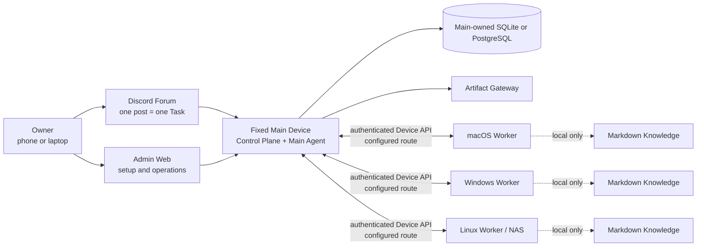

# OpenDelegate

OpenDelegate is a personal, self-hosted control plane for coordinating AI agents across one fixed
Main Device and multiple macOS, Windows, and Linux Devices.

Create a Task from a phone or computer, let the Main Agent divide it into Work Orders, route those
Work Orders to eligible Devices, and receive one durable, inspectable result without manually
reopening every agent session.

> [!WARNING] This repository currently builds an **unsupported internal preview**, not a supported
> OpenDelegate release. The Main runtime, authenticated Admin Task surface, and many
> production-shaped contracts exist, but production Worker/Discord/service/Agent/Computer Use
> execution wiring and the live three-OS acceptance matrix are incomplete. OpenDelegate must not be
> represented as complete or used as an unattended production control plane yet.

## Why OpenDelegate

- One Discord Forum post maps to one durable Task and context boundary.
- Deterministic software owns identity, policy, health, routing, leases, retries, persistence, and
  state transitions. Agents handle semantic judgment and assigned work.
- Workers connect only to Main. They do not need an NxN SSH mesh or direct database access.
- Codex, Claude, and custom runners sit behind Agent Adapter contracts while useful provider-native
  sessions remain resumable.
- Each Device keeps its own selective, linked Markdown Knowledge. Main never receives its filenames,
  titles, links, graph, index, snippets, or content.
- Rich results can become Artifacts served by Main under an explicit exposure policy.

## Architecture



Workers do not connect to the database or to one another as an OpenDelegate control mesh. LAN,
Omada, Tailscale, tunnels, and custom networking are deterministic Transport Profile options between
Main and each Device.

## Current source state

The following table distinguishes runnable code from boundaries that are not yet connected to
release-valid external systems.

| Area                 | Implemented and testable now                                                                                                                                                                                  | Still required for the first milestone                                                                                                                |
| -------------------- | ------------------------------------------------------------------------------------------------------------------------------------------------------------------------------------------------------------- | ----------------------------------------------------------------------------------------------------------------------------------------------------- |
| Main and persistence | Bundled `opendelegate` CLI with `init`, `serve`, and `status`; Main composition; Control Plane health; authenticated Task inspection/emergency-control APIs; embedded SQLite; PostgreSQL configuration and equivalent storage contracts | Connected orchestration/execution, clean-host and restart proof on every supported OS, backup/restore proof, and complete runtime reconciliation      |
| Owner access         | Loopback-only initial claim, passphrase login, recovery codes, session revocation, CSRF protection, and SQL persistence                                                                                       | Release-valid remote-route, restart, theft-revocation, and recovery evidence                                                                          |
| Admin Web            | Authenticated login/recovery; durable Task inspection; pause/cancel emergency controls; responsive Device and read-only Configuration Chat surfaces. Creation/resume/retry fixtures exist but packaged Main gates them while execution is unavailable | Connected Task execution and Configuration Agent messaging, real Device projections, approvals/audit inspectors, and live outage acceptance           |
| Device runtime       | Device identity and single-use enrollment contracts, Worker durable inbox/outbox and Run supervision contracts, discovery, transport, locks, and local Knowledge                                              | Authenticated end-to-end Main–Worker channel, enrolled real Devices, service installation, and disconnect/restart proof                               |
| Agents and Discord   | Codex CLI, Claude CLI, and generic command adapter lifecycle packages; durable Discord Forum mapping, authorization, reconciliation, controls, and projection contracts                                       | Authenticated live provider sessions; production Discord HTTP/Gateway driver; dedicated Community Server, Forum, bot, token, intents, and permissions |
| Artifacts            | Local Artifact Store and isolated Artifact Gateway contracts with hostile-content tests                                                                                                                       | Resumable Worker upload, live Discord presentation, owner-route exposure, and cross-network acceptance                                                |
| Platform services    | Windows SCM, macOS launchd, and Linux systemd service plans, renderers, readiness models, and read-only validation seams                                                                                      | Privileged native installation, packaged service executors, reboot/login/logout tests, upgrade rollback, and signing/notarization                     |
| Computer Use         | Resource-lock kernel, OS-driver contract package, permission/readiness probes, and deterministic conformance fixtures                                                                                         | A real input backend and reference workflow on macOS, Windows, and supported graphical Linux, including cancellation and permission-failure proof     |

The machine-readable release ledger is
[`docs/release/acceptance-evidence.json`](docs/release/acceptance-evidence.json).
`pnpm release:status` reports its current state. All 36 acceptance criteria require evidence; none
of the platform or Computer Use gates can be waived.

Release words have deliberately narrow meanings:

| Label                           | Meaning                                                                 |
| ------------------------------- | ----------------------------------------------------------------------- |
| Public source pre-alpha         | Reviewable source; unsupported and not a completed installation         |
| `internal-preview-*` bundle     | Local validation payload; always unsupported, even if local smoke passes |
| `release-candidate` bundle      | All 36 gates passed, but the artifact is not yet promoted or supported  |
| `released`                      | A separately attested artifact published through a supported channel    |

No `released` artifact currently exists.

## Implemented Admin Web

The screenshots below show the current Admin Web implementation. They were captured from the browser
suite using deterministic API fixtures. The UI calls the authenticated Admin API contract, but these
images are not evidence of a live Discord binding, real Worker enrollment, or three-OS acceptance.


_Task operations design fixture: authenticated list/detail data and controls. Packaged Main disables
execution-starting actions until its orchestration runtime is connected._


_Implemented owner login and recovery entry surface. Initial owner claim remains a separate
loopback-only bootstrap flow._

## Build an internal preview

Release bundles require exactly **Node.js 24.18.0**. The repository pins pnpm 11.15.1. Node.js 22.14
or later in the Node 22 line remains a contributor compatibility target, but it cannot produce a
release bundle.

From a clean committed checkout and dependency installation:

```sh
node --version
git status --short
pnpm install --frozen-lockfile
pnpm check
pnpm build
pnpm test:browser
pnpm release:build --destination ABSOLUTE_PATH --internal-preview
```

`node --version` must print `v24.18.0`, and `git status --short` must print nothing.
`ABSOLUTE_PATH` must be an absent path outside the source checkout. The builder refuses to overwrite
an existing destination. A minimal launcher exports the clean commit and re-executes the release
logic from that disposable snapshot before assembly. The builder creates a platform-specific bundle
by downloading the pinned official Node archive and verifying its audited SHA-256. It includes
Admin assets, the init skill, release metadata, a dependency-instance legal inventory, checksums,
and smoke evidence for CLI help, clean-home initialization, Main health, Admin serving, owner
claim/login, session-cookie round-trip, and clean shutdown.

The destination name must contain `internal-preview`. Generated `INTERNAL_PREVIEW.md` and
`release-metadata.json` record that the bundle is unsupported and preserve the exact release
evidence state. To inspect the foreground runtime:

```powershell
.\opendelegate.cmd init --open
```

```sh
./opendelegate init --open
```

Use the launcher for the platform on which the bundle was built. The internal preview does not
install a persistent OS service and must not be published under a release tag.

A production build intentionally fails while any acceptance criterion is incomplete:

```sh
pnpm release:gate
pnpm release:build --destination ABSOLUTE_PATH
```

Both commands may succeed only after all 36 implementation and live-evidence gates pass. See
[the release evidence guide](docs/release/README.md) and
[platform lab checklist](docs/release/PLATFORM_LAB.md).

## Development

```sh
pnpm install --frozen-lockfile
pnpm setup:browser
pnpm check
pnpm build
pnpm test:browser
```

`pnpm setup:browser` installs Chromium for the Admin Web browser suite. On Linux, Playwright may
also request operating-system dependencies.

Run the Admin development server with:

```sh
pnpm dev:admin
```

This development server is not an owner installation path. Use the generated internal-preview
launcher when validating the bundled Main.

## Repository map

- `apps/main` — Main composition and deterministic CLI.
- `apps/control-plane` — authenticated HTTP and local-claim boundaries.
- `apps/admin-web` — owner login, Task operations, Device surface, and Configuration Chat.
- `apps/artifact-gateway` — isolated Artifact delivery boundary.
- `packages/domain`, `packages/policy`, and `packages/scheduler` — deterministic domain mechanics
  and executable policy.
- `packages/storage-sql`, `packages/owner-auth`, `packages/task-service`, and
  `packages/configuration` — Main persistence and application services.
- `packages/device-identity`, `packages/worker-runtime`, `packages/transport`, and
  `packages/device-discovery` — Device enrollment and Worker-side contracts.
- `packages/agent-adapters` and `packages/discord-adapter` — provider and Forum adapter
  implementations that still require live integration proof.
- `packages/artifact-store` — Main-owned Artifact bytes and metadata boundary.
- `packages/platform-services` and `packages/computer-use-os` — OS service and graphical-runtime
  contracts; these are not evidence of installed services or real desktop control.
- `packages/knowledge` — Device-local Markdown discovery, linked retrieval, and indexing.
- `packages/acceptance` and `packages/simulator` — deterministic Task journeys, restart cases, and
  replay fixtures.
- `skills/opendelegate-init` — agent-facing initialization workflow with explicit internal-preview
  gating.
- `docs` — product, architecture, security, design, research, and release evidence.

## Canonical product documents

Read these in order before planning or changing product behavior:

1. [`CONTEXT.md`](CONTEXT.md) — compact domain model, vocabulary, and non-negotiable invariants.
2. [`docs/PRODUCT_SPEC.md`](docs/PRODUCT_SPEC.md) — complete product and architecture specification.
3. [`docs/IMPLEMENTATION_PLAN.md`](docs/IMPLEMENTATION_PLAN.md) — delivery phases, public test
   seams, and release gates.
4. [`docs/DECISIONS.md`](docs/DECISIONS.md) — accepted product decisions and rationale.
5. [`docs/research/platform-capabilities.md`](docs/research/platform-capabilities.md) —
   primary-source platform constraints.

Contributor workflow is documented in [CONTRIBUTING.md](CONTRIBUTING.md). Security boundaries and
the verified private vulnerability-reporting route are in [SECURITY.md](SECURITY.md).

OpenDelegate is licensed under the [Apache License 2.0](LICENSE). Repository content, domain terms,
APIs, logs, and UI defaults use English.
