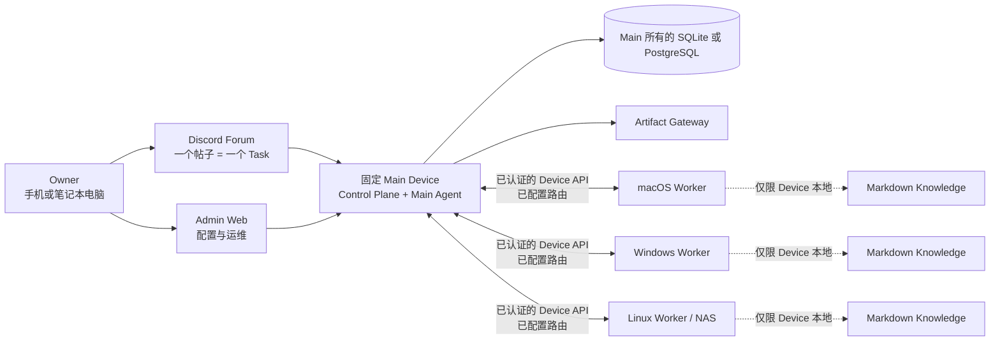

# OpenDelegate

语言：[English](README.md) · [한국어](README.ko.md) · [日本語](README.ja.md) ·
[Français](README.fr.md) · [Español](README.es.md) · **[简体中文](README.zh-CN.md)**

OpenDelegate 是一个个人自托管控制平面，用于在一台固定的 Main Device 与多台 macOS、Windows 和 Linux
Device 之间协调 AI Agent。

> [!TIP]
> **从这里开始：** [快速开始](#快速开始) · [完整设置指南（英文）](docs/GETTING_STARTED.md) ·
> [Discord Forum 设置](docs/DISCORD_SETUP.md)

## 快速开始

> [!WARNING]
> 此仓库构建的是**不受支持的内部预览版**，而不是受支持的 Release。平台、Provider、Discord、网络、权限和打包所需的真实环境证据仍不完整。请勿将其描述为已发布产品，也不要将其用作无人值守的生产控制平面。详情请参阅[当前源代码状态](#当前源代码状态)。

OpenDelegate 由 Agent 协助安装；Owner 安装流程不需要运行 `npm run start`。

1. 获取与操作系统和架构匹配的 bundle，并使用通过可信发布渠道独立取得的 digest 核验
   `SHA256SUMS`。当前仓库只能生成带有明确标识的内部预览 bundle；请参阅
   [构建内部预览版](#构建内部预览版)。
2. 如需使用 Discord，请先按照
   [Discord Forum 设置指南](docs/DISCORD_SETUP.md)，在首次 Main 初始化之前准备完整的 Binding。当前预览版无法在初始化后添加或替换 Binding。
3. 在 Codex 或 Claude 中打开解压后的 bundle 目录，并原样发送以下内容： _“Read
   `skills/opendelegate-init/SKILL.md` and initialize this computer as my fixed OpenDelegate Main
   Device. Guide me through every owner decision, keep runtime state outside this bundle, and stop
   if a required safety check fails.”_
4. 按照 Agent 的引导完成 Owner Claim，并妥善保存全部十个一次性恢复代码。
5. 在 Admin Web 右下角的 Configuration
   Chat 中检查 Device、Agent、Route 和 Artifact 配置，以及初始化前准备的 Discord 状态。
6. 添加 Device 时，请通过 Configuration Chat 签发一份短期、一次性的 Device
   Grant。不要打开该文件；使用 Owner 控制的安全方式将其交给目标 Device，然后让该 Device 上的 Agent 按照
   `skills/opendelegate-join/SKILL.md` 操作。
7. 如果已配置 Discord，请为每个独立 Task 创建一个 Forum 新帖子。同一帖子的回复会延续同一 Task 及其 native
   Agent Session；新帖子则从干净的 Context 开始。如果 Discord 已禁用或不可用，请选择 **Admin Web →
   Tasks → 新建任务**。

请阅读[完整设置指南（英文）](docs/GETTING_STARTED.md)，其中包括 Owner 恢复、添加 Device、创建首个 Task 和故障排查。

## 为什么选择 OpenDelegate

你可以通过手机或电脑创建 Task，让 Main Agent 将其拆分为 Work Order，把这些 Work
Order 路由到符合条件的 Device，并获得一个持久、可检查的统一结果，而无需手动重新打开每个 Agent
Session。

- 一个 Discord Forum 帖子对应一个持久的 Task 和一个上下文边界。
- 确定性软件负责身份、Policy、健康状态、路由、lease、重试、持久化和状态转换。Agent负责语义判断和分配给它们的工作。
- Worker 只连接到 Main。它们不需要 NxN SSH 网状网络，也不需要直接访问数据库。
- Codex、Claude 和自定义 runner 位于 Agent Adapter 契约之后，同时仍可恢复有价值的 provider-native
  session。
- 每台 Device 都保留自己选择性检索、相互链接的 Markdown
  Knowledge。Main 永远不会收到其中的文件名、标题、链接、图谱、索引、片段或内容。
- 丰富的结果可以成为 Artifact，并由 Main 按照明确的 Exposure Policy 提供。

## 架构



Worker 不会连接数据库，也不会相互连接形成 OpenDelegate 控制网。LAN、Omada、Tailscale、tunnel 和自定义网络是 Main 与每台 Device 之间由确定性逻辑处理的 Transport
Profile 选项。

## 当前源代码状态

下表区分了源代码中已实现的生产形态执行路径，以及声明支持之前仍需补齐的外部证据。

| 领域             | 源代码中已实现且可测试                                                                                                                                                                                                                                      | 第一个 milestone 仍需完成                                                                                                                                              |
| ---------------- | ----------------------------------------------------------------------------------------------------------------------------------------------------------------------------------------------------------------------------------------------------------- | ---------------------------------------------------------------------------------------------------------------------------------------------------------------------- |
| Main 与持久化    | 随附的 `opendelegate` CLI；已组合的 Control Plane；SQLite/PostgreSQL 存储契约（托管 PostgreSQL 验证目前固定为 17）；持久化的 Task 执行、Approval、Audit、Artifact、Enrollment、Discord 和 Device Channel 服务；当中断 Action 的结果未知时安全失败的启动对账 | 在每个声明的 Main 平台上完成全新主机安装、数据库迁移/恢复、服务重启及完整对账证据；其他 PostgreSQL 主版本仍未经验证                                                    |
| Owner 访问       | 仅限 loopback 的初始认领、口令登录、恢复代码、Session 撤销、CSRF 防护和 SQL 持久化                                                                                                                                                                          | 符合 Release 要求的远程路由、重启、被盗浏览器 Session 撤销及不依赖 Discord 的恢复证据                                                                                  |
| Admin Web        | 经过身份验证的 Device、Task、Approval、Enrollment、Artifact、Audit、紧急控制和 Configuration Chat 界面；按 Capability 状态启用的控制项；提供持久化语言选择的响应式英语、韩语、日语、法语、西班牙语和简体中文 UI                                             | 真实 Device 入网与故障流程、Release Bundle 上的无障碍与无溢出证据，以及真实运营者验收                                                                                  |
| Device runtime   | 一次性 Enrollment、Device-scoped Identity、经过身份验证的出站 Main–Worker Channel、基于 Lease 的 Dispatch、持久 Inbox/Outbox、Run 监督、Workspace、本地 Agent 执行、本地 Knowledge MCP、Computer Use MCP 和 Artifact 上传                                   | 已入网的物理 Device、路由丢失与重启恢复、Omada/Tailscale 类混合路由证据，以及三类操作系统上的持久服务证据                                                              |
| Agent 与 Discord | 以 Codex App Server 和 Claude Agent SDK 为首选的 Adapter、能力受限的 CLI Fallback、通用命令、原生 Session 连续性、Single-writer Enforcement 和精确 Action Authorization；Discord HTTP/Gateway、Forum 对账、控制及 Main 组合                                 | 使用固定版本完成经过身份验证的 Codex/Claude 真实运行；专用 Community Server、Forum、Bot、Token、Intent、Permission、Reconnect、Mobile 和 Outage 证据                   |
| Knowledge        | Device 本地链接 Markdown 发现、有限检索、确定性索引、准入检查，以及内容始终位于 Main 契约之外的 Agent MCP Tool                                                                                                                                              | 在各类真实 Device 上完成网络层 No-egress 证据及 Create/Update/Rebuild 流程                                                                                             |
| Artifact         | Main 所有的本地 Store、经过身份验证且可恢复的 Worker 上传、隔离的 Static/Interactive Gateway 路径、Signed Access、Exposure Policy 契约及 Admin 检查                                                                                                         | 真实 Discord 展示、Retention/Exposure 流程、打包 Build 的恶意内容验证，以及从 Owner Device 跨网络打开                                                                  |
| 平台服务         | Windows SCM、macOS launchd、Linux systemd/前台模式源代码实现；分离的 Core/Owner-session Helper Host；经过身份验证的本地 IPC；Install/Start/Stop/Restart/Upgrade/Rollback/Diagnose/Uninstall 命令路径                                                        | 全新主机上的特权执行、Reboot/Login/Logout 持久性、失败回滚、权限设置、适用平台的签名/公证及实验室证据                                                                  |
| Computer Use     | Device-wide Desktop Lock、精确 Action Authorization、一次性本地 Capability Broker、Session-helper IPC、原生 Windows/macOS/Linux Backend 源代码、就绪/权限探测，以及 Capture/Input/Cancel/Emergency-stop 契约与确定性/原生 Fixture 测试                      | 在物理 macOS、Windows 和声明的图形化 Linux 环境中完成参考交互，并提供 Screenshot、Exclusivity、Cancellation、Permission Failure、Locked-session 和 Headless Linux 证据 |

在能够强制执行所需 Sandbox 之前，OpenDelegate 不会将原生 Windows 上的 Claude
SDK 执行标记为受支持；请在 Windows 上使用 Codex、WSL2 或已配置的 Container。WSL2 或 Container
Worker 不能替代原生 Windows Service、重启、权限或 Computer Use 的 Release Gate。

项目依赖的自动安装目前仅支持 npm，并使用无凭据、仅限官方 Registry 且禁用 Script 的 Staging 边界。OpenDelegate 也接受通过明确配置的 System
Package
Manager 发出的仅安装请求，会固定并在执行前重新验证该 Manager 的可执行文件；添加软件源和运行远程安装程序仍需审批。这些仅属于实现证据：在现有 Source 与权限行为通过目标平台的全新主机实验室验证前，不会宣称任何 System
Package Manager 获得 Release 支持。

机器可读的 Release 账本位于
[`docs/release/acceptance-evidence.json`](docs/release/acceptance-evidence.json)。
`pnpm release:status` 会报告其当前状态。全部 36 项验收标准都需要证据；任何平台或 Computer Use
gate 都不能豁免。

Release 术语刻意采用严格定义：

| 标签                        | 含义                                                                                                                         |
| --------------------------- | ---------------------------------------------------------------------------------------------------------------------------- |
| Public source pre-alpha     | 可审查的源代码；不受支持，且不是完整安装                                                                                     |
| `internal-preview-*` bundle | 本地验证载荷；即使本地 smoke test 通过，也始终不受支持                                                                       |
| `release-candidate` bundle  | 36 项 gate 全部通过，但 Artifact 尚未被提升或获得支持                                                                        |
| `released`                  | 根据有效的不可变 Candidate，以及可信发布者、平台真实性、Promotion、Supported Channel 和撤销策略的完整 Chain 计算出的有效状态 |

目前不存在任何 `released` Artifact。

## 已实现的 Admin Web

以下截图展示了当前的 Admin Web 实现。它们由浏览器测试套件使用确定性的 API
fixture 生成。界面调用经过身份验证的 Admin
API 契约，但这些图片不能证明已真实绑定 Discord、已 enrollment 真实 Worker 或已完成三操作系统验收。英语为默认语言。语言选择器还可将面向 Owner 的完整界面切换为韩语、日语、法语、西班牙语或简体中文，但不会翻译 Owner 编写的 Task 内容或 Agent 对话历史。


_Task 操作设计 fixture：经过身份验证的列表/详情数据和控制项。每个控制项都遵循 Main 报告的 Capability 状态；此 fixture 不能证明真实外部 runtime 已就绪。_


_已实现的 Owner 登录与恢复入口。初始 Owner 认领仍是一个独立、仅限 loopback 的 bootstrap 流程。_

## 构建内部预览版

Release bundle 要求恰好使用 **Node.js 24.18.0**。仓库固定使用 pnpm 11.15.1。Node.js 22.14 或 Node
22 系列的更高版本仍是贡献者兼容目标，但不能生成 Release bundle。

在具有已安装依赖项、干净且已提交的 checkout 中运行：

```sh
node --version
git status --short
pnpm install --frozen-lockfile
pnpm check
pnpm build
pnpm test:browser
pnpm release:build --destination ABSOLUTE_PATH --internal-preview
```

`node --version` 必须输出 `v24.18.0`，而 `git status --short` 必须没有任何输出。 `ABSOLUTE_PATH`
必须是源代码 checkout 之外一个尚不存在的路径。Builder 会拒绝覆盖现有目标。一个最小 launcher 会导出干净的 commit，并在组装前从该一次性 snapshot 重新执行 Release 逻辑。Builder 会下载固定版本的官方 Node
archive，验证其经过审计的 SHA-256，然后创建特定于平台的 bundle。其中包含 Main/Worker launcher、Admin
asset、初始化/入网 skill、Release
metadata、依赖实例的法律清单、checksum，以及针对 CLI/service/Worker 命令、干净 home 初始化、Main 健康状态、Admin 服务、Owner 认领/登录、session
cookie 往返和正常关闭的有限 smoke evidence。

目标名称必须包含 `internal-preview`。生成的 `INTERNAL_PREVIEW.md` 和 `release-metadata.json`
会记录该 bundle 不受支持，并保留准确的 Release evidence 状态。请仅通过上方 Agent-first
[快速开始](#快速开始)初始化已组装的 bundle，以便在创建持久 Main 配置之前确定 Discord 和其他所有 Owner 选择。内部预览版以前台方式运行，不会安装持久化的操作系统服务，也不得以 Release
tag 发布。

只要有任何验收标准尚未完成，生产构建就会按设计失败：

```sh
pnpm release:gate
pnpm release:build \
  --destination ABSOLUTE_PATH \
  --git-executable ABSOLUTE_UNLINKED_GIT \
  --git-executable-sha256 APPROVED_GIT_EXECUTABLE_SHA256 \
  --runner-executable-sha256 APPROVED_NODE_EXECUTABLE_SHA256
```

上面的 `release:build` 调用只有用于 Linux x64
Candidate 时才是完整命令。在 macOS 和 Windows 上，请追加目标平台所需的原生 Credential Policy 参数：

```sh
  --platform-signing-policy ABSOLUTE_PLATFORM_SIGNING_POLICY \
  --platform-signing-policy-sha256 APPROVED_PLATFORM_SIGNING_POLICY_SHA256
```

`pnpm release:sign` 被刻意限制为仅用于已明确确认且不受支持的 Preview，并会拒绝 Release
Candidate。36 项 Criterion Gate 全部完成后，干净且 Hash 固定的目标平台原生 Runner 使用
`pnpm release:finalize` 冻结每个 Production
Candidate，并创建 Candidate-v2 发布者 Attestation。只有对已配置的外部 Promotion 和 Supported Channel
Receipt Chain 的验证，才能使该不可变 Candidate 的有效状态成为 `released`；请参阅
[Release Trust 流程](docs/release/README.md#supported-promotion-trust-path)。

可使用以下命令生成不含 Credential 的运维输入骨架：

```sh
pnpm release:examples -- --destination ABSOLUTE_NEW_DIRECTORY
```

所有生成内容都会标记为 `PLACEHOLDER` 和
`NOT-A-RELEASE`，且不包含 Credential、签名、Artifact 或 Release 证据。详情请参阅
[Release 输入示例指南](docs/release/EXAMPLES.md)。

生产模式的 `release:gate` 和 Candidate 模式的 `release:build`
命令只有在全部 36 项实现和真实证据 gate 都通过后才能成功。对不受支持 Preview 的签名既不能满足、也不能绕过该生产 gate。请参阅
[精确的首个里程碑支持矩阵](docs/release/SUPPORT_MATRIX.md)、
[Release evidence 指南](docs/release/README.md)和
[平台实验室检查清单](docs/release/PLATFORM_LAB.md)。

## 开发

```sh
pnpm install --frozen-lockfile
pnpm setup:browser
pnpm check
pnpm build
pnpm test:browser
```

`pnpm setup:browser` 会为 Admin
Web 浏览器测试套件安装 Chromium。在 Linux 上，Playwright 可能还会请求安装操作系统依赖项。

使用以下命令运行 Admin 开发服务器：

```sh
pnpm dev:admin
```

此开发服务器不是 Owner 安装路径。验证打包后的 Main 时，请使用生成的 `internal-preview` launcher。

Codex 和 Claude 身份验证默认按 OpenDelegate Device 隔离在 `state/providers/codex` 与
`state/providers/claude` 中。设置完成后，请直接在对应的 controlled
home 中以交互方式完成身份验证。OpenDelegate 不会从用户的全局 provider
home 复制或继承登录状态，并且 first-class provider Run 会拒绝包含凭据的环境变量。

## 仓库结构

- `apps/main` — Main 组合、确定性 CLI、Action Authorization、Device
  Channel、Discord、Artifact 与 Agent runtime 集成。
- `apps/worker` 和 `apps/service-host` — 已入网的 Worker
  runtime，以及平台服务定义使用的持久化 Core/Session Process Host。
- `apps/control-plane` — 经过身份验证的 HTTP 边界与本地认领边界。
- `apps/admin-web` —
  Owner 登录、Device、Task、Approval、Enrollment、Artifact、Audit、紧急操作与 Configuration Chat。
- `apps/artifact-gateway` — 隔离的 Artifact 交付边界。
- `packages/domain`、`packages/policy` 和 `packages/scheduler` — 确定性领域机制与可执行 Policy。
- `packages/storage-sql`、`packages/owner-auth`、`packages/task-service` 和 `packages/configuration`
  — Main 持久化与应用服务。
- `packages/device-identity`、`packages/device-channel`、`packages/worker-runtime`、
  `packages/transport` 和 `packages/device-discovery` — Device
  Enrollment、经过身份验证的 Main–Worker 通信与 Worker 执行。
- `packages/agent-adapters` 和 `packages/discord-adapter` — 编程式 Provider 与 Discord
  Forum 集成，仍需使用真实凭据验证。
- `packages/artifact-store` — Main 所拥有的 Artifact 字节与 metadata 边界。
- `packages/platform-services` 和 `packages/computer-use-os`
  — 操作系统服务与图形 runtime 实现；源代码与 fixture 结果不能证明受支持的服务已安装，也不能证明三操作系统桌面控制。
- `packages/session-helper-ipc`、`packages/session-helper-runtime`、 `packages/computer-use-mcp` 和
  `packages/run-capability-broker` — 经过身份验证、按 Run 限定的 Owner-session Capability。
- `packages/knowledge` 和 `packages/knowledge-mcp` —
  Device 本地 Markdown 发现、链接检索、索引与 Agent Tool。
- `packages/acceptance` 和 `packages/simulator` — 确定性 Task 流程、重启场景与 replay fixture。
- `skills/opendelegate-init` — 面向 Agent 的初始化 workflow，并具有明确的 `internal-preview` gate。
- `skills/opendelegate-join` — 不暴露凭据的仅出站 Worker enrollment 与恢复 workflow。
- `docs` — 产品、架构、安全、设计、研究与 Release evidence。

## 规范性产品文档

在规划或修改产品行为前，请按以下顺序阅读：

1. [`CONTEXT.md`](CONTEXT.md) — 精简领域模型、术语和不可协商的 invariant。
2. [`docs/PRODUCT_SPEC.md`](docs/PRODUCT_SPEC.md) — 完整的产品与架构规范。
3. [`docs/IMPLEMENTATION_PLAN.md`](docs/IMPLEMENTATION_PLAN.md) — 交付阶段、公开测试边界和 Release
   gate。
4. [`docs/DECISIONS.md`](docs/DECISIONS.md) — 已接受的产品决策及其理由。
5. [`docs/research/platform-capabilities.md`](docs/research/platform-capabilities.md)
   —基于一手资料的平台限制。

贡献者 workflow 记录在 [CONTRIBUTING.md](CONTRIBUTING.md)
中。安全边界以及经过验证的私密漏洞报告途径位于
[SECURITY.md](SECURITY.md)。安全的 Main 元数据快照和向全新目标的恢复流程记录在
[备份与恢复指南](docs/BACKUP_AND_RESTORE.md)中。

OpenDelegate 采用
[Apache License 2.0](LICENSE)。仓库内容、领域术语、API、日志和 UI 默认值均使用英语。本 README 和面向 Owner 的 Admin
UI 也提供页面顶部所链接的五种译文。
