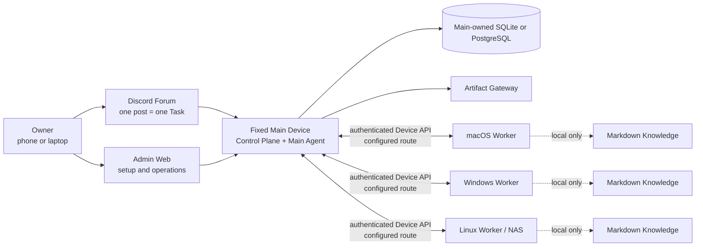

# OpenDelegate

语言：[English](README.md) · [한국어](README.ko.md) · [日本語](README.ja.md) ·
[Français](README.fr.md) · [Español](README.es.md) · **[简体中文](README.zh-CN.md)**

OpenDelegate 是一个个人自托管控制平面，用于在一台固定的 Main Device 与多台 macOS、Windows 和 Linux
Device 之间协调 AI Agent。

你可以通过手机或电脑创建 Task，让 Main Agent 将其拆分为 Work Order，把这些 Work
Order 路由到符合条件的 Device，并获得一个持久、可检查的统一结果，而无需手动重新打开每个 Agent
Session。

> [!WARNING] 此仓库目前构建的是**不受支持的内部预览版**，而不是受支持的 OpenDelegate Release。Main
> runtime、经过身份验证的 Admin
> Task 界面以及许多接近生产形态的契约已经存在，但生产级 Worker/Discord/service/Agent/Computer
> Use 执行链路以及真实的三操作系统验收矩阵仍不完整。目前不得将 OpenDelegate 描述为完整产品，也不得将其用作无人值守的生产控制平面。

## 为什么选择 OpenDelegate

- 一个 Discord Forum 帖子对应一个持久的 Task 和一个上下文边界。
- 确定性软件负责身份、Policy、健康状态、路由、lease、重试、持久化和状态转换。Agent负责语义判断和分配给它们的工作。
- Worker 只连接到 Main。它们不需要 NxN SSH 网状网络，也不需要直接访问数据库。
- Codex、Claude 和自定义 runner 位于 Agent Adapter 契约之后，同时仍可恢复有价值的 provider-native
  session。
- 每台 Device 都保留自己选择性检索、相互链接的 Markdown
  Knowledge。Main 永远不会收到其中的文件名、标题、链接、图谱、索引、片段或内容。
- 丰富的结果可以成为 Artifact，并由 Main 按照明确的 Exposure Policy 提供。

## 架构



Worker 不会连接数据库，也不会相互连接形成 OpenDelegate 控制网。LAN、Omada、Tailscale、tunnel 和自定义网络是 Main 与每台 Device 之间由确定性逻辑处理的 Transport
Profile 选项。

## 当前源代码状态

下表区分了当前可运行的代码，以及尚未连接到符合 Release 要求的外部系统的边界。

| 领域             | 当前已实现且可测试                                                                                                                                                                                                                                  | 第一个 milestone 仍需完成                                                                                                        |
| ---------------- | --------------------------------------------------------------------------------------------------------------------------------------------------------------------------------------------------------------------------------------------------- | -------------------------------------------------------------------------------------------------------------------------------- |
| Main 与持久化    | 随附包含 `init`、`serve` 和 `status` 的 `opendelegate` CLI；Main 组合；Control Plane 健康检查；经过身份验证的 Task 检查与紧急控制 API；内嵌 SQLite；PostgreSQL 配置及等价存储契约                                                                   | 接通编排/执行；在每个受支持操作系统上的全新主机与重启验证；备份/恢复验证；完整的 runtime 对账                                    |
| Owner 访问       | 仅限 loopback 的初始认领、口令登录、恢复代码、Session 撤销、CSRF 防护和 SQL 持久化                                                                                                                                                                  | 符合 Release 要求的远程路由、重启、被盗凭据撤销和恢复证据                                                                        |
| Admin Web        | 经过身份验证的登录/恢复；持久化 Task 检查；暂停/取消紧急控制；响应式 Device 界面与只读 Configuration Chat；提供持久化的英语、韩语、日语、法语、西班牙语和简体中文 UI。创建/恢复/重试 fixture 已存在，但在执行不可用时，打包后的 Main 会禁用这些操作 | 接通 Task 执行和 Configuration Agent 消息；真实 Device 投影；审批/审计检查器；真实故障验收                                       |
| Device runtime   | Device 身份与一次性 enrollment 契约、Worker 持久 inbox/outbox 和 Run 监督契约、发现、传输、lock 与本地 Knowledge                                                                                                                                    | 端到端身份验证的 Main–Worker 通道；已 enrollment 的真实 Device；服务安装；断线/重启验证                                          |
| Agent 与 Discord | Codex CLI、Claude CLI 和通用命令 adapter 生命周期 package；持久化 Discord Forum 映射、授权、对账、控制和投影契约                                                                                                                                    | 经过身份验证的真实 provider session；生产级 Discord HTTP/Gateway driver；专用 Community Server、Forum、bot、token、intent 和权限 |
| Artifact         | 本地 Artifact Store 与隔离的 Artifact Gateway 契约，并包含恶意内容测试                                                                                                                                                                              | 可恢复的 Worker 上传；真实 Discord 展示；Owner 路由暴露；跨网络验收                                                              |
| 平台服务         | Windows SCM、macOS launchd 和 Linux systemd 服务计划、renderer、就绪模型与只读验证边界                                                                                                                                                              | 需特权的原生安装；打包后的服务 executor；重启/登录/注销测试；升级回滚；签名/公证                                                 |
| Computer Use     | Resource Lock 核心、OS driver 契约 package、权限/就绪探测和确定性一致性 fixture                                                                                                                                                                     | macOS、Windows 和受支持的图形化 Linux 上的真实输入 backend 与参考 workflow，包括取消和权限失败证据                               |

机器可读的 Release 账本位于
[`docs/release/acceptance-evidence.json`](docs/release/acceptance-evidence.json)。
`pnpm release:status` 会报告其当前状态。全部 36 项验收标准都需要证据；任何平台或 Computer Use
gate 都不能豁免。

Release 术语刻意采用严格定义：

| 标签                        | 含义                                                   |
| --------------------------- | ------------------------------------------------------ |
| Public source pre-alpha     | 可审查的源代码；不受支持，且不是完整安装               |
| `internal-preview-*` bundle | 本地验证载荷；即使本地 smoke test 通过，也始终不受支持 |
| `release-candidate` bundle  | 36 项 gate 全部通过，但 Artifact 尚未被提升或获得支持  |
| `released`                  | 经过独立证明并通过受支持渠道发布的 Artifact            |

目前不存在任何 `released` Artifact。

## 已实现的 Admin Web

以下截图展示了当前的 Admin Web 实现。它们由浏览器测试套件使用确定性的 API
fixture 生成。界面调用经过身份验证的 Admin
API 契约，但这些图片不能证明已真实绑定 Discord、已 enrollment 真实 Worker 或已完成三操作系统验收。英语为默认语言。语言选择器还可将面向 Owner 的完整界面切换为韩语、日语、法语、西班牙语或简体中文，但不会翻译 Owner 编写的 Task 内容或 Agent 对话历史。


_Task 操作设计 fixture：经过身份验证的列表/详情数据和控制项。在编排 runtime 接通之前，打包后的 Main 会禁用启动执行的操作。_


_已实现的 Owner 登录与恢复入口。初始 Owner 认领仍是一个独立、仅限 loopback 的 bootstrap 流程。_

## 构建内部预览版

Release bundle 要求恰好使用 **Node.js 24.18.0**。仓库固定使用 pnpm 11.15.1。Node.js 22.14 或 Node
22 系列的更高版本仍是贡献者兼容目标，但不能生成 Release bundle。

在具有已安装依赖项、干净且已提交的 checkout 中运行：

```sh
node --version
git status --short
pnpm install --frozen-lockfile
pnpm check
pnpm build
pnpm test:browser
pnpm release:build --destination ABSOLUTE_PATH --internal-preview
```

`node --version` 必须输出 `v24.18.0`，而 `git status --short` 必须没有任何输出。 `ABSOLUTE_PATH`
必须是源代码 checkout 之外一个尚不存在的路径。Builder 会拒绝覆盖现有目标。一个最小 launcher 会导出干净的 commit，并在组装前从该一次性 snapshot 重新执行 Release 逻辑。Builder 会下载固定版本的官方 Node
archive，验证其经过审计的 SHA-256，然后创建特定于平台的 bundle。其中包含 Admin
asset、初始化 skill、Release
metadata、依赖实例的法律清单、checksum，以及针对 CLI 帮助、干净 home 初始化、Main 健康状态、Admin 服务、Owner 认领/登录、session
cookie 往返和正常关闭的 smoke evidence。

目标名称必须包含 `internal-preview`。生成的 `INTERNAL_PREVIEW.md` 和 `release-metadata.json`
会记录该 bundle 不受支持，并保留准确的 Release evidence 状态。如需检查前台 runtime：

```powershell
.\opendelegate.cmd init --open
```

```sh
./opendelegate init --open
```

请使用 bundle 构建平台对应的 launcher。内部预览版不会安装持久化的操作系统服务，也不得以 Release
tag 发布。

只要有任何验收标准尚未完成，生产构建就会按设计失败：

```sh
pnpm release:gate
pnpm release:build --destination ABSOLUTE_PATH
```

只有在全部 36 项实现和真实证据 gate 都通过后，这两个命令才可以成功。请参阅
[Release evidence 指南](docs/release/README.md)和
[平台实验室检查清单](docs/release/PLATFORM_LAB.md)。

## 开发

```sh
pnpm install --frozen-lockfile
pnpm setup:browser
pnpm check
pnpm build
pnpm test:browser
```

`pnpm setup:browser` 会为 Admin
Web 浏览器测试套件安装 Chromium。在 Linux 上，Playwright 可能还会请求安装操作系统依赖项。

使用以下命令运行 Admin 开发服务器：

```sh
pnpm dev:admin
```

此开发服务器不是 Owner 安装路径。验证打包后的 Main 时，请使用生成的 `internal-preview` launcher。

## 仓库结构

- `apps/main` — Main 组合与确定性 CLI。
- `apps/control-plane` — 经过身份验证的 HTTP 边界与本地认领边界。
- `apps/admin-web` — Owner 登录、Task 操作、Device 界面与 Configuration Chat。
- `apps/artifact-gateway` — 隔离的 Artifact 交付边界。
- `packages/domain`、`packages/policy` 和 `packages/scheduler` — 确定性领域机制与可执行 Policy。
- `packages/storage-sql`、`packages/owner-auth`、`packages/task-service` 和 `packages/configuration`
  — Main 持久化与应用服务。
- `packages/device-identity`、`packages/worker-runtime`、`packages/transport` 和
  `packages/device-discovery` — Device enrollment 与 Worker 端契约。
- `packages/agent-adapters` 和 `packages/discord-adapter` — provider 与 Forum
  adapter 实现，仍需真实集成证据。
- `packages/artifact-store` — Main 所拥有的 Artifact 字节与 metadata 边界。
- `packages/platform-services` 和 `packages/computer-use-os`
  — 操作系统服务与图形 runtime 契约；它们不能证明服务已经安装，也不能证明真实桌面控制已经实现。
- `packages/knowledge` — Device 本地 Markdown 发现、链接检索与索引。
- `packages/acceptance` 和 `packages/simulator` — 确定性 Task 流程、重启场景与 replay fixture。
- `skills/opendelegate-init` — 面向 Agent 的初始化 workflow，并具有明确的 `internal-preview` gate。
- `docs` — 产品、架构、安全、设计、研究与 Release evidence。

## 规范性产品文档

在规划或修改产品行为前，请按以下顺序阅读：

1. [`CONTEXT.md`](CONTEXT.md) — 精简领域模型、术语和不可协商的 invariant。
2. [`docs/PRODUCT_SPEC.md`](docs/PRODUCT_SPEC.md) — 完整的产品与架构规范。
3. [`docs/IMPLEMENTATION_PLAN.md`](docs/IMPLEMENTATION_PLAN.md) — 交付阶段、公开测试边界和 Release
   gate。
4. [`docs/DECISIONS.md`](docs/DECISIONS.md) — 已接受的产品决策及其理由。
5. [`docs/research/platform-capabilities.md`](docs/research/platform-capabilities.md)
   —基于一手资料的平台限制。

贡献者 workflow 记录在 [CONTRIBUTING.md](CONTRIBUTING.md)
中。安全边界以及经过验证的私密漏洞报告途径位于 [SECURITY.md](SECURITY.md)。

OpenDelegate 采用
[Apache License 2.0](LICENSE)。仓库内容、领域术语、API、日志和 UI 默认值均使用英语。本 README 和面向 Owner 的 Admin
UI 也提供页面顶部所链接的五种译文。
