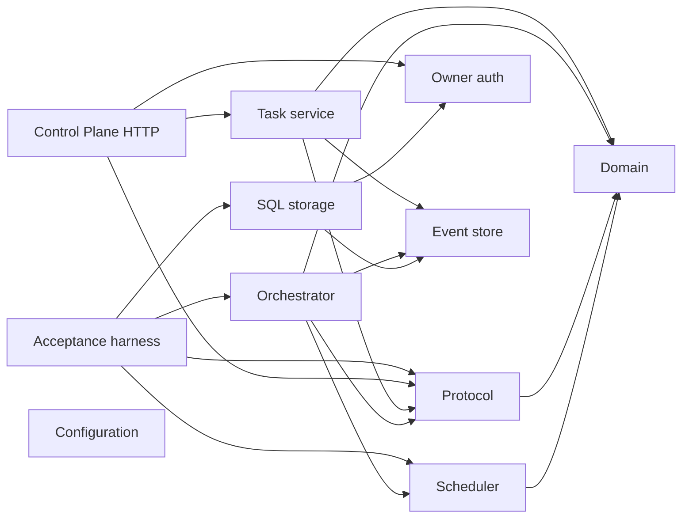

# ADR-0003: Phase-zero module boundary map

Status: **Accepted**

Date: **2026-07-24**

## Context

The implementation plan names responsibility boundaries but explicitly does not
require those names to become source-directory names. Phase 0 still requires every
boundary to have an unambiguous workspace home before later operating-system,
database, Discord, and service entrypoints exist.

Creating placeholder applications for every future process would falsely imply
runnable production behavior. Conversely, leaving the mapping implicit makes it
easy to put Worker-local Knowledge, Secrets, or desktop control into the Main
process by convenience.

## Decision

The current workspace map, established in Phase 0 and extended as implementation
boundaries become real, is:

| Planned boundary | Current workspace home | Current status |
| --- | --- | --- |
| Domain | `packages/domain`, `packages/policy`, `packages/scheduler`, `packages/resource-locks` | Pure kernel and deterministic services |
| Protocol | `packages/protocol` | Versioned runtime-validated contracts |
| Control Plane | `apps/main`, `apps/control-plane`, `packages/orchestrator`, `packages/event-store`, `packages/task-service`, `packages/owner-auth`, `packages/configuration` | Runnable Main composition, injectable HTTP boundary, channel-neutral durable Task application service, orchestration journal, owner-auth core, and typed configuration transactions |
| Worker Core | `packages/worker-runtime`, `packages/device-identity`, `packages/device-discovery`, `packages/transport`, `packages/secrets`, `packages/knowledge` | Durable outbound Worker runtime, enrollment identity, and Worker-local adapters |
| User Session Helper | `packages/computer-use`, `packages/computer-use-os` | Backend-neutral lock kernel plus injected Windows, macOS, and Linux driver/readiness boundary |
| Agent Adapters | `packages/agent-adapter`, `packages/agent-adapters` | Provider-neutral contract/fake plus programmatic Codex, Claude, and generic command adapters |
| Channel Adapters | `packages/discord-adapter` plus channel-neutral Task services | Durable Discord Forum synchronization core with injected HTTP, Gateway, Task, and persistence ports |
| Admin Web | `apps/admin-web` | Authenticated Task control, owner recovery, and Device configuration surfaces |
| Storage | `packages/event-store`, `packages/storage-sql`, `packages/artifact-store`, `apps/artifact-gateway` | SQLite/PostgreSQL metadata, local Artifact bytes, and isolated Artifact HTTP presentation |
| Bootstrap and Service Management | `apps/main`, `packages/platform-services`, `skills/opendelegate-init`, `tooling/` | Bundled Main/init CLI, guarded release builder, and native service/rendering/lifecycle plans; privileged installer composition and live service proof remain gated |
| Acceptance Harness | `packages/acceptance`, `packages/simulator` | Canonical public-contract journey plus lower-level event replay fixture |

Process entrypoints are added only when their implementation phase begins. The
Control Plane has an injectable Fastify composition, and `apps/main` binds it
through validated loopback-HTTP or configured HTTPS settings. Platform service,
Computer Use, Agent, and Discord packages now own production-shaped injected
boundaries and deterministic conformance fixtures. They do not claim live support:
privileged installer composition, native desktop drivers, Discord HTTP/Gateway
drivers, SQL persistence wiring, and the three-OS lab remain explicit gates. Entry
points must depend inward on the mapped contracts rather than moving those
contracts into an operating-system adapter.

`packages/knowledge` contains an early filesystem-backed reference adapter because
path containment, bounded retrieval, Markdown linking, and local-only behavior are
security-sensitive contracts worth proving early. It is not wired into a Main
entrypoint or declared production-ready; Phase 9 remains responsible for Worker
integration, watcher behavior, index durability, and live acceptance.

`packages/acceptance` owns the canonical fake Task journey through public contracts.
`packages/simulator` is the lower-level deterministic fixture for recorded-event
projection, replay, and restart boundaries. Its private event vocabulary is not a
second product contract; changes to the canonical journey must review the fixture
for continued relevance or parity.

`packages/owner-auth` owns ADR-0006's local claim, owner credential, browser session,
CSRF, recovery, throttling, redaction, and auth-audit transaction contract. It has no
HTTP, SQL, Discord, or Admin Web dependency. `apps/control-plane` composes that
contract with the versioned HTTP schemas without importing a SQL implementation.
`packages/configuration` owns typed scope precedence, proposal/diff/apply/rollback,
and configuration audit semantics without an Agent or UI dependency.
`packages/task-service` owns the channel-neutral idempotent Task intake and emergency
control API over the event-store port. Discord and Admin Web can therefore address
the same Task lifecycle without making either channel authoritative.
`packages/storage-sql` implements the portable event-store and owner-auth repository
boundaries selected by ADR-0005 and ADR-0006.

The checked dependency direction for the active orchestration path is:

Protocol reuses the canonical `OsFamily` vocabulary from Domain. Scheduler owns
mechanical Device eligibility, scoring, preferred-Device fallback, and bounded
tie-candidate exposure. Orchestrator consumes those public contracts and asks the
Coordinator to choose only when Scheduler returns a semantic tie. This direction
keeps provider-neutral validation and deterministic scheduling out of the
acceptance harness.

## Alternatives considered

### Empty application packages for every future process

Rejected because empty executables create maintenance overhead and can be mistaken
for supported services.

### One package per planned heading

Rejected because policy, scheduling, locks, and transport are deeper modules when
kept independently testable.

### Deleting the early Knowledge reference adapter

Rejected because its tests already enforce local path and context-budget boundaries.
Keeping it behind a Worker-local contract does not activate later-phase product
behavior.

## Consequences

- Every planned responsibility has a named workspace owner without fake production
  entrypoints.
- Main, Worker, desktop-helper, Discord, storage, and bootstrap boundaries remain
  independently testable, with live external composition tracked as a release gate.
- Implementing a reference adapter early does not advance its live-integration or
  platform-support milestone.
- Moving a responsibility across this table requires an ADR update.

## Verification

- Workspace dependency review shows no Admin or Main dependency on Worker Knowledge
  content.
- `pnpm architecture:check` rejects unmapped workspaces, dependency drift, cycles, and
  source imports that bypass a workspace manifest; every workspace also exposes a
  package-local strict typecheck surface and a test command that cannot enumerate
  only today's test files.
- The canonical journey in `packages/acceptance` uses boundary contracts and
  deterministic fakes; `packages/simulator` remains explicitly lower-level.
- No live service, Discord, provider, or desktop support is claimed from this map.

## References

- `CONTEXT.md`
- `docs/IMPLEMENTATION_PLAN.md`
- `docs/PRODUCT_SPEC.md`
