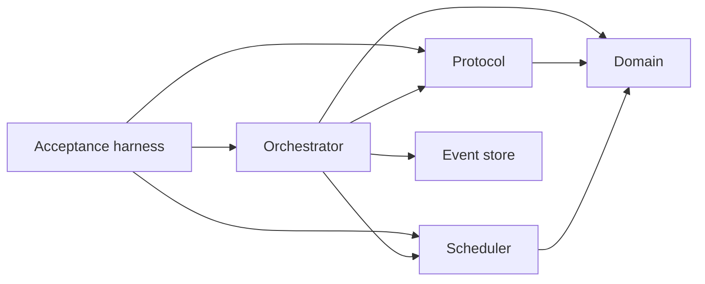

# ADR-0003: Phase-zero module boundary map

Status: **Accepted**

Date: **2026-07-24**

## Context

The implementation plan names responsibility boundaries but explicitly does not
require those names to become source-directory names. Phase 0 still requires every
boundary to have an unambiguous workspace home before later operating-system,
database, Discord, and service entrypoints exist.

Creating placeholder applications for every future process would falsely imply
runnable production behavior. Conversely, leaving the mapping implicit makes it
easy to put Worker-local Knowledge, Secrets, or desktop control into the Main
process by convenience.

## Decision

The Phase 0 and Phase 1 workspace map is:

| Planned boundary | Current workspace home | Current status |
| --- | --- | --- |
| Domain | `packages/domain`, `packages/policy`, `packages/scheduler`, `packages/resource-locks` | Pure kernel and deterministic services |
| Protocol | `packages/protocol` | Versioned runtime-validated contracts |
| Control Plane | `packages/orchestrator`, `packages/event-store` | In-process simulated application seam and journal |
| Worker Core | `packages/device-discovery`, `packages/transport`, `packages/secrets`, `packages/knowledge` | Worker-local contracts and reference adapters |
| User Session Helper | `packages/computer-use` | Backend-neutral contract and deterministic fake only |
| Agent Adapters | `packages/agent-adapter` | Codex, Claude, and generic fake/conformance boundary |
| Channel Adapters | Channel-neutral authorizer and Forum input contracts in `packages/orchestrator` | Discord implementation deferred |
| Admin Web | `apps/admin-web` | Initial one-Device setup surface |
| Storage | `packages/event-store` plus future storage implementations | In-memory journal only; SQL and Artifact stores deferred |
| Bootstrap and Service Management | `tooling/` plus future init/join skills and service applications | Reserved boundary; no service behavior yet |
| Acceptance Harness | `packages/acceptance`, `packages/simulator` | Canonical public-contract journey plus lower-level event replay fixture |

Process entrypoints will be added only when their implementation phase begins:
Main Control Plane and Worker service in Phases 2–4, service installation,
supervision, and the user-session helper in Phase 4, Discord in Phase 7, and
conversational bootstrap/onboarding integration in Phase 8. They must depend inward
on the mapped contracts rather than moving those contracts into an operating-system
adapter.

`packages/knowledge` contains an early filesystem-backed reference adapter because
path containment, bounded retrieval, Markdown linking, and local-only behavior are
security-sensitive contracts worth proving early. It is not wired into a Main
entrypoint or declared production-ready; Phase 9 remains responsible for Worker
integration, watcher behavior, index durability, and live acceptance.

`packages/acceptance` owns the canonical fake Task journey through public contracts.
`packages/simulator` is the lower-level deterministic fixture for recorded-event
projection, replay, and restart boundaries. Its private event vocabulary is not a
second product contract; changes to the canonical journey must review the fixture
for continued relevance or parity.

The checked dependency direction for the active orchestration path is:

Protocol reuses the canonical `OsFamily` vocabulary from Domain. Scheduler owns
mechanical Device eligibility, scoring, preferred-Device fallback, and bounded
tie-candidate exposure. Orchestrator consumes those public contracts and asks the
Coordinator to choose only when Scheduler returns a semantic tie. This direction
keeps provider-neutral validation and deterministic scheduling out of the
acceptance harness.

## Alternatives considered

### Empty application packages for every future process

Rejected because empty executables create maintenance overhead and can be mistaken
for supported services.

### One package per planned heading

Rejected because policy, scheduling, locks, and transport are deeper modules when
kept independently testable.

### Deleting the early Knowledge reference adapter

Rejected because its tests already enforce local path and context-budget boundaries.
Keeping it behind a Worker-local contract does not activate later-phase product
behavior.

## Consequences

- Every planned responsibility has a named workspace owner without fake production
  entrypoints.
- Main, Worker, desktop-helper, Discord, storage, and bootstrap process boundaries
  remain explicit future gates.
- Implementing a reference adapter early does not advance its live-integration or
  platform-support milestone.
- Moving a responsibility across this table requires an ADR update.

## Verification

- Workspace dependency review shows no Admin or Main dependency on Worker Knowledge
  content.
- `pnpm architecture:check` rejects unmapped workspaces, dependency drift, cycles, and
  source imports that bypass a workspace manifest; every workspace also exposes a
  package-local strict typecheck surface and a test command that cannot enumerate
  only today's test files.
- The canonical journey in `packages/acceptance` uses boundary contracts and
  deterministic fakes; `packages/simulator` remains explicitly lower-level.
- No service, SQL, Discord, or live desktop support is claimed from this map.

## References

- `CONTEXT.md`
- `docs/IMPLEMENTATION_PLAN.md`
- `docs/PRODUCT_SPEC.md`
