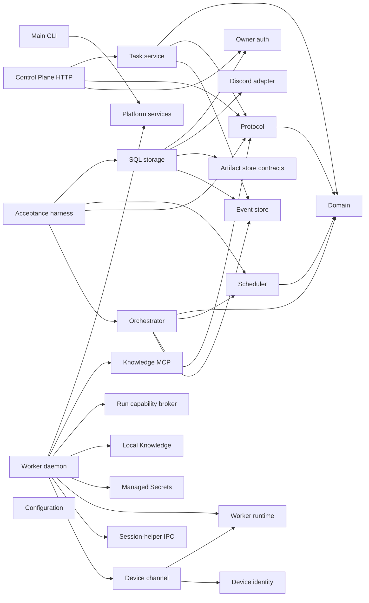

# ADR-0003: Phase-zero module boundary map

Status: **Accepted**

Date: **2026-07-24**

## Context

The implementation plan names responsibility boundaries but explicitly does not
require those names to become source-directory names. Phase 0 still requires every
boundary to have an unambiguous workspace home before later operating-system,
database, Discord, and service entrypoints exist.

Creating placeholder applications for every future process would falsely imply
runnable production behavior. Conversely, leaving the mapping implicit makes it
easy to put Worker-local Knowledge, Secrets, or desktop control into the Main
process by convenience.

## Decision

The current workspace map, established in Phase 0 and extended as implementation
boundaries become real, is:

| Planned boundary | Current workspace home | Current status |
| --- | --- | --- |
| Domain | `packages/domain`, `packages/policy`, `packages/scheduler`, `packages/resource-locks` | Pure kernel and deterministic services |
| Protocol | `packages/protocol` | Versioned runtime-validated contracts |
| Control Plane | `apps/main`, `apps/control-plane`, `packages/orchestrator`, `packages/event-store`, `packages/task-service`, `packages/owner-auth`, `packages/configuration` | Runnable Main composition, injectable HTTP boundary, channel-neutral durable Task application service, orchestration journal, owner-auth core, and typed configuration transactions |
| Worker Core | `apps/worker`, `packages/worker-runtime`, `packages/device-channel`, `packages/device-identity`, `packages/device-discovery`, `packages/transport`, `packages/secrets`, `packages/knowledge`, `packages/knowledge-mcp`, `packages/run-capability-broker` | Runnable outbound-only Worker daemon/CLI, durable authenticated Device channel, enrollment identity, one-time local Run capabilities, and Worker-local adapters |
| User Session Helper | `apps/service-host`, `packages/session-helper-runtime`, `packages/session-helper-ipc`, `packages/computer-use`, `packages/computer-use-os`, `packages/computer-use-mcp` | Native-launched role-agnostic core/helper hosts, asymmetric two-plane local IPC and presence, backend-neutral lock kernel, injected Windows, macOS, and Linux driver/readiness boundary, and run-scoped MCP stdio tool adapter |
| Agent Adapters | `packages/agent-adapter`, `packages/agent-adapters` | Provider-neutral contract/fake plus programmatic Codex, Claude, and generic command adapters |
| Channel Adapters | `packages/discord-adapter` plus channel-neutral Task services | Durable Discord Forum synchronization core with production API v10 HTTP/Gateway drivers and injected Task, credential, vault, and persistence ports |
| Admin Web | `apps/admin-web` | Authenticated Task control, owner recovery, and Device configuration surfaces |
| Storage | `packages/event-store`, `packages/storage-sql`, `packages/artifact-store`, `apps/artifact-gateway` | SQLite/PostgreSQL metadata, local Artifact bytes, and isolated Artifact HTTP presentation |
| Bootstrap and Service Management | `apps/main`, `apps/worker`, `apps/service-host`, `packages/platform-services`, `skills/opendelegate-init`, `skills/opendelegate-join`, `tooling/` | Bundled Main/init, Worker join/run, two-plane service entrypoints, guarded release builder, native rendering/plans, and an idempotent injected executor boundary; privileged platform acceptance remains gated |
| Acceptance Harness | `packages/acceptance`, `packages/simulator` | Canonical public-contract journey plus lower-level event replay fixture |

Process entrypoints are added only when their implementation phase begins. The
Control Plane has an injectable Fastify composition, and `apps/main` binds it
through validated loopback-HTTP or configured HTTPS settings. Platform service,
Computer Use, Agent, and Discord packages now own production-shaped injected
boundaries and deterministic conformance fixtures. The Discord package includes
bounded API v10 HTTP and JSON Gateway drivers, and SQL storage implements its
  durable cursor/inbox/binding/outbox contract. Main now supervises that adapter
  with SQL state and its Device-local managed Secret Store. This does not claim
  live support: privileged installer proof, private Discord laboratory proof, and
  the three-OS lab remain explicit gates. Entry points must depend inward on the mapped contracts rather than moving those
contracts into an operating-system adapter.

`packages/device-channel` owns the strict v1 Worker/Main frame vocabulary, pinned
TLS enrollment client, TLS 1.3 mutual-authentication WebSocket lifecycle, and
durable Main and Worker channel sequence state. `apps/worker` composes that boundary
with the managed Device-local Secret Store, native Agent adapters, registered
Workspaces, bounded local Knowledge retrieval, and the Worker runtime. Worker makes
outbound connections only; neither package accepts generic shell, path, database,
or Enrollment Grant authority through channel frames.

`packages/session-helper-ipc` owns ADR-0011's transport-injected, mutually
authenticated core-to-user-session-helper protocol. It binds both fresh nonces to
the exact Device, helper, OS session, service epoch, release, and separate core and
helper Ed25519 identities. It pins peer SPKI keys, signs the handshake and every
direction/sequence/transcript-bound frame, enforces strict bounded capability
schemas and monotonic sequences, and closes on authentication, replay, gap, or
binding failure.
The package includes Node `net` adapters for local named pipes and Unix-domain
sockets, while OS endpoint ACL and peer-identity evidence remain injected
defense-in-depth inputs rather than replacements for protocol authentication.

`packages/session-helper-runtime` owns signed process presence, reconnect and
replacement fencing, persistent desktop-authority activation, core-side runtime
leases, helper-side capability serving, and native-driver lifetime tied to one exact
service epoch. `apps/service-host` is the native launcher's JavaScript boundary for
both roles and both planes; it loads only strict durable configuration, opens each
plane's own Secret Store, verifies release/native-component identity, and composes
the role-agnostic helper without granting it scheduling or policy authority.

`packages/computer-use-mcp` owns the dependency-free, run-scoped MCP JSONL stdio
adapter exposed to native Agent runners. It accepts exact Worker-issued Run, lease,
fence, execution-handle, and desktop-epoch authority only through its injected
process seam; none of those values are tool arguments. Its injected tool port remains
responsible for current Policy, Approval, lease, fence, and desktop-authority
revalidation immediately before input. The package cannot mint or renew authority
and has no dependency on a provider, Worker runtime, native driver, or Policy
implementation.

`packages/run-capability-broker` owns one-time owner-protected local descriptors,
authenticated local socket claims, exact Run/Task/Device/lease/fence binding,
revocation, cancellation, and bounded request framing. A descriptor cannot mint or
widen authority and is deleted when consumed or disposed.

`packages/knowledge` owns filesystem-backed local Markdown, disposable deterministic
indexing, wiki-link relationships, bounded retrieval, strict path containment, and
qualified atomic upserts. `packages/knowledge-mcp` owns the dependency-free strict
JSONL MCP surface for search, open, relationships, and upsert. `apps/worker` binds
them through the Run capability broker and independently enforces cumulative
candidate, opened-character, and context budgets. The native Agent attached to that
exact Run is the only non-Knowledge process allowed to receive tool inputs/results.
Provider adapters strip them from normalized events, and no Device-channel, Main,
Admin, Artifact, log, or diagnostic schema carries them. Initial selected Knowledge
is added only when a native session is first created; resumed sessions do not
receive it again.

`packages/acceptance` owns the canonical fake Task journey through public contracts.
`packages/simulator` is the lower-level deterministic fixture for recorded-event
projection, replay, and restart boundaries. Its private event vocabulary is not a
second product contract; changes to the canonical journey must review the fixture
for continued relevance or parity.

`packages/owner-auth` owns ADR-0006's local claim, owner credential, browser session,
CSRF, recovery, throttling, redaction, and auth-audit transaction contract. It has no
HTTP, SQL, Discord, or Admin Web dependency. `apps/control-plane` composes that
contract with the versioned HTTP schemas without importing a SQL implementation.
`packages/configuration` owns typed scope precedence, proposal/diff/apply/rollback,
and configuration audit semantics without an Agent or UI dependency.
`packages/task-service` owns the channel-neutral idempotent Task intake, emergency
control API, and authoritative Task-execution bridge over the event-store port. The
bridge persists Task-linked Work Order plans, Run assignments, lease/fence
retirement, and authenticated Worker-event acceptance so a semantic Agent can plan
and verify but cannot manufacture execution evidence. `packages/orchestrator`
retains the standalone canonical-journey orchestration kernel used by the acceptance
harness; it is not a second production Task authority. Discord and Admin Web can
therefore address the same Task lifecycle without making either channel
authoritative.
`packages/storage-sql` implements the portable event-store, owner-auth, Device
identity, Discord state, and Artifact index repository boundaries selected by the
storage ADRs and channel contract. It implements the backend-neutral Artifact index
port from `packages/artifact-store`; Artifact bytes remain outside SQL in the
configured byte store.

The checked dependency direction for the active orchestration path is:

Protocol reuses the canonical `OsFamily` vocabulary from Domain. Scheduler owns
mechanical Device eligibility, scoring, preferred-Device fallback, and bounded
tie-candidate exposure. Orchestrator consumes those public contracts and asks the
Coordinator to choose only when Scheduler returns a semantic tie. This direction
keeps provider-neutral validation and deterministic scheduling out of the
acceptance harness.

## Alternatives considered

### Empty application packages for every future process

Rejected because empty executables create maintenance overhead and can be mistaken
for supported services.

### One package per planned heading

Rejected because policy, scheduling, locks, and transport are deeper modules when
kept independently testable.

### Deleting the early Knowledge reference adapter

Rejected because its tests already enforce local path and context-budget boundaries.
Keeping it behind a Worker-local contract does not activate later-phase product
behavior.

## Consequences

- Every planned responsibility has a named workspace owner without fake production
  entrypoints.
- Main, Worker, desktop-helper, Discord, storage, and bootstrap boundaries remain
  independently testable, with live external composition tracked as a release gate.
- Implementing a reference adapter early does not advance its live-integration or
  platform-support milestone.
- Moving a responsibility across this table requires an ADR update.

## Verification

- Workspace dependency review shows no Admin or Main dependency on Worker Knowledge
  content.
- `pnpm architecture:check` rejects unmapped workspaces, dependency drift, cycles, and
  source imports that bypass a workspace manifest; every workspace also exposes a
  package-local strict typecheck surface and a test command that cannot enumerate
  only today's test files.
- The canonical journey in `packages/acceptance` uses boundary contracts and
  deterministic fakes; `packages/simulator` remains explicitly lower-level.
- No live service, Discord, provider, or desktop support is claimed from this map.

## References

- `CONTEXT.md`
- `docs/IMPLEMENTATION_PLAN.md`
- `docs/PRODUCT_SPEC.md`
